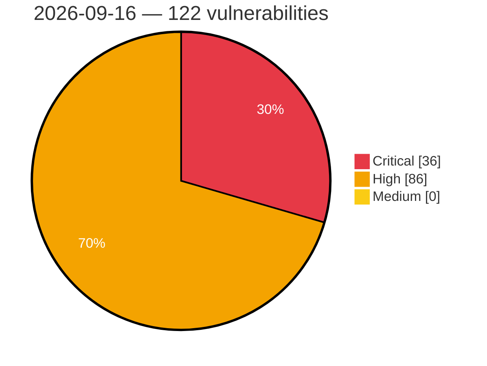

# Critical, High & Medium Severity Vulnerabilities — 2026-09-16

**Source status for this day:**

| Source | Critical | High | Medium | Total |
|--------|---------:|-----:|-------:|------:|
| cvefeed.io (High/Critical) | 36 | 86 | 0 | 122 |

**KEV (actively exploited):** 0  **Watchlist matches:** 84

## Critical (36)

| CVSS | Flags | Source | CVE / Title | Reported |
|------|-------|--------|-------------|----------|
| 10.0 | — | cvefeed.io (High/Critical) | [CVE-2026-73453 - Security Advisory 0174](https://cvefeed.io/vuln/detail/CVE-2026-73453) | 31 minutes ago |
| 10.0 | ⭐ | cvefeed.io (High/Critical) | [CVE-2026-70416 - Dell ObjectScale Deserialization of Untrusted Data Vulnerability](https://cvefeed.io/vuln/detail/CVE-2026-70416) | 2 hours, 33 minutes ago |
| 9.9 | ⭐ | cvefeed.io (High/Critical) | [CVE-2026-20307 - Cisco Identity Services Engine Remote Code Execution Vulnerability](https://cvefeed.io/vuln/detail/CVE-2026-20307) | 1 hour, 33 minutes ago |
| 9.9 | — | cvefeed.io (High/Critical) | [CVE-2026-20234 - Cisco Identity Services Engine Hardening Release - Insuffiencently Protected Credential Vulnerabilities](https://cvefeed.io/vuln/detail/CVE-2026-20234) | 1 hour, 33 minutes ago |
| 9.8 | — | cvefeed.io (High/Critical) | [CVE-2026-14349 - TrueBooker <= 1.2.3 - Missing Authorization to Unauthenticated Arbitrary User Email Modification via 'admin_addcustomer' AJAX Action](https://cvefeed.io/vuln/detail/CVE-2026-14349) | 26 minutes ago |
| 9.8 | ⭐ | cvefeed.io (High/Critical) | [CVE-2026-12793 - JetFormBuilder <= 3.6.2 - Unauthenticated Privilege Escalation via '_jet_engine_booking_form_id' Parameter](https://cvefeed.io/vuln/detail/CVE-2026-12793) | 26 minutes ago |
| 9.8 | ⭐ | cvefeed.io (High/Critical) | [CVE-2026-27565 - Remote code execution via uploading a malicious IODD file](https://cvefeed.io/vuln/detail/CVE-2026-27565) | 2 hours, 1 minute ago |
| 9.8 | ⭐ | cvefeed.io (High/Critical) | [CVE-2026-27546 - Authentication Bypass in _account_log](https://cvefeed.io/vuln/detail/CVE-2026-27546) | 2 hours, 1 minute ago |
| 9.8 | — | cvefeed.io (High/Critical) | [CVE-2026-91843 - Stack overflow in login process to the Security Management and Log Servers](https://cvefeed.io/vuln/detail/CVE-2026-91843) | 16 minutes ago |
| 9.8 | ⭐ | cvefeed.io (High/Critical) | [CVE-2025-59953 - LMdeploy has Remote Code Execution by Pickle Deserialization via zmq_rpc.call_and_response() in InterLM/lmdeploy](https://cvefeed.io/vuln/detail/CVE-2025-59953) | 2 hours, 33 minutes ago |
| 9.8 | — | cvefeed.io (High/Critical) | [CVE-2026-92805 - UVdesk Community Skeleton through 1.1.8 Missing Authentication on the Installation Wizard](https://cvefeed.io/vuln/detail/CVE-2026-92805) | 23 minutes ago |
| 9.8 | ⭐ | cvefeed.io (High/Critical) | [CVE-2026-92787 - Feast through 0.66.0 Authentication Bypass via Unverified Token](https://cvefeed.io/vuln/detail/CVE-2026-92787) | 23 minutes ago |
| 9.6 | ⭐ | cvefeed.io (High/Critical) | [CVE-2026-92716 - Shuffle through 2.2.1 API Key Reset Cross-Tenant Privilege Escalation](https://cvefeed.io/vuln/detail/CVE-2026-92716) | 33 minutes ago |
| 9.6 | — | cvefeed.io (High/Critical) | [CVE-2026-20331 - Cisco Secure Adaptive Security Appliance Software, Secure Firewall Threat Defense Software and Secure Firewall Management Center Software Hardening Release - Protection Mechanism Failure Vulnerabilities](https://cvefeed.io/vuln/detail/CVE-2026-20331) | 1 hour, 33 minutes ago |
| 9.5 | ⭐ | cvefeed.io (High/Critical) | [CVE-2026-15640 - Authentication Bypass via SAML Response Manipulation](https://cvefeed.io/vuln/detail/CVE-2026-15640) | 38 minutes ago |
| 9.4 | — | cvefeed.io (High/Critical) | [CVE-2026-73461 - Security Advisory 0163](https://cvefeed.io/vuln/detail/CVE-2026-73461) | 1 hour ago |
| 9.4 | ⭐ | cvefeed.io (High/Critical) | [CVE-2026-58146 - Unauthorized remote code execution in T-Mobile 5G Box IDU routers](https://cvefeed.io/vuln/detail/CVE-2026-58146) | 2 hours, 16 minutes ago |
| 9.3 | ⭐ | cvefeed.io (High/Critical) | [CVE-2026-15639 - Reflected Cross-Site Scripting](https://cvefeed.io/vuln/detail/CVE-2026-15639) | 38 minutes ago |
| 9.3 | ⭐ | cvefeed.io (High/Critical) | [CVE-2026-73172 - Advantech EKI-1242EIMS OS Command Injection Vulnerability](https://cvefeed.io/vuln/detail/CVE-2026-73172) | 1 hour, 15 minutes ago |
| 9.3 | ⭐ | cvefeed.io (High/Critical) | [CVE-2026-58147 - Authorized remote code execution via password change functionality in T-Mobile 5G Box IDU routers](https://cvefeed.io/vuln/detail/CVE-2026-58147) | 2 hours, 16 minutes ago |
| 9.3 | ⭐ | cvefeed.io (High/Critical) | [CVE-2026-40855 - Command Injection in T-Mobile 5G Box IDU router via ping functionality](https://cvefeed.io/vuln/detail/CVE-2026-40855) | 2 hours, 17 minutes ago |
| 9.3 | ⭐ | cvefeed.io (High/Critical) | [CVE-2026-92720 - Kubero through 3.1.1 Unauthenticated Notifications API Access](https://cvefeed.io/vuln/detail/CVE-2026-92720) | 33 minutes ago |
| 9.3 | ⭐ | cvefeed.io (High/Critical) | [CVE-2026-92717 - Covenant through 0.6 Missing Authentication on the CovenantHub SignalR Hub](https://cvefeed.io/vuln/detail/CVE-2026-92717) | 33 minutes ago |
| 9.2 | ⭐ | cvefeed.io (High/Critical) | [CVE-2026-92785 - Angel through 3.3.0 Unauthenticated Kryo Deserialization of Arbitrary Classes](https://cvefeed.io/vuln/detail/CVE-2026-92785) | 23 minutes ago |
| 9.2 | ⭐ | cvefeed.io (High/Critical) | [CVE-2026-92749 - SafeLine through 9.4.1 Authentication Bypass via Weak Session Secret](https://cvefeed.io/vuln/detail/CVE-2026-92749) | 23 minutes ago |
| 9.2 | ⭐ | cvefeed.io (High/Critical) | [CVE-2026-92578 - WWBN AVideo through 29.0 Authentication Bypass via Stored Password Hash](https://cvefeed.io/vuln/detail/CVE-2026-92578) | 1 hour, 12 minutes ago |
| 9.2 | ⭐ | cvefeed.io (High/Critical) | [CVE-2026-92576 - HKUDS nanobot before 0.3.0 Server-Side Request Forgery via WebFetchTool](https://cvefeed.io/vuln/detail/CVE-2026-92576) | 1 hour, 12 minutes ago |
| 9.1 | — | cvefeed.io (High/Critical) | [CVE-2026-15638 - Cryptographic Padding Oracle](https://cvefeed.io/vuln/detail/CVE-2026-15638) | 38 minutes ago |
| 9.1 | ⭐ | cvefeed.io (High/Critical) | [CVE-2026-81642 - Heap buffer overflow and possible Remote Code Execution when digesting DNSKEY](https://cvefeed.io/vuln/detail/CVE-2026-81642) | 1 hour ago |
| 9.1 | ⭐ | cvefeed.io (High/Critical) | [CVE-2026-92398 - Ruijie RG-EW3000GX user_list_note admin os command injection](https://cvefeed.io/vuln/detail/CVE-2026-92398) | 1 hour, 32 minutes ago |
| 9.1 | ⭐ | cvefeed.io (High/Critical) | [CVE-2026-20306 - Cisco Identity Services Engine Command Injection Vulnerability](https://cvefeed.io/vuln/detail/CVE-2026-20306) | 1 hour, 33 minutes ago |
| 9.1 | ⭐ | cvefeed.io (High/Critical) | [CVE-2026-20305 - Cisco Identity Services Engine Command Injection Vulnerability](https://cvefeed.io/vuln/detail/CVE-2026-20305) | 1 hour, 33 minutes ago |
| 9.1 | ⭐ | cvefeed.io (High/Critical) | [CVE-2026-92397 - Ruijie RG-EW3000GX configChange unifyframe-sgi.elf cc_set os command injection](https://cvefeed.io/vuln/detail/CVE-2026-92397) | 2 hours, 33 minutes ago |
| 9.1 | ⭐ | cvefeed.io (High/Critical) | [CVE-2026-92395 - @fastify/proxy-addr vulnerable to IP spoofing via IPv4-mapped IPv6 trust subnet](https://cvefeed.io/vuln/detail/CVE-2026-92395) | 3 hours, 31 minutes ago |
| 9.1 | ⭐ | cvefeed.io (High/Critical) | [CVE-2026-61594 - djust has an authorization bypass on the WebSocket/SSE mount path](https://cvefeed.io/vuln/detail/CVE-2026-61594) | 1 hour, 13 minutes ago |
| 9.0 | ⭐ | cvefeed.io (High/Critical) | [CVE-2026-76420 - Cisco Secure Firewall Management Center Software Impersonated sftunnel Connection Vulnerability](https://cvefeed.io/vuln/detail/CVE-2026-76420) | 1 hour, 32 minutes ago |

## High (86)

| CVSS | Flags | Source | CVE / Title | Reported |
|------|-------|--------|-------------|----------|
| 8.9 | — | cvefeed.io (High/Critical) | [CVE-2026-73455 - Security Advisory 0173](https://cvefeed.io/vuln/detail/CVE-2026-73455) | 31 minutes ago |
| 8.8 | ⭐ | cvefeed.io (High/Critical) | [CVE-2026-78088 - Contest Gallery <= 32.0.1 - Unauthenticated Arbitrary File Upload  via 'baseUrlForFacebook' Parameter](https://cvefeed.io/vuln/detail/CVE-2026-78088) | 26 minutes ago |
| 8.8 | — | cvefeed.io (High/Critical) | [CVE-2026-73464 - Security Advisory 0166](https://cvefeed.io/vuln/detail/CVE-2026-73464) | 1 hour ago |
| 8.8 | ⭐ | cvefeed.io (High/Critical) | [CVE-2026-84408 - QND Named Pipe Improper Access Control Vulnerability](https://cvefeed.io/vuln/detail/CVE-2026-84408) | 2 hours, 1 minute ago |
| 8.8 | ⭐ | cvefeed.io (High/Critical) | [CVE-2026-27559 - Command Injection via GET in /api/status/data](https://cvefeed.io/vuln/detail/CVE-2026-27559) | 2 hours, 1 minute ago |
| 8.8 | ⭐ | cvefeed.io (High/Critical) | [CVE-2026-27558 - Command Injection in /index.php/attached_devices_tab/ajax_remove_uploaded_iodd_files](https://cvefeed.io/vuln/detail/CVE-2026-27558) | 2 hours, 1 minute ago |
| 8.8 | — | cvefeed.io (High/Critical) | [CVE-2026-27556 - Local File Inclusion in /index.php/ajax/save_iodd_parameters](https://cvefeed.io/vuln/detail/CVE-2026-27556) | 2 hours, 1 minute ago |
| 8.8 | — | cvefeed.io (High/Critical) | [CVE-2026-27555 - Local File Inclusion in /index.php/ajax/get_iodd_port_info](https://cvefeed.io/vuln/detail/CVE-2026-27555) | 2 hours, 1 minute ago |
| 8.8 | ⭐ | cvefeed.io (High/Critical) | [CVE-2026-27554 - Command Injection in /index.php/ajax/save_iodd_parameters](https://cvefeed.io/vuln/detail/CVE-2026-27554) | 2 hours, 1 minute ago |
| 8.8 | ⭐ | cvefeed.io (High/Critical) | [CVE-2026-27551 - Command Injection in /index.php/ajax/parameterManage](https://cvefeed.io/vuln/detail/CVE-2026-27551) | 2 hours, 1 minute ago |
| 8.8 | ⭐ | cvefeed.io (High/Critical) | [CVE-2026-27550 - Command Injection in Field_Shadow_Password Class](https://cvefeed.io/vuln/detail/CVE-2026-27550) | 2 hours, 1 minute ago |
| 8.8 | ⭐ | cvefeed.io (High/Critical) | [CVE-2026-27549 - Command Injection in /index.php/attached_devices_tab/do_upload](https://cvefeed.io/vuln/detail/CVE-2026-27549) | 2 hours, 1 minute ago |
| 8.8 | ⭐ | cvefeed.io (High/Critical) | [CVE-2026-27548 - Command Injection in /index.php/ajax/get_iodd_port_info](https://cvefeed.io/vuln/detail/CVE-2026-27548) | 2 hours, 1 minute ago |
| 8.8 | ⭐ | cvefeed.io (High/Critical) | [CVE-2026-27547 - Command Injection in /index.php/ajax/get_iodd_menu_info](https://cvefeed.io/vuln/detail/CVE-2026-27547) | 2 hours, 1 minute ago |
| 8.8 | ⭐ | cvefeed.io (High/Critical) | [CVE-2026-92466 - microservices-platform through 6.0.0 Missing Authorization via Disabled URL Permission Checking](https://cvefeed.io/vuln/detail/CVE-2026-92466) | 16 minutes ago |
| 8.8 | ⭐ | cvefeed.io (High/Critical) | [CVE-2026-82964 - Avast sandbox privilege escalation via unpreserved DACLs on virtualized files in aswSnx.sys](https://cvefeed.io/vuln/detail/CVE-2026-82964) | 32 minutes ago |
| 8.8 | — | cvefeed.io (High/Critical) | [CVE-2026-73173 - Advantech EKI-1242EIMS Missing Authentication for Critical Function Vulnerability](https://cvefeed.io/vuln/detail/CVE-2026-73173) | 1 hour, 15 minutes ago |
| 8.8 | — | cvefeed.io (High/Critical) | [CVE-2026-92729 - SigNoz 0.88.0 through 0.141.0 - Missing Authentication on Trace Funnel Analytics Endpoints](https://cvefeed.io/vuln/detail/CVE-2026-92729) | 19 minutes ago |
| 8.8 | ⭐ | cvefeed.io (High/Critical) | [CVE-2026-47094 - SIMAC MyPHR 1.1 IDOR Account Takeover via /api/employes/put/{id}](https://cvefeed.io/vuln/detail/CVE-2026-47094) | 33 minutes ago |
| 8.8 | — | cvefeed.io (High/Critical) | [CVE-2026-85731 - oras-go: Arbitrary file write outside file.Store root via symlink-chain bypass in tar extraction (pushDir)](https://cvefeed.io/vuln/detail/CVE-2026-85731) | 1 hour, 32 minutes ago |
| 8.8 | ⭐ | cvefeed.io (High/Critical) | [CVE-2026-92566 - DataGear through 6.0.0 Unauthenticated SSRF via HTTP Dataset Preview](https://cvefeed.io/vuln/detail/CVE-2026-92566) | 3 hours, 31 minutes ago |
| 8.8 | ⭐ | cvefeed.io (High/Critical) | [CVE-2026-92801 - cc-connect through 1.5.0 User Allowlist Bypass via Feishu Card Actions](https://cvefeed.io/vuln/detail/CVE-2026-92801) | 23 minutes ago |
| 8.8 | — | cvefeed.io (High/Critical) | [CVE-2026-92796 - Manticore Search 27.0.0 before 28.4.4 Multi-Statement Authorization Bypass](https://cvefeed.io/vuln/detail/CVE-2026-92796) | 23 minutes ago |
| 8.8 | — | cvefeed.io (High/Critical) | [CVE-2026-92788 - Coze Studio through 0.5.1 Cross-Tenant Database Access via Workflow SQL Node](https://cvefeed.io/vuln/detail/CVE-2026-92788) | 23 minutes ago |
| 8.8 | ⭐ | cvefeed.io (High/Critical) | [CVE-2026-92780 - KnowStreaming through 3.4.1 Missing Authorization on the REST API](https://cvefeed.io/vuln/detail/CVE-2026-92780) | 23 minutes ago |
| 8.8 | ⭐ | cvefeed.io (High/Critical) | [CVE-2026-92762 - Pelican Panel before 1.0.0-beta35 Authorization Bypass via Startup](https://cvefeed.io/vuln/detail/CVE-2026-92762) | 23 minutes ago |
| 8.8 | ⭐ | cvefeed.io (High/Critical) | [CVE-2026-92761 - WebVirtCloud Missing Authorization on Instance Control Actions](https://cvefeed.io/vuln/detail/CVE-2026-92761) | 23 minutes ago |
| 8.8 | ⭐ | cvefeed.io (High/Critical) | [CVE-2026-92748 - BC Security Empire before 6.7.1 Path Traversal File Upload RCE](https://cvefeed.io/vuln/detail/CVE-2026-92748) | 23 minutes ago |
| 8.8 | — | cvefeed.io (High/Critical) | [CVE-2026-61599 - djust has an unauthenticated arbitrary module import via the WebSocket/SSE view-mount path](https://cvefeed.io/vuln/detail/CVE-2026-61599) | 13 minutes ago |
| 8.8 | ⭐ | cvefeed.io (High/Critical) | [CVE-2026-92593 - Craft CMS 5.10.0 before 5.10.13 Authenticated Remote Code Execution](https://cvefeed.io/vuln/detail/CVE-2026-92593) | 1 hour, 12 minutes ago |
| 8.8 | ⭐ | cvefeed.io (High/Critical) | [CVE-2026-92592 - Craft CMS before 4.18.6 Remote Code Execution via signed cookie](https://cvefeed.io/vuln/detail/CVE-2026-92592) | 1 hour, 12 minutes ago |
| 8.8 | ⭐ | cvefeed.io (High/Critical) | [CVE-2026-92580 - AVideo through 29.0 CloneSite Stored Shell Injection via SSH Password CSRF](https://cvefeed.io/vuln/detail/CVE-2026-92580) | 1 hour, 12 minutes ago |
| 8.7 | ⭐ | cvefeed.io (High/Critical) | [CVE-2026-92355 - Octopus Server Path Traversal Vulnerability](https://cvefeed.io/vuln/detail/CVE-2026-92355) | 2 hours, 1 minute ago |
| 8.7 | ⭐ | cvefeed.io (High/Critical) | [CVE-2026-88263 - XikeStor Layer3 Switches Authentication Bypass](https://cvefeed.io/vuln/detail/CVE-2026-88263) | 2 hours, 1 minute ago |
| 8.7 | — | cvefeed.io (High/Critical) | [CVE-2026-92467 - microservices-platform through 6.0.0 Unverified Password Change via /users/password](https://cvefeed.io/vuln/detail/CVE-2026-92467) | 16 minutes ago |
| 8.7 | ⭐ | cvefeed.io (High/Critical) | [CVE-2026-88817 - Privilege escalation via legacy access group creation endpoint](https://cvefeed.io/vuln/detail/CVE-2026-88817) | 1 hour, 15 minutes ago |
| 8.7 | ⭐ | cvefeed.io (High/Critical) | [CVE-2026-73174 - Advantech EKI-1242EIMS Cleartext Transmission of Sensitive Information](https://cvefeed.io/vuln/detail/CVE-2026-73174) | 1 hour, 15 minutes ago |
| 8.7 | ⭐ | cvefeed.io (High/Critical) | [CVE-2026-92719 - Quickwit through 0.9.0 SSRF via SQS queue_url Parameter](https://cvefeed.io/vuln/detail/CVE-2026-92719) | 33 minutes ago |
| 8.7 | ⭐ | cvefeed.io (High/Critical) | [CVE-2026-92815 - changedetection.io through 0.60.6 SSRF via browser-step Goto URL](https://cvefeed.io/vuln/detail/CVE-2026-92815) | 23 minutes ago |
| 8.7 | ⭐ | cvefeed.io (High/Critical) | [CVE-2026-92794 - OpenSign through 2.41.3 Information Disclosure via getDocument](https://cvefeed.io/vuln/detail/CVE-2026-92794) | 23 minutes ago |
| 8.7 | ⭐ | cvefeed.io (High/Critical) | [CVE-2026-92792 - OpenNHP through 1.0.2 Authentication Bypass via Fallback Verifier](https://cvefeed.io/vuln/detail/CVE-2026-92792) | 23 minutes ago |
| 8.7 | ⭐ | cvefeed.io (High/Critical) | [CVE-2026-92791 - Uber Kraken through 0.1.29 Path Traversal via tag parameter](https://cvefeed.io/vuln/detail/CVE-2026-92791) | 23 minutes ago |
| 8.7 | — | cvefeed.io (High/Critical) | [CVE-2026-92752 - metasfresh Unauthorized Access via Document Attachments and Comments Endpoints](https://cvefeed.io/vuln/detail/CVE-2026-92752) | 23 minutes ago |
| 8.7 | ⭐ | cvefeed.io (High/Critical) | [CVE-2026-92599 - Joi before 17.13.7 and 18.2.6 ReDoS via isoDate](https://cvefeed.io/vuln/detail/CVE-2026-92599) | 1 hour, 12 minutes ago |
| 8.7 | — | cvefeed.io (High/Critical) | [CVE-2026-92596 - Nodemailer before 9.1.0 Denial of Service via addressparser](https://cvefeed.io/vuln/detail/CVE-2026-92596) | 1 hour, 12 minutes ago |
| 8.7 | ⭐ | cvefeed.io (High/Critical) | [CVE-2026-92594 - Craft CMS before 5.11.0 Unauthenticated PII Disclosure via GraphQL](https://cvefeed.io/vuln/detail/CVE-2026-92594) | 1 hour, 12 minutes ago |
| 8.7 | ⭐ | cvefeed.io (High/Critical) | [CVE-2026-92577 - AVideo through 29.0 API get_api_video Broken Access Control via clean_title](https://cvefeed.io/vuln/detail/CVE-2026-92577) | 1 hour, 12 minutes ago |
| 8.6 | — | cvefeed.io (High/Critical) | [CVE-2026-73454 - Security Advisory 0165](https://cvefeed.io/vuln/detail/CVE-2026-73454) | 1 hour ago |
| 8.6 | — | cvefeed.io (High/Critical) | [CVE-2026-73177 - Advantech EKI-1242EIMS Insufficient Firmware Signature Verification](https://cvefeed.io/vuln/detail/CVE-2026-73177) | 16 minutes ago |
| 8.6 | ⭐ | cvefeed.io (High/Critical) | [CVE-2026-73176 - Advantech EKI-1242IEIMS OS Command Injection Vulnerability](https://cvefeed.io/vuln/detail/CVE-2026-73176) | 1 hour, 15 minutes ago |
| 8.6 | — | cvefeed.io (High/Critical) | [CVE-2026-73171 - Advantech EKI-1242EIMS Arbitrary File Write Vulnerability](https://cvefeed.io/vuln/detail/CVE-2026-73171) | 1 hour, 15 minutes ago |
| 8.6 | — | cvefeed.io (High/Critical) | [CVE-2026-73170 - Advantech EKI-1242EIMS Code Injection Vulnerability](https://cvefeed.io/vuln/detail/CVE-2026-73170) | 1 hour, 15 minutes ago |
| 8.6 | ⭐ | cvefeed.io (High/Critical) | [CVE-2026-73167 - Advantech EKI-1242IEIMS OS Command Injection Vulnerability](https://cvefeed.io/vuln/detail/CVE-2026-73167) | 1 hour, 15 minutes ago |
| 8.6 | — | cvefeed.io (High/Critical) | [CVE-2026-73166 - Advantech EKI-1242IEIMS Code Injection Vulnerability](https://cvefeed.io/vuln/detail/CVE-2026-73166) | 1 hour, 15 minutes ago |
| 8.6 | ⭐ | cvefeed.io (High/Critical) | [CVE-2026-73165 - Advantech EKI-1242IEIMS OS Command Injection Vulnerability](https://cvefeed.io/vuln/detail/CVE-2026-73165) | 1 hour, 15 minutes ago |
| 8.6 | ⭐ | cvefeed.io (High/Critical) | [CVE-2026-73164 - Advantech EKI-1242IEIMS OS Command Injection Vulnerability](https://cvefeed.io/vuln/detail/CVE-2026-73164) | 1 hour, 15 minutes ago |
| 8.6 | ⭐ | cvefeed.io (High/Critical) | [CVE-2026-73163 - Advantech EKI-1242IEIMS OS Command Injection Vulnerability](https://cvefeed.io/vuln/detail/CVE-2026-73163) | 1 hour, 15 minutes ago |
| 8.6 | ⭐ | cvefeed.io (High/Critical) | [CVE-2026-19535 - Advantech EKI-1242IEIMS Cross-Site Request Forgery Vulnerability](https://cvefeed.io/vuln/detail/CVE-2026-19535) | 1 hour, 16 minutes ago |
| 8.6 | — | cvefeed.io (High/Critical) | [CVE-2026-92793 - GoAdmin through 1.2.26 Authorization Bypass via Query Parameter](https://cvefeed.io/vuln/detail/CVE-2026-92793) | 23 minutes ago |
| 8.6 | — | cvefeed.io (High/Critical) | [CVE-2026-92782 - Chroma through 1.5.9 Authorization Bypass via Collection Identifier](https://cvefeed.io/vuln/detail/CVE-2026-92782) | 23 minutes ago |
| 8.6 | ⭐ | cvefeed.io (High/Critical) | [CVE-2026-92776 - Wiki.js through 2.5.314 Path Prefix Matching Authorization Bypass](https://cvefeed.io/vuln/detail/CVE-2026-92776) | 23 minutes ago |
| 8.6 | ⭐ | cvefeed.io (High/Critical) | [CVE-2026-92763 - Rundeck through 6.2.1 Authorization Bypass via Project Import](https://cvefeed.io/vuln/detail/CVE-2026-92763) | 23 minutes ago |
| 8.5 | — | cvefeed.io (High/Critical) | [CVE-2026-79708 - Incorrect Authorization in GitLab](https://cvefeed.io/vuln/detail/CVE-2026-79708) | 3 hours, 1 minute ago |
| 8.5 | — | cvefeed.io (High/Critical) | [CVE-2026-86359 - Dell Repository Manager Incorrect Default Permissions Vulnerability](https://cvefeed.io/vuln/detail/CVE-2026-86359) | 1 hour, 32 minutes ago |
| 8.5 | ⭐ | cvefeed.io (High/Critical) | [CVE-2026-92816 - ComfyUI before 0.30.0 Path Traversal via dataset save nodes](https://cvefeed.io/vuln/detail/CVE-2026-92816) | 22 minutes ago |
| 8.5 | — | cvefeed.io (High/Critical) | [CVE-2026-92786 - LightGBM through 4.7.0 Out-of-Bounds Write via Crafted Model](https://cvefeed.io/vuln/detail/CVE-2026-92786) | 23 minutes ago |
| 8.4 | ⭐ | cvefeed.io (High/Critical) | [CVE-2026-82717 - CNAME synthesis could lead to heap corruption](https://cvefeed.io/vuln/detail/CVE-2026-82717) | 1 hour ago |
| 8.4 | ⭐ | cvefeed.io (High/Critical) | [CVE-2026-40857 - CSRF token bypass in T-Mobile 5G Box IDU routers](https://cvefeed.io/vuln/detail/CVE-2026-40857) | 2 hours, 17 minutes ago |
| 8.3 | — | cvefeed.io (High/Critical) | [CVE-2026-92598 - Nodemailer before 9.1.0 IDN/Punycode Domain Allow-list Bypass](https://cvefeed.io/vuln/detail/CVE-2026-92598) | 1 hour, 12 minutes ago |
| 8.3 | — | cvefeed.io (High/Critical) | [CVE-2026-92597 - Nodemailer before 9.1.0 Email Domain Validation Bypass via RFC 5322 Comment](https://cvefeed.io/vuln/detail/CVE-2026-92597) | 1 hour, 12 minutes ago |
| 8.2 | — | cvefeed.io (High/Critical) | [CVE-2026-73435 - Security Advisory 0171](https://cvefeed.io/vuln/detail/CVE-2026-73435) | 58 minutes ago |
| 8.2 | — | cvefeed.io (High/Critical) | [CVE-2026-89028 - MikroTik RouterOS < 7.24 Heap Corruption via SMB1 SessionSetupAndX](https://cvefeed.io/vuln/detail/CVE-2026-89028) | 16 minutes ago |
| 8.2 | ⭐ | cvefeed.io (High/Critical) | [CVE-2026-71180 - Dell Update Package Framework Unchecked Return Value Privilege Escalation](https://cvefeed.io/vuln/detail/CVE-2026-71180) | 1 hour, 32 minutes ago |
| 8.2 | ⭐ | cvefeed.io (High/Critical) | [CVE-2026-92591 - Craft CMS 5.0.0 before 5.10.13 Environment Secret Exposure via Installer](https://cvefeed.io/vuln/detail/CVE-2026-92591) | 1 hour, 12 minutes ago |
| 8.1 | ⭐ | cvefeed.io (High/Critical) | [CVE-2026-27552 - Unauthorized IODD File Upload due to Improper Authorization](https://cvefeed.io/vuln/detail/CVE-2026-27552) | 2 hours, 1 minute ago |
| 8.1 | ⭐ | cvefeed.io (High/Critical) | [CVE-2026-92087 - @fastify/auth vulnerable to Authorization Bypass via order-dependent evaluation of composed auth](https://cvefeed.io/vuln/detail/CVE-2026-92087) | 12 minutes ago |
| 8.1 | — | cvefeed.io (High/Critical) | [CVE-2026-92469 - microservices-platform through 6.0.0 Arbitrary File Deletion via Missing Ownership Check](https://cvefeed.io/vuln/detail/CVE-2026-92469) | 16 minutes ago |
| 8.1 | ⭐ | cvefeed.io (High/Critical) | [CVE-2026-92604 - Scirius through 3.8.0 Arbitrary File Write via PCAP Upload](https://cvefeed.io/vuln/detail/CVE-2026-92604) | 33 minutes ago |
| 8.1 | ⭐ | cvefeed.io (High/Critical) | [CVE-2026-61593 - djust has Cross-Site Request Forgery on the Server-Sent-Events transport: a cross-origin page can drive a victim-authenticated SSE session](https://cvefeed.io/vuln/detail/CVE-2026-61593) | 2 hours, 33 minutes ago |
| 8.1 | — | cvefeed.io (High/Critical) | [CVE-2025-43936 - Dell ObjectScale Improper Authentication Vulnerability](https://cvefeed.io/vuln/detail/CVE-2025-43936) | 2 hours, 33 minutes ago |
| 8.1 | — | cvefeed.io (High/Critical) | [CVE-2026-92806 - phpList before 3.6.17 Cross-Site Request Forgery via massremove.php](https://cvefeed.io/vuln/detail/CVE-2026-92806) | 23 minutes ago |
| 8.1 | ⭐ | cvefeed.io (High/Critical) | [CVE-2026-92783 - Yeti through 2.11.0 Missing Authorization on RBAC Relationship Deletion](https://cvefeed.io/vuln/detail/CVE-2026-92783) | 23 minutes ago |
| 8.1 | ⭐ | cvefeed.io (High/Critical) | [CVE-2026-92751 - CMAK through 3.0.0.6 Cross-Site Request Forgery via Missing CSRF Filter](https://cvefeed.io/vuln/detail/CVE-2026-92751) | 23 minutes ago |
| 8.1 | ⭐ | cvefeed.io (High/Critical) | [CVE-2026-61591 - djust: Unsigned client state snapshot is restored as trusted view state (privilege escalation / state injection)](https://cvefeed.io/vuln/detail/CVE-2026-61591) | 1 hour, 13 minutes ago |
| 8.0 | ⭐ | cvefeed.io (High/Critical) | [CVE-2026-86108 - Security Advisory 0181](https://cvefeed.io/vuln/detail/CVE-2026-86108) | 1 hour, 27 minutes ago |
| 8.0 | ⭐ | cvefeed.io (High/Critical) | [CVE-2026-85469 - Quay-builder-qemu: quay-builder-qemu: release workflow uses third-party action pinned to mutable @master with registry credentials in scope](https://cvefeed.io/vuln/detail/CVE-2026-85469) | 1 hour, 12 minutes ago |
