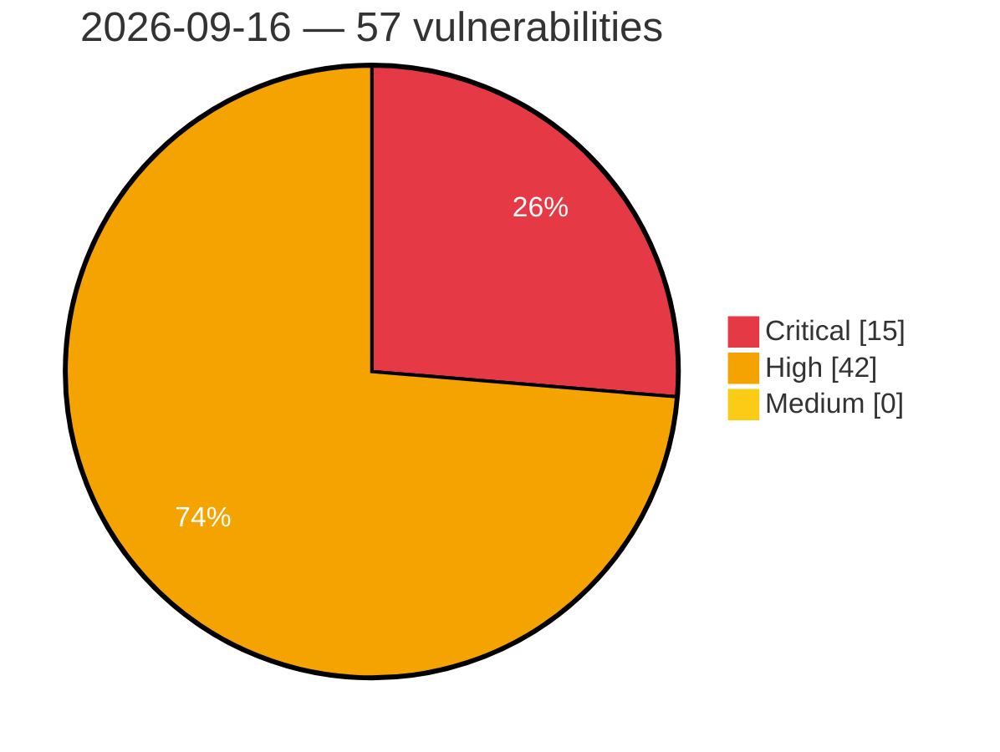

# Critical, High & Medium Severity Vulnerabilities — 2026-09-16

**Source status for this day:**

| Source | Critical | High | Medium | Total |
|--------|---------:|-----:|-------:|------:|
| cvefeed.io (High/Critical) | 15 | 42 | 0 | 57 |

**KEV (actively exploited):** 0  **Watchlist matches:** 37

## Critical (15)

| CVSS | Flags | Source | CVE / Title | Reported |
|------|-------|--------|-------------|----------|
| 10.0 | — | cvefeed.io (High/Critical) | [CVE-2026-73453 - Security Advisory 0174](https://cvefeed.io/vuln/detail/CVE-2026-73453) | 31 minutes ago |
| 9.8 | — | cvefeed.io (High/Critical) | [CVE-2026-14349 - TrueBooker <= 1.2.3 - Missing Authorization to Unauthenticated Arbitrary User Email Modification via 'admin_addcustomer' AJAX Action](https://cvefeed.io/vuln/detail/CVE-2026-14349) | 26 minutes ago |
| 9.8 | ⭐ | cvefeed.io (High/Critical) | [CVE-2026-12793 - JetFormBuilder <= 3.6.2 - Unauthenticated Privilege Escalation via '_jet_engine_booking_form_id' Parameter](https://cvefeed.io/vuln/detail/CVE-2026-12793) | 26 minutes ago |
| 9.8 | ⭐ | cvefeed.io (High/Critical) | [CVE-2026-27565 - Remote code execution via uploading a malicious IODD file](https://cvefeed.io/vuln/detail/CVE-2026-27565) | 2 hours, 1 minute ago |
| 9.8 | ⭐ | cvefeed.io (High/Critical) | [CVE-2026-27546 - Authentication Bypass in _account_log](https://cvefeed.io/vuln/detail/CVE-2026-27546) | 2 hours, 1 minute ago |
| 9.8 | — | cvefeed.io (High/Critical) | [CVE-2026-91843 - Stack overflow in login process to the Security Management and Log Servers](https://cvefeed.io/vuln/detail/CVE-2026-91843) | 16 minutes ago |
| 9.5 | ⭐ | cvefeed.io (High/Critical) | [CVE-2026-15640 - Authentication Bypass via SAML Response Manipulation](https://cvefeed.io/vuln/detail/CVE-2026-15640) | 38 minutes ago |
| 9.4 | — | cvefeed.io (High/Critical) | [CVE-2026-73461 - Security Advisory 0163](https://cvefeed.io/vuln/detail/CVE-2026-73461) | 1 hour ago |
| 9.4 | ⭐ | cvefeed.io (High/Critical) | [CVE-2026-58146 - Unauthorized remote code execution in T-Mobile 5G Box IDU routers](https://cvefeed.io/vuln/detail/CVE-2026-58146) | 2 hours, 16 minutes ago |
| 9.3 | ⭐ | cvefeed.io (High/Critical) | [CVE-2026-15639 - Reflected Cross-Site Scripting](https://cvefeed.io/vuln/detail/CVE-2026-15639) | 38 minutes ago |
| 9.3 | ⭐ | cvefeed.io (High/Critical) | [CVE-2026-73172 - Advantech EKI-1242EIMS OS Command Injection Vulnerability](https://cvefeed.io/vuln/detail/CVE-2026-73172) | 1 hour, 15 minutes ago |
| 9.3 | ⭐ | cvefeed.io (High/Critical) | [CVE-2026-58147 - Authorized remote code execution via password change functionality in T-Mobile 5G Box IDU routers](https://cvefeed.io/vuln/detail/CVE-2026-58147) | 2 hours, 16 minutes ago |
| 9.3 | ⭐ | cvefeed.io (High/Critical) | [CVE-2026-40855 - Command Injection in T-Mobile 5G Box IDU router via ping functionality](https://cvefeed.io/vuln/detail/CVE-2026-40855) | 2 hours, 17 minutes ago |
| 9.1 | — | cvefeed.io (High/Critical) | [CVE-2026-15638 - Cryptographic Padding Oracle](https://cvefeed.io/vuln/detail/CVE-2026-15638) | 38 minutes ago |
| 9.1 | ⭐ | cvefeed.io (High/Critical) | [CVE-2026-81642 - Heap buffer overflow and possible Remote Code Execution when digesting DNSKEY](https://cvefeed.io/vuln/detail/CVE-2026-81642) | 1 hour ago |

## High (42)

| CVSS | Flags | Source | CVE / Title | Reported |
|------|-------|--------|-------------|----------|
| 8.9 | — | cvefeed.io (High/Critical) | [CVE-2026-73455 - Security Advisory 0173](https://cvefeed.io/vuln/detail/CVE-2026-73455) | 31 minutes ago |
| 8.8 | ⭐ | cvefeed.io (High/Critical) | [CVE-2026-78088 - Contest Gallery <= 32.0.1 - Unauthenticated Arbitrary File Upload  via 'baseUrlForFacebook' Parameter](https://cvefeed.io/vuln/detail/CVE-2026-78088) | 26 minutes ago |
| 8.8 | — | cvefeed.io (High/Critical) | [CVE-2026-73464 - Security Advisory 0166](https://cvefeed.io/vuln/detail/CVE-2026-73464) | 1 hour ago |
| 8.8 | ⭐ | cvefeed.io (High/Critical) | [CVE-2026-84408 - QND Named Pipe Improper Access Control Vulnerability](https://cvefeed.io/vuln/detail/CVE-2026-84408) | 2 hours, 1 minute ago |
| 8.8 | ⭐ | cvefeed.io (High/Critical) | [CVE-2026-27559 - Command Injection via GET in /api/status/data](https://cvefeed.io/vuln/detail/CVE-2026-27559) | 2 hours, 1 minute ago |
| 8.8 | ⭐ | cvefeed.io (High/Critical) | [CVE-2026-27558 - Command Injection in /index.php/attached_devices_tab/ajax_remove_uploaded_iodd_files](https://cvefeed.io/vuln/detail/CVE-2026-27558) | 2 hours, 1 minute ago |
| 8.8 | — | cvefeed.io (High/Critical) | [CVE-2026-27556 - Local File Inclusion in /index.php/ajax/save_iodd_parameters](https://cvefeed.io/vuln/detail/CVE-2026-27556) | 2 hours, 1 minute ago |
| 8.8 | — | cvefeed.io (High/Critical) | [CVE-2026-27555 - Local File Inclusion in /index.php/ajax/get_iodd_port_info](https://cvefeed.io/vuln/detail/CVE-2026-27555) | 2 hours, 1 minute ago |
| 8.8 | ⭐ | cvefeed.io (High/Critical) | [CVE-2026-27554 - Command Injection in /index.php/ajax/save_iodd_parameters](https://cvefeed.io/vuln/detail/CVE-2026-27554) | 2 hours, 1 minute ago |
| 8.8 | ⭐ | cvefeed.io (High/Critical) | [CVE-2026-27551 - Command Injection in /index.php/ajax/parameterManage](https://cvefeed.io/vuln/detail/CVE-2026-27551) | 2 hours, 1 minute ago |
| 8.8 | ⭐ | cvefeed.io (High/Critical) | [CVE-2026-27550 - Command Injection in Field_Shadow_Password Class](https://cvefeed.io/vuln/detail/CVE-2026-27550) | 2 hours, 1 minute ago |
| 8.8 | ⭐ | cvefeed.io (High/Critical) | [CVE-2026-27549 - Command Injection in /index.php/attached_devices_tab/do_upload](https://cvefeed.io/vuln/detail/CVE-2026-27549) | 2 hours, 1 minute ago |
| 8.8 | ⭐ | cvefeed.io (High/Critical) | [CVE-2026-27548 - Command Injection in /index.php/ajax/get_iodd_port_info](https://cvefeed.io/vuln/detail/CVE-2026-27548) | 2 hours, 1 minute ago |
| 8.8 | ⭐ | cvefeed.io (High/Critical) | [CVE-2026-27547 - Command Injection in /index.php/ajax/get_iodd_menu_info](https://cvefeed.io/vuln/detail/CVE-2026-27547) | 2 hours, 1 minute ago |
| 8.8 | ⭐ | cvefeed.io (High/Critical) | [CVE-2026-92466 - microservices-platform through 6.0.0 Missing Authorization via Disabled URL Permission Checking](https://cvefeed.io/vuln/detail/CVE-2026-92466) | 16 minutes ago |
| 8.8 | ⭐ | cvefeed.io (High/Critical) | [CVE-2026-82964 - Avast sandbox privilege escalation via unpreserved DACLs on virtualized files in aswSnx.sys](https://cvefeed.io/vuln/detail/CVE-2026-82964) | 32 minutes ago |
| 8.8 | — | cvefeed.io (High/Critical) | [CVE-2026-73173 - Advantech EKI-1242EIMS Missing Authentication for Critical Function Vulnerability](https://cvefeed.io/vuln/detail/CVE-2026-73173) | 1 hour, 15 minutes ago |
| 8.7 | ⭐ | cvefeed.io (High/Critical) | [CVE-2026-92355 - Octopus Server Path Traversal Vulnerability](https://cvefeed.io/vuln/detail/CVE-2026-92355) | 2 hours, 1 minute ago |
| 8.7 | ⭐ | cvefeed.io (High/Critical) | [CVE-2026-88263 - XikeStor Layer3 Switches Authentication Bypass](https://cvefeed.io/vuln/detail/CVE-2026-88263) | 2 hours, 1 minute ago |
| 8.7 | — | cvefeed.io (High/Critical) | [CVE-2026-92467 - microservices-platform through 6.0.0 Unverified Password Change via /users/password](https://cvefeed.io/vuln/detail/CVE-2026-92467) | 16 minutes ago |
| 8.7 | ⭐ | cvefeed.io (High/Critical) | [CVE-2026-88817 - Privilege escalation via legacy access group creation endpoint](https://cvefeed.io/vuln/detail/CVE-2026-88817) | 1 hour, 15 minutes ago |
| 8.7 | ⭐ | cvefeed.io (High/Critical) | [CVE-2026-73174 - Advantech EKI-1242EIMS Cleartext Transmission of Sensitive Information](https://cvefeed.io/vuln/detail/CVE-2026-73174) | 1 hour, 15 minutes ago |
| 8.6 | — | cvefeed.io (High/Critical) | [CVE-2026-73454 - Security Advisory 0165](https://cvefeed.io/vuln/detail/CVE-2026-73454) | 1 hour ago |
| 8.6 | — | cvefeed.io (High/Critical) | [CVE-2026-73177 - Advantech EKI-1242EIMS Insufficient Firmware Signature Verification](https://cvefeed.io/vuln/detail/CVE-2026-73177) | 16 minutes ago |
| 8.6 | ⭐ | cvefeed.io (High/Critical) | [CVE-2026-73176 - Advantech EKI-1242IEIMS OS Command Injection Vulnerability](https://cvefeed.io/vuln/detail/CVE-2026-73176) | 1 hour, 15 minutes ago |
| 8.6 | — | cvefeed.io (High/Critical) | [CVE-2026-73171 - Advantech EKI-1242EIMS Arbitrary File Write Vulnerability](https://cvefeed.io/vuln/detail/CVE-2026-73171) | 1 hour, 15 minutes ago |
| 8.6 | — | cvefeed.io (High/Critical) | [CVE-2026-73170 - Advantech EKI-1242EIMS Code Injection Vulnerability](https://cvefeed.io/vuln/detail/CVE-2026-73170) | 1 hour, 15 minutes ago |
| 8.6 | ⭐ | cvefeed.io (High/Critical) | [CVE-2026-73167 - Advantech EKI-1242IEIMS OS Command Injection Vulnerability](https://cvefeed.io/vuln/detail/CVE-2026-73167) | 1 hour, 15 minutes ago |
| 8.6 | — | cvefeed.io (High/Critical) | [CVE-2026-73166 - Advantech EKI-1242IEIMS Code Injection Vulnerability](https://cvefeed.io/vuln/detail/CVE-2026-73166) | 1 hour, 15 minutes ago |
| 8.6 | ⭐ | cvefeed.io (High/Critical) | [CVE-2026-73165 - Advantech EKI-1242IEIMS OS Command Injection Vulnerability](https://cvefeed.io/vuln/detail/CVE-2026-73165) | 1 hour, 15 minutes ago |
| 8.6 | ⭐ | cvefeed.io (High/Critical) | [CVE-2026-73164 - Advantech EKI-1242IEIMS OS Command Injection Vulnerability](https://cvefeed.io/vuln/detail/CVE-2026-73164) | 1 hour, 15 minutes ago |
| 8.6 | ⭐ | cvefeed.io (High/Critical) | [CVE-2026-73163 - Advantech EKI-1242IEIMS OS Command Injection Vulnerability](https://cvefeed.io/vuln/detail/CVE-2026-73163) | 1 hour, 15 minutes ago |
| 8.6 | ⭐ | cvefeed.io (High/Critical) | [CVE-2026-19535 - Advantech EKI-1242IEIMS Cross-Site Request Forgery Vulnerability](https://cvefeed.io/vuln/detail/CVE-2026-19535) | 1 hour, 16 minutes ago |
| 8.5 | — | cvefeed.io (High/Critical) | [CVE-2026-79708 - Incorrect Authorization in GitLab](https://cvefeed.io/vuln/detail/CVE-2026-79708) | 3 hours, 1 minute ago |
| 8.4 | ⭐ | cvefeed.io (High/Critical) | [CVE-2026-82717 - CNAME synthesis could lead to heap corruption](https://cvefeed.io/vuln/detail/CVE-2026-82717) | 1 hour ago |
| 8.4 | ⭐ | cvefeed.io (High/Critical) | [CVE-2026-40857 - CSRF token bypass in T-Mobile 5G Box IDU routers](https://cvefeed.io/vuln/detail/CVE-2026-40857) | 2 hours, 17 minutes ago |
| 8.2 | — | cvefeed.io (High/Critical) | [CVE-2026-73435 - Security Advisory 0171](https://cvefeed.io/vuln/detail/CVE-2026-73435) | 58 minutes ago |
| 8.2 | — | cvefeed.io (High/Critical) | [CVE-2026-89028 - MikroTik RouterOS < 7.24 Heap Corruption via SMB1 SessionSetupAndX](https://cvefeed.io/vuln/detail/CVE-2026-89028) | 16 minutes ago |
| 8.1 | ⭐ | cvefeed.io (High/Critical) | [CVE-2026-27552 - Unauthorized IODD File Upload due to Improper Authorization](https://cvefeed.io/vuln/detail/CVE-2026-27552) | 2 hours, 1 minute ago |
| 8.1 | ⭐ | cvefeed.io (High/Critical) | [CVE-2026-92087 - @fastify/auth vulnerable to Authorization Bypass via order-dependent evaluation of composed auth](https://cvefeed.io/vuln/detail/CVE-2026-92087) | 12 minutes ago |
| 8.1 | — | cvefeed.io (High/Critical) | [CVE-2026-92469 - microservices-platform through 6.0.0 Arbitrary File Deletion via Missing Ownership Check](https://cvefeed.io/vuln/detail/CVE-2026-92469) | 16 minutes ago |
| 8.0 | ⭐ | cvefeed.io (High/Critical) | [CVE-2026-86108 - Security Advisory 0181](https://cvefeed.io/vuln/detail/CVE-2026-86108) | 1 hour, 27 minutes ago |
