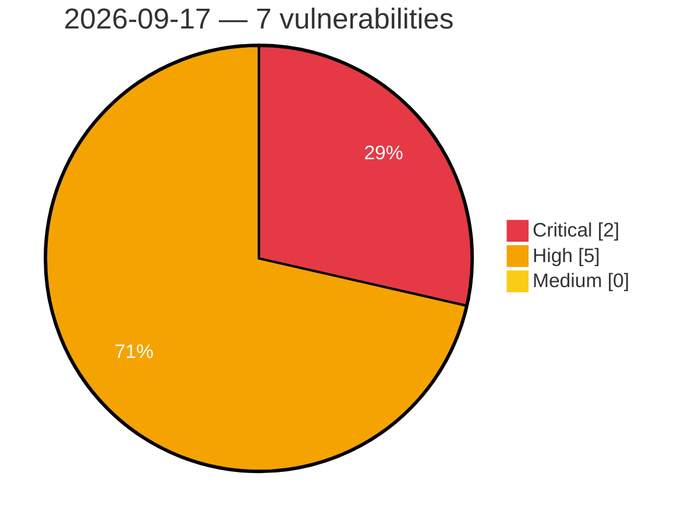

# Critical, High & Medium Severity Vulnerabilities — 2026-09-17

**Source status for this day:**

| Source | Critical | High | Medium | Total |
|--------|---------:|-----:|-------:|------:|
| cvefeed.io (High/Critical) | 2 | 5 | 0 | 7 |

**KEV (actively exploited):** 0  **Watchlist matches:** 7

## Critical (2)

| CVSS | Flags | Source | CVE / Title | Reported |
|------|-------|--------|-------------|----------|
| 9.8 | ⭐ | cvefeed.io (High/Critical) | [CVE-2026-87796 - Multi Uploader for Gravity Forms <= 1.1.9 - Unauthenticated Arbitrary File Upload via Chunked File Upload](https://cvefeed.io/vuln/detail/CVE-2026-87796) | 5 hours, 1 minute ago |
| 9.2 | ⭐ | cvefeed.io (High/Critical) | [CVE-2026-15688 - Password Authentication Bypass Vulnerability in GX Works3 and Motion Control Setting](https://cvefeed.io/vuln/detail/CVE-2026-15688) | 1 hour, 1 minute ago |

## High (5)

| CVSS | Flags | Source | CVE / Title | Reported |
|------|-------|--------|-------------|----------|
| 8.8 | ⭐ | cvefeed.io (High/Critical) | [CVE-2026-25283 - Stack-based Buffer Overflow in OOBM](https://cvefeed.io/vuln/detail/CVE-2026-25283) | 44 minutes ago |
| 8.8 | ⭐ | cvefeed.io (High/Critical) | [CVE-2026-86801 - To Do List Member 1.4 - 1.6 - Unauthenticated Stored XSS, File Listing and Deletion via Unprotected Upload Handler](https://cvefeed.io/vuln/detail/CVE-2026-86801) | 3 hours, 2 minutes ago |
| 8.6 | ⭐ | cvefeed.io (High/Critical) | [CVE-2026-87963 - Yo 1.1 - 1.3.1 - Unauthenticated SQL Injection via username Parameter](https://cvefeed.io/vuln/detail/CVE-2026-87963) | 3 hours, 2 minutes ago |
| 8.1 | ⭐ | cvefeed.io (High/Critical) | [CVE-2026-87935 - Paid Downloads <= 3.15 - Unauthenticated Arbitrary File Upload via 'paiddownloads_update_file' Action](https://cvefeed.io/vuln/detail/CVE-2026-87935) | 5 hours, 1 minute ago |
| 8.0 | ⭐ | cvefeed.io (High/Critical) | [CVE-2026-78428 - Flaw in Nuevector can result in one user receiving another user's authenticated session when multiple SSO login attempts occur concurrently](https://cvefeed.io/vuln/detail/CVE-2026-78428) | 59 minutes ago |
