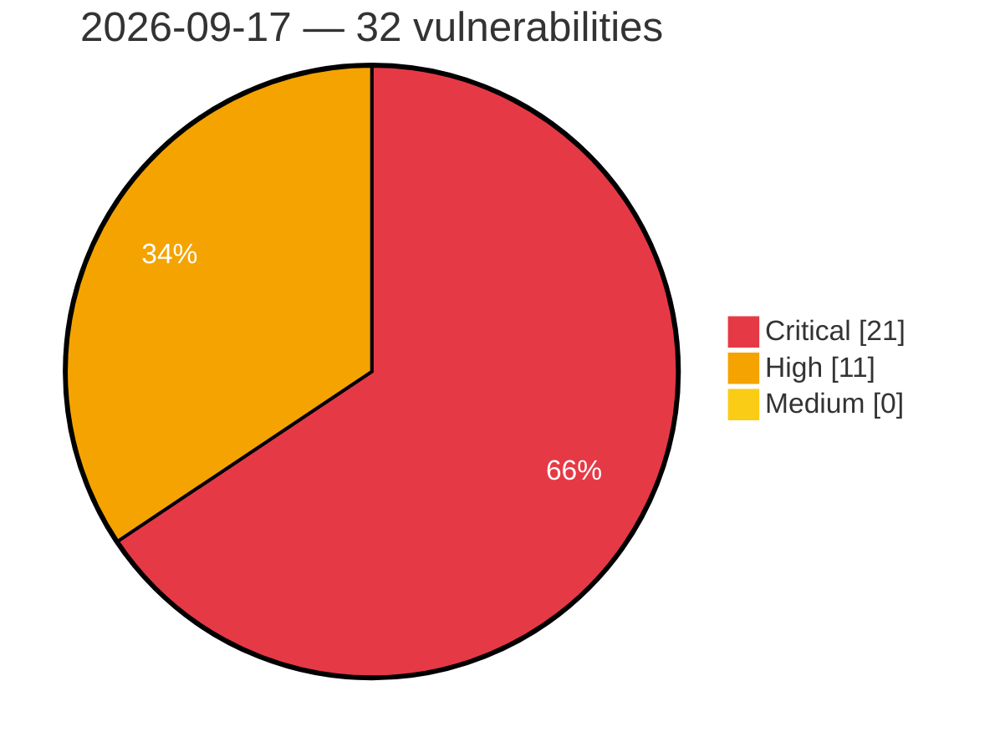

# Critical, High & Medium Severity Vulnerabilities — 2026-09-17

**Source status for this day:**

| Source | Critical | High | Medium | Total |
|--------|---------:|-----:|-------:|------:|
| cvefeed.io (High/Critical) | 21 | 11 | 0 | 32 |

**KEV (actively exploited):** 0  **Watchlist matches:** 18

## Critical (21)

| CVSS | Flags | Source | CVE / Title | Reported |
|------|-------|--------|-------------|----------|
| 10.0 | — | cvefeed.io (High/Critical) | [CVE-2026-92960 - vm2 before 3.11.6 Process-wide State Exposure via os and dns](https://cvefeed.io/vuln/detail/CVE-2026-92960) | 21 minutes ago |
| 10.0 | — | cvefeed.io (High/Critical) | [CVE-2026-92956 - vm2 3.10.1 through 3.11.6 Sandbox Escape via WebAssembly.compileStreaming](https://cvefeed.io/vuln/detail/CVE-2026-92956) | 21 minutes ago |
| 10.0 | — | cvefeed.io (High/Critical) | [CVE-2026-92955 - vm2 before 3.11.8 Sandbox Escape via NodeVM](https://cvefeed.io/vuln/detail/CVE-2026-92955) | 21 minutes ago |
| 10.0 | — | cvefeed.io (High/Critical) | [CVE-2026-92953 - vm2 3.11.0 through 3.11.7 Prototype Pollution via TypedArray](https://cvefeed.io/vuln/detail/CVE-2026-92953) | 21 minutes ago |
| 10.0 | — | cvefeed.io (High/Critical) | [CVE-2026-92947 - vm2 before 3.11.7 Memory Disclosure via Buffer Pool](https://cvefeed.io/vuln/detail/CVE-2026-92947) | 21 minutes ago |
| 10.0 | ⭐ | cvefeed.io (High/Critical) | [CVE-2026-92946 - vm2 before 3.11.7 Remote Code Execution via require.external](https://cvefeed.io/vuln/detail/CVE-2026-92946) | 21 minutes ago |
| 10.0 | — | cvefeed.io (High/Critical) | [CVE-2026-92941 - vm2 3.11.3 before 3.11.7 TLS Trust Store Manipulation](https://cvefeed.io/vuln/detail/CVE-2026-92941) | 21 minutes ago |
| 10.0 | — | cvefeed.io (High/Critical) | [CVE-2026-92940 - vm2 3.11.3 through 3.11.6 HTTPS Credential Exposure via globalAgent](https://cvefeed.io/vuln/detail/CVE-2026-92940) | 21 minutes ago |
| 10.0 | ⭐ | cvefeed.io (High/Critical) | [CVE-2026-92937 - vm2 3.11.6 Remote Code Execution via Promise call/apply](https://cvefeed.io/vuln/detail/CVE-2026-92937) | 21 minutes ago |
| 9.9 | ⭐ | cvefeed.io (High/Critical) | [CVE-2026-92957 - vm2 before 3.11.7 Authentication Bypass via node: Prefix](https://cvefeed.io/vuln/detail/CVE-2026-92957) | 21 minutes ago |
| 9.9 | — | cvefeed.io (High/Critical) | [CVE-2026-92951 - vm2 before 3.11.7 Module Allowlist Bypass via Custom Resolver](https://cvefeed.io/vuln/detail/CVE-2026-92951) | 21 minutes ago |
| 9.9 | — | cvefeed.io (High/Critical) | [CVE-2026-92948 - vm2 3.9.6 through 3.11.5 Sandbox Escape via node:test](https://cvefeed.io/vuln/detail/CVE-2026-92948) | 21 minutes ago |
| 9.9 | — | cvefeed.io (High/Critical) | [CVE-2026-92939 - vm2 3.11.3 through 3.11.6 Native Code Execution via crypto.setEngine](https://cvefeed.io/vuln/detail/CVE-2026-92939) | 21 minutes ago |
| 9.9 | ⭐ | cvefeed.io (High/Critical) | [CVE-2026-92938 - vm2 3.11.3 through 3.11.6 Remote Code Execution via node:sqlite](https://cvefeed.io/vuln/detail/CVE-2026-92938) | 21 minutes ago |
| 9.8 | ⭐ | cvefeed.io (High/Critical) | [CVE-2026-87796 - Multi Uploader for Gravity Forms <= 1.1.9 - Unauthenticated Arbitrary File Upload via Chunked File Upload](https://cvefeed.io/vuln/detail/CVE-2026-87796) | 5 hours, 1 minute ago |
| 9.8 | — | cvefeed.io (High/Critical) | [CVE-2026-92944 - vm2 3.10.2 through 3.11.6 Sandbox Escape via Promise Protector](https://cvefeed.io/vuln/detail/CVE-2026-92944) | 21 minutes ago |
| 9.5 | ⭐ | cvefeed.io (High/Critical) | [CVE-2026-92935 - vm2 NodeVM Remote Code Execution via Array-Shaped Require](https://cvefeed.io/vuln/detail/CVE-2026-92935) | 21 minutes ago |
| 9.5 | ⭐ | cvefeed.io (High/Critical) | [CVE-2026-92934 - vm2 before 3.11.8 Sandbox Escape RCE via AggregateError](https://cvefeed.io/vuln/detail/CVE-2026-92934) | 21 minutes ago |
| 9.3 | — | cvefeed.io (High/Critical) | [CVE-2026-92950 - vm2 before 3.11.7 Sandbox Escape via CLI require](https://cvefeed.io/vuln/detail/CVE-2026-92950) | 21 minutes ago |
| 9.2 | ⭐ | cvefeed.io (High/Critical) | [CVE-2026-15688 - Password Authentication Bypass Vulnerability in GX Works3 and Motion Control Setting](https://cvefeed.io/vuln/detail/CVE-2026-15688) | 1 hour, 1 minute ago |
| 9.2 | ⭐ | cvefeed.io (High/Critical) | [CVE-2026-92954 - vm2 3.10.0 through 3.11.5 Denial of Service via Host Promise](https://cvefeed.io/vuln/detail/CVE-2026-92954) | 21 minutes ago |

## High (11)

| CVSS | Flags | Source | CVE / Title | Reported |
|------|-------|--------|-------------|----------|
| 8.9 | ⭐ | cvefeed.io (High/Critical) | [CVE-2026-92952 - vm2 3.11.4 through 3.11.6 Sandbox Symbol Filtering Bypass](https://cvefeed.io/vuln/detail/CVE-2026-92952) | 21 minutes ago |
| 8.8 | ⭐ | cvefeed.io (High/Critical) | [CVE-2026-25283 - Stack-based Buffer Overflow in OOBM](https://cvefeed.io/vuln/detail/CVE-2026-25283) | 44 minutes ago |
| 8.8 | ⭐ | cvefeed.io (High/Critical) | [CVE-2026-86801 - To Do List Member 1.4 - 1.6 - Unauthenticated Stored XSS, File Listing and Deletion via Unprotected Upload Handler](https://cvefeed.io/vuln/detail/CVE-2026-86801) | 3 hours, 2 minutes ago |
| 8.8 | — | cvefeed.io (High/Critical) | [CVE-2026-92972 - SGLang through 0.5.19 Unauthenticated Route Poisoning via PUT endpoint](https://cvefeed.io/vuln/detail/CVE-2026-92972) | 24 minutes ago |
| 8.7 | ⭐ | cvefeed.io (High/Critical) | [CVE-2026-92961 - vm2 before 3.11.6 Memory Exhaustion DoS via bufferAllocLimit Bypass](https://cvefeed.io/vuln/detail/CVE-2026-92961) | 21 minutes ago |
| 8.7 | ⭐ | cvefeed.io (High/Critical) | [CVE-2026-92942 - vm2 before 3.11.7 Timeout Bypass via FinalizationRegistry](https://cvefeed.io/vuln/detail/CVE-2026-92942) | 21 minutes ago |
| 8.6 | ⭐ | cvefeed.io (High/Critical) | [CVE-2026-87963 - Yo 1.1 - 1.3.1 - Unauthenticated SQL Injection via username Parameter](https://cvefeed.io/vuln/detail/CVE-2026-87963) | 3 hours, 2 minutes ago |
| 8.5 | ⭐ | cvefeed.io (High/Critical) | [CVE-2026-92958 - vm2 before 3.11.7 Denylist Bypass via fs/promises](https://cvefeed.io/vuln/detail/CVE-2026-92958) | 21 minutes ago |
| 8.1 | ⭐ | cvefeed.io (High/Critical) | [CVE-2026-87935 - Paid Downloads <= 3.15 - Unauthenticated Arbitrary File Upload via 'paiddownloads_update_file' Action](https://cvefeed.io/vuln/detail/CVE-2026-87935) | 5 hours, 1 minute ago |
| 8.1 | — | cvefeed.io (High/Critical) | [CVE-2026-81442 - Dell OpenManage Server Administrator Improper Privilege Management Vulnerability](https://cvefeed.io/vuln/detail/CVE-2026-81442) | 20 minutes ago |
| 8.0 | ⭐ | cvefeed.io (High/Critical) | [CVE-2026-78428 - Flaw in Nuevector can result in one user receiving another user's authenticated session when multiple SSO login attempts occur concurrently](https://cvefeed.io/vuln/detail/CVE-2026-78428) | 59 minutes ago |
