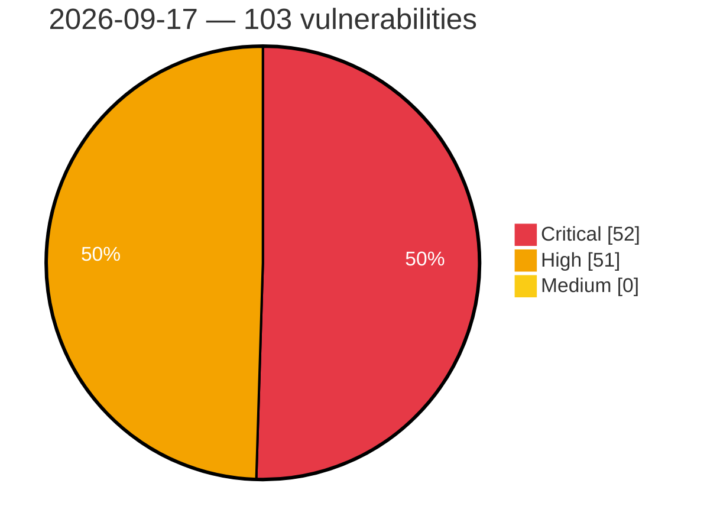

# Critical, High & Medium Severity Vulnerabilities — 2026-09-17

**Source status for this day:**

| Source | Critical | High | Medium | Total |
|--------|---------:|-----:|-------:|------:|
| cvefeed.io (High/Critical) | 52 | 51 | 0 | 103 |

**KEV (actively exploited):** 0  **Watchlist matches:** 59

## Critical (52)

| CVSS | Flags | Source | CVE / Title | Reported |
|------|-------|--------|-------------|----------|
| 10.0 | — | cvefeed.io (High/Critical) | [CVE-2026-92960 - vm2 before 3.11.6 Process-wide State Exposure via os and dns](https://cvefeed.io/vuln/detail/CVE-2026-92960) | 21 minutes ago |
| 10.0 | — | cvefeed.io (High/Critical) | [CVE-2026-92956 - vm2 3.10.1 through 3.11.6 Sandbox Escape via WebAssembly.compileStreaming](https://cvefeed.io/vuln/detail/CVE-2026-92956) | 21 minutes ago |
| 10.0 | — | cvefeed.io (High/Critical) | [CVE-2026-92955 - vm2 before 3.11.8 Sandbox Escape via NodeVM](https://cvefeed.io/vuln/detail/CVE-2026-92955) | 21 minutes ago |
| 10.0 | — | cvefeed.io (High/Critical) | [CVE-2026-92953 - vm2 3.11.0 through 3.11.7 Prototype Pollution via TypedArray](https://cvefeed.io/vuln/detail/CVE-2026-92953) | 21 minutes ago |
| 10.0 | — | cvefeed.io (High/Critical) | [CVE-2026-92947 - vm2 before 3.11.7 Memory Disclosure via Buffer Pool](https://cvefeed.io/vuln/detail/CVE-2026-92947) | 21 minutes ago |
| 10.0 | ⭐ | cvefeed.io (High/Critical) | [CVE-2026-92946 - vm2 before 3.11.7 Remote Code Execution via require.external](https://cvefeed.io/vuln/detail/CVE-2026-92946) | 21 minutes ago |
| 10.0 | — | cvefeed.io (High/Critical) | [CVE-2026-92941 - vm2 3.11.3 before 3.11.7 TLS Trust Store Manipulation](https://cvefeed.io/vuln/detail/CVE-2026-92941) | 21 minutes ago |
| 10.0 | — | cvefeed.io (High/Critical) | [CVE-2026-92940 - vm2 3.11.3 through 3.11.6 HTTPS Credential Exposure via globalAgent](https://cvefeed.io/vuln/detail/CVE-2026-92940) | 21 minutes ago |
| 10.0 | ⭐ | cvefeed.io (High/Critical) | [CVE-2026-92937 - vm2 3.11.6 Remote Code Execution via Promise call/apply](https://cvefeed.io/vuln/detail/CVE-2026-92937) | 21 minutes ago |
| 10.0 | — | cvefeed.io (High/Critical) | [CVE-2026-85889 - Azure AI Foundry Elevation of Privilege Vulnerability](https://cvefeed.io/vuln/detail/CVE-2026-85889) | 16 minutes ago |
| 10.0 | ⭐ | cvefeed.io (High/Critical) | [CVE-2026-83944 - Azure Logic Apps Elevation of Privilege Vulnerability](https://cvefeed.io/vuln/detail/CVE-2026-83944) | 16 minutes ago |
| 10.0 | ⭐ | cvefeed.io (High/Critical) | [CVE-2026-70200 - Azure Logic Apps Elevation of Privilege Vulnerability](https://cvefeed.io/vuln/detail/CVE-2026-70200) | 16 minutes ago |
| 10.0 | — | cvefeed.io (High/Critical) | [CVE-2026-69865 - Microsoft Container Registry Elevation of Privilege Vulnerability](https://cvefeed.io/vuln/detail/CVE-2026-69865) | 16 minutes ago |
| 10.0 | — | cvefeed.io (High/Critical) | [CVE-2026-69399 - Azure Arc Elevation of Privilege Vulnerability](https://cvefeed.io/vuln/detail/CVE-2026-69399) | 16 minutes ago |
| 10.0 | — | cvefeed.io (High/Critical) | [CVE-2026-69843 - Microsoft Fabric Elevation of Privilege Vulnerability](https://cvefeed.io/vuln/detail/CVE-2026-69843) | 30 minutes ago |
| 10.0 | — | cvefeed.io (High/Critical) | [CVE-2026-62874 - Azure Billing Elevation of Privilege Vulnerability](https://cvefeed.io/vuln/detail/CVE-2026-62874) | 30 minutes ago |
| 10.0 | — | cvefeed.io (High/Critical) | [CVE-2026-54734 - Prebid Server Java: Vulnerability to request forgery allows for possible host environment data extraction](https://cvefeed.io/vuln/detail/CVE-2026-54734) | 1 hour, 17 minutes ago |
| 9.9 | ⭐ | cvefeed.io (High/Critical) | [CVE-2026-92957 - vm2 before 3.11.7 Authentication Bypass via node: Prefix](https://cvefeed.io/vuln/detail/CVE-2026-92957) | 21 minutes ago |
| 9.9 | — | cvefeed.io (High/Critical) | [CVE-2026-92951 - vm2 before 3.11.7 Module Allowlist Bypass via Custom Resolver](https://cvefeed.io/vuln/detail/CVE-2026-92951) | 21 minutes ago |
| 9.9 | — | cvefeed.io (High/Critical) | [CVE-2026-92948 - vm2 3.9.6 through 3.11.5 Sandbox Escape via node:test](https://cvefeed.io/vuln/detail/CVE-2026-92948) | 21 minutes ago |
| 9.9 | — | cvefeed.io (High/Critical) | [CVE-2026-92939 - vm2 3.11.3 through 3.11.6 Native Code Execution via crypto.setEngine](https://cvefeed.io/vuln/detail/CVE-2026-92939) | 21 minutes ago |
| 9.9 | ⭐ | cvefeed.io (High/Critical) | [CVE-2026-92938 - vm2 3.11.3 through 3.11.6 Remote Code Execution via node:sqlite](https://cvefeed.io/vuln/detail/CVE-2026-92938) | 21 minutes ago |
| 9.9 | ⭐ | cvefeed.io (High/Critical) | [CVE-2026-85885 - Microsoft 365 Copilot Elevation of Privilege Vulnerability](https://cvefeed.io/vuln/detail/CVE-2026-85885) | 16 minutes ago |
| 9.9 | — | cvefeed.io (High/Critical) | [CVE-2026-85878 - Azure Database for PostgreSQL Elevation of Privilege Vulnerability](https://cvefeed.io/vuln/detail/CVE-2026-85878) | 30 minutes ago |
| 9.8 | ⭐ | cvefeed.io (High/Critical) | [CVE-2026-87796 - Multi Uploader for Gravity Forms <= 1.1.9 - Unauthenticated Arbitrary File Upload via Chunked File Upload](https://cvefeed.io/vuln/detail/CVE-2026-87796) | 5 hours, 1 minute ago |
| 9.8 | — | cvefeed.io (High/Critical) | [CVE-2026-92944 - vm2 3.10.2 through 3.11.6 Sandbox Escape via Promise Protector](https://cvefeed.io/vuln/detail/CVE-2026-92944) | 21 minutes ago |
| 9.8 | ⭐ | cvefeed.io (High/Critical) | [CVE-2026-86863 - pgAdmin 4: Authentication bypass via a client-controlled identity header in Webserver authentication mode](https://cvefeed.io/vuln/detail/CVE-2026-86863) | 47 minutes ago |
| 9.8 | — | cvefeed.io (High/Critical) | [CVE-2026-54627 - SAIL: Heap out-of-bounds write in SAIL PSD decoder (Bitmap mode ignores depth)](https://cvefeed.io/vuln/detail/CVE-2026-54627) | 32 minutes ago |
| 9.8 | — | cvefeed.io (High/Critical) | [CVE-2026-54626 - SAIL: Heap out-of-bounds write in SAIL TGA decoder (indexed-RLE bpp/stride mismatch)](https://cvefeed.io/vuln/detail/CVE-2026-54626) | 32 minutes ago |
| 9.8 | ⭐ | cvefeed.io (High/Critical) | [CVE-2026-54617 - GravitLauncher: Unauthenticated path traversal in LaunchServer FileServerHandler](https://cvefeed.io/vuln/detail/CVE-2026-54617) | 1 hour, 32 minutes ago |
| 9.6 | ⭐ | cvefeed.io (High/Critical) | [CVE-2026-54752 - NetBox Device Type Library: Insecure Pickle Deserialization in Test Suite Allows Remote Code Execution via Malicious Pull Request](https://cvefeed.io/vuln/detail/CVE-2026-54752) | 32 minutes ago |
| 9.6 | ⭐ | cvefeed.io (High/Critical) | [CVE-2026-54053 - Many Notes: Path Traversal via ZIP import allows arbitrary file write and stored XSS in other users' vaults](https://cvefeed.io/vuln/detail/CVE-2026-54053) | 2 hours, 33 minutes ago |
| 9.6 | — | cvefeed.io (High/Critical) | [CVE-2026-87701 - Azure Cosmos DB Elevation of Privilege Vulnerability](https://cvefeed.io/vuln/detail/CVE-2026-87701) | 16 minutes ago |
| 9.5 | ⭐ | cvefeed.io (High/Critical) | [CVE-2026-92935 - vm2 NodeVM Remote Code Execution via Array-Shaped Require](https://cvefeed.io/vuln/detail/CVE-2026-92935) | 21 minutes ago |
| 9.5 | ⭐ | cvefeed.io (High/Critical) | [CVE-2026-92934 - vm2 before 3.11.8 Sandbox Escape RCE via AggregateError](https://cvefeed.io/vuln/detail/CVE-2026-92934) | 21 minutes ago |
| 9.4 | ⭐ | cvefeed.io (High/Critical) | [CVE-2026-54618 - Obsidian Web MCP: Unauthenticated vault access: /oauth/authorize auto-approves without authenticating the user](https://cvefeed.io/vuln/detail/CVE-2026-54618) | 32 minutes ago |
| 9.3 | — | cvefeed.io (High/Critical) | [CVE-2026-92950 - vm2 before 3.11.7 Sandbox Escape via CLI require](https://cvefeed.io/vuln/detail/CVE-2026-92950) | 21 minutes ago |
| 9.3 | ⭐ | cvefeed.io (High/Critical) | [CVE-2026-70009 - Azure Arc Elevation of Privilege Vulnerability](https://cvefeed.io/vuln/detail/CVE-2026-70009) | 16 minutes ago |
| 9.2 | ⭐ | cvefeed.io (High/Critical) | [CVE-2026-15688 - Password Authentication Bypass Vulnerability in GX Works3 and Motion Control Setting](https://cvefeed.io/vuln/detail/CVE-2026-15688) | 1 hour, 1 minute ago |
| 9.2 | ⭐ | cvefeed.io (High/Critical) | [CVE-2026-92954 - vm2 3.10.0 through 3.11.5 Denial of Service via Host Promise](https://cvefeed.io/vuln/detail/CVE-2026-92954) | 21 minutes ago |
| 9.2 | — | cvefeed.io (High/Critical) | [CVE-2026-76834 - b2evolution CMS 6.7.8 through 7.2.5 Object Injection via Negative Integer Array Key](https://cvefeed.io/vuln/detail/CVE-2026-76834) | 47 minutes ago |
| 9.2 | ⭐ | cvefeed.io (High/Critical) | [CVE-2026-79752 - CakePHP: Multiple methods in FunctionsBuilder vulnerable to SQL injection](https://cvefeed.io/vuln/detail/CVE-2026-79752) | 1 hour, 48 minutes ago |
| 9.2 | — | cvefeed.io (High/Critical) | [CVE-2026-93393 - Heap overflow via oversized decrypted TLS record sequence in Windows Secure Channel stream](https://cvefeed.io/vuln/detail/CVE-2026-93393) | 23 minutes ago |
| 9.2 | ⭐ | cvefeed.io (High/Critical) | [CVE-2026-92943 - Improper validation of certificate with host mismatch in AWS IoT Device SDK for Python](https://cvefeed.io/vuln/detail/CVE-2026-92943) | 30 minutes ago |
| 9.1 | ⭐ | cvefeed.io (High/Critical) | [CVE-2026-91039 - dynamic_oidc identities are not namespaced by connection in ash_authentication, allowing cross-connection account takeover](https://cvefeed.io/vuln/detail/CVE-2026-91039) | 46 minutes ago |
| 9.1 | ⭐ | cvefeed.io (High/Critical) | [CVE-2026-88952 - OAuth2 sign-in attached to an existing account without an email comparison in AshAuthentication](https://cvefeed.io/vuln/detail/CVE-2026-88952) | 1 hour, 48 minutes ago |
| 9.1 | ⭐ | cvefeed.io (High/Critical) | [CVE-2026-63472 - Vendure: External-authentication account takeover: external login linked to a pre-existing account by email without verification](https://cvefeed.io/vuln/detail/CVE-2026-63472) | 1 hour, 48 minutes ago |
| 9.1 | ⭐ | cvefeed.io (High/Critical) | [CVE-2026-76949 - Remember-me sign-in guard reads a session key that is never written in ash_authentication, allowing session replacement](https://cvefeed.io/vuln/detail/CVE-2026-76949) | 1 hour, 17 minutes ago |
| 9.1 | ⭐ | cvefeed.io (High/Critical) | [CVE-2026-54767 - WeGIA: Hardcoded Secret Key Backdoor — Mass Data Destruction via deletar_socios.php](https://cvefeed.io/vuln/detail/CVE-2026-54767) | 1 hour, 17 minutes ago |
| 9.1 | ⭐ | cvefeed.io (High/Critical) | [CVE-2026-54670 - WeGIA: Unauthenticated Auth Bypass + Local File Inclusion](https://cvefeed.io/vuln/detail/CVE-2026-54670) | 1 hour, 17 minutes ago |
| 9.0 | ⭐ | cvefeed.io (High/Critical) | [CVE-2026-47252 - Anyquery: AppleScript/JXA Code Injection via Unescaped URL in macOS plugins (Brave, Chrome, Edge, Reminders, Safari)](https://cvefeed.io/vuln/detail/CVE-2026-47252) | 1 hour, 32 minutes ago |
| 9.0 | ⭐ | cvefeed.io (High/Critical) | [CVE-2026-77903 - Microsoft Dataverse Elevation of Privilege Vulnerability](https://cvefeed.io/vuln/detail/CVE-2026-77903) | 16 minutes ago |

## High (51)

| CVSS | Flags | Source | CVE / Title | Reported |
|------|-------|--------|-------------|----------|
| 8.9 | ⭐ | cvefeed.io (High/Critical) | [CVE-2026-92952 - vm2 3.11.4 through 3.11.6 Sandbox Symbol Filtering Bypass](https://cvefeed.io/vuln/detail/CVE-2026-92952) | 21 minutes ago |
| 8.8 | ⭐ | cvefeed.io (High/Critical) | [CVE-2026-25283 - Stack-based Buffer Overflow in OOBM](https://cvefeed.io/vuln/detail/CVE-2026-25283) | 44 minutes ago |
| 8.8 | ⭐ | cvefeed.io (High/Critical) | [CVE-2026-86801 - To Do List Member 1.4 - 1.6 - Unauthenticated Stored XSS, File Listing and Deletion via Unprotected Upload Handler](https://cvefeed.io/vuln/detail/CVE-2026-86801) | 3 hours, 2 minutes ago |
| 8.8 | — | cvefeed.io (High/Critical) | [CVE-2026-92972 - SGLang through 0.5.19 Unauthenticated Route Poisoning via PUT endpoint](https://cvefeed.io/vuln/detail/CVE-2026-92972) | 24 minutes ago |
| 8.8 | ⭐ | cvefeed.io (High/Critical) | [CVE-2026-28326 - SolarWinds Access Rights Manager Unauthenticated Remote Code Execution Vulnerability](https://cvefeed.io/vuln/detail/CVE-2026-28326) | 34 minutes ago |
| 8.8 | ⭐ | cvefeed.io (High/Critical) | [CVE-2026-89036 - Appwrite < 2.0.0 Argument Injection via providerRootDirectory Parameter](https://cvefeed.io/vuln/detail/CVE-2026-89036) | 46 minutes ago |
| 8.8 | — | cvefeed.io (High/Critical) | [CVE-2026-86864 - pgAdmin 4: Argument and connection-string injection via the database field in the Backup tool](https://cvefeed.io/vuln/detail/CVE-2026-86864) | 47 minutes ago |
| 8.8 | ⭐ | cvefeed.io (High/Critical) | [CVE-2026-92986 - SiYuan before 3.8.4 Cross-Site Scripting via Document Title](https://cvefeed.io/vuln/detail/CVE-2026-92986) | 1 hour, 48 minutes ago |
| 8.8 | ⭐ | cvefeed.io (High/Critical) | [CVE-2026-92985 - SiYuan before 3.8.4 Cross-Site Scripting via Bookmark Labels](https://cvefeed.io/vuln/detail/CVE-2026-92985) | 1 hour, 48 minutes ago |
| 8.8 | ⭐ | cvefeed.io (High/Critical) | [CVE-2026-77614 - Opencast: Session fixation in login enables account takeover via crafted link](https://cvefeed.io/vuln/detail/CVE-2026-77614) | 1 hour, 48 minutes ago |
| 8.8 | ⭐ | cvefeed.io (High/Critical) | [CVE-2026-54504 - MCP Documentation Server: Web UI API binds to all interfaces without authentication by default](https://cvefeed.io/vuln/detail/CVE-2026-54504) | 1 hour, 32 minutes ago |
| 8.8 | ⭐ | cvefeed.io (High/Critical) | [CVE-2026-54239 - FaustWP  — Authentication Bypass via Initialization Vector Modification in Token Envelope](https://cvefeed.io/vuln/detail/CVE-2026-54239) | 1 hour, 32 minutes ago |
| 8.8 | ⭐ | cvefeed.io (High/Critical) | [CVE-2026-54671 - WeGIA: Authorization Bypass via Empty Resource Array in InternoControle](https://cvefeed.io/vuln/detail/CVE-2026-54671) | 1 hour, 17 minutes ago |
| 8.8 | ⭐ | cvefeed.io (High/Critical) | [CVE-2026-54612 - Vvveb: Authenticated editor path traversal to PHP file write/RCE via data-v-save-global](https://cvefeed.io/vuln/detail/CVE-2026-54612) | 1 hour, 17 minutes ago |
| 8.8 | ⭐ | cvefeed.io (High/Critical) | [CVE-2026-54519 - AI Agent Automation: Missing ownership checks in memory APIs allow cross-user memory read and deletion](https://cvefeed.io/vuln/detail/CVE-2026-54519) | 1 hour, 17 minutes ago |
| 8.7 | ⭐ | cvefeed.io (High/Critical) | [CVE-2026-92961 - vm2 before 3.11.6 Memory Exhaustion DoS via bufferAllocLimit Bypass](https://cvefeed.io/vuln/detail/CVE-2026-92961) | 21 minutes ago |
| 8.7 | ⭐ | cvefeed.io (High/Critical) | [CVE-2026-92942 - vm2 before 3.11.7 Timeout Bypass via FinalizationRegistry](https://cvefeed.io/vuln/detail/CVE-2026-92942) | 21 minutes ago |
| 8.7 | ⭐ | cvefeed.io (High/Critical) | [CVE-2026-69197 - Umbraco: Delivery API leaks protected (Public Access) content through Content Picker / Multi-Node Tree Picker expansion](https://cvefeed.io/vuln/detail/CVE-2026-69197) | 47 minutes ago |
| 8.7 | — | cvefeed.io (High/Critical) | [CVE-2026-92987 - roxmltree through 0.21.1 Denial of Service via Quadratic Parsing](https://cvefeed.io/vuln/detail/CVE-2026-92987) | 1 hour, 48 minutes ago |
| 8.7 | — | cvefeed.io (High/Critical) | [CVE-2026-92983 - InternLM LMDeploy through 0.17.0 Memory Exhaustion via Session ID Mismatch](https://cvefeed.io/vuln/detail/CVE-2026-92983) | 1 hour, 48 minutes ago |
| 8.7 | ⭐ | cvefeed.io (High/Critical) | [CVE-2026-63459 - Vendure: Stored XSS in the Admin Dashboard via unsafe HTML-stripping (innerHTML) of entity descriptions](https://cvefeed.io/vuln/detail/CVE-2026-63459) | 1 hour, 48 minutes ago |
| 8.7 | — | cvefeed.io (High/Critical) | [CVE-2026-54571 - ESPAsyncWebServer: Integer overflow in multipart boundary parser causes denial of service](https://cvefeed.io/vuln/detail/CVE-2026-54571) | 1 hour, 32 minutes ago |
| 8.7 | ⭐ | cvefeed.io (High/Critical) | [CVE-2026-52836 - OpenDDS: out-of-bounds `rd_ptr` dereference in `RtpsSampleHeader::init` — triggered by malformed RTPS submessage, remotely exploitable denial of service](https://cvefeed.io/vuln/detail/CVE-2026-52836) | 2 hours, 33 minutes ago |
| 8.7 | — | cvefeed.io (High/Critical) | [CVE-2026-93436 - vLLM through 0.29.0 Memory Exhaustion via Rejected Requests](https://cvefeed.io/vuln/detail/CVE-2026-93436) | 16 minutes ago |
| 8.7 | — | cvefeed.io (High/Critical) | [CVE-2026-93435 - redis-parser through 3.0.0 Denial of Service via Unbounded Recursion](https://cvefeed.io/vuln/detail/CVE-2026-93435) | 16 minutes ago |
| 8.6 | ⭐ | cvefeed.io (High/Critical) | [CVE-2026-87963 - Yo 1.1 - 1.3.1 - Unauthenticated SQL Injection via username Parameter](https://cvefeed.io/vuln/detail/CVE-2026-87963) | 3 hours, 2 minutes ago |
| 8.6 | ⭐ | cvefeed.io (High/Critical) | [CVE-2026-92980 - HortusFox-Web < 6.1 Remote Code Execution via Import/Export](https://cvefeed.io/vuln/detail/CVE-2026-92980) | 1 hour, 1 minute ago |
| 8.6 | — | cvefeed.io (High/Critical) | [CVE-2026-19477 - Stack-based Buffer Overflow Vulnerability in Linux (uldaq)](https://cvefeed.io/vuln/detail/CVE-2026-19477) | 1 hour, 33 minutes ago |
| 8.6 | — | cvefeed.io (High/Critical) | [CVE-2026-68791 - Azure Machine Learning Information Disclosure Vulnerability](https://cvefeed.io/vuln/detail/CVE-2026-68791) | 16 minutes ago |
| 8.5 | ⭐ | cvefeed.io (High/Critical) | [CVE-2026-92958 - vm2 before 3.11.7 Denylist Bypass via fs/promises](https://cvefeed.io/vuln/detail/CVE-2026-92958) | 21 minutes ago |
| 8.5 | ⭐ | cvefeed.io (High/Critical) | [CVE-2026-93292 - SigNoz 0.88.0 before 0.142.1 - SQL Injection in Trace Funnel Analytics Query Builders](https://cvefeed.io/vuln/detail/CVE-2026-93292) | 38 minutes ago |
| 8.5 | — | cvefeed.io (High/Critical) | [CVE-2026-92984 - HUBzero CMS through 2.2.32 Session Fixation via Query-String Session Identifier](https://cvefeed.io/vuln/detail/CVE-2026-92984) | 1 hour, 48 minutes ago |
| 8.5 | — | cvefeed.io (High/Critical) | [CVE-2026-71538 - @cyclonedx/cyclonedx-npm: Shell Injection via Unsanitized --workspace Argument on Windows](https://cvefeed.io/vuln/detail/CVE-2026-71538) | 1 hour, 48 minutes ago |
| 8.5 | ⭐ | cvefeed.io (High/Critical) | [CVE-2026-93337 - NetworkManager-l2tp Privilege Escalation via pppd Plugin Injection](https://cvefeed.io/vuln/detail/CVE-2026-93337) | 30 minutes ago |
| 8.5 | ⭐ | cvefeed.io (High/Critical) | [CVE-2026-93426 - SigNoz 0.87.0 before 0.142.0 - SQL Injection in v5 Query Builder Field Key Names](https://cvefeed.io/vuln/detail/CVE-2026-93426) | 1 hour, 17 minutes ago |
| 8.4 | ⭐ | cvefeed.io (High/Critical) | [CVE-2026-55062 - uniget: Path Traversal in Hook Files - Directory Escape Vulnerability](https://cvefeed.io/vuln/detail/CVE-2026-55062) | 1 hour, 32 minutes ago |
| 8.3 | — | cvefeed.io (High/Critical) | [CVE-2026-54583 - mport package bundle downloads allow unsafe destination filenames](https://cvefeed.io/vuln/detail/CVE-2026-54583) | 3 hours, 33 minutes ago |
| 8.3 | — | cvefeed.io (High/Critical) | [CVE-2026-54581 - mport bootstrap index fetch can continue after hash verification failure](https://cvefeed.io/vuln/detail/CVE-2026-54581) | 3 hours, 33 minutes ago |
| 8.3 | — | cvefeed.io (High/Critical) | [CVE-2026-54580 - mport index decompression can leave partial or corrupt index data after zstd failures](https://cvefeed.io/vuln/detail/CVE-2026-54580) | 3 hours, 33 minutes ago |
| 8.2 | — | cvefeed.io (High/Critical) | [CVE-2026-86039 - libp2p: PeerStore accepts attacker-signed PeerRecords for a victim peer ID and stores certified attacker addresses](https://cvefeed.io/vuln/detail/CVE-2026-86039) | 47 minutes ago |
| 8.2 | — | cvefeed.io (High/Critical) | [CVE-2026-56795 - Dell Server Update Utility Uncontrolled Search Path Element Vulnerability](https://cvefeed.io/vuln/detail/CVE-2026-56795) | 47 minutes ago |
| 8.2 | ⭐ | cvefeed.io (High/Critical) | [CVE-2026-85077 - Sanic: HTTP response header injection via missing CR/LF validation in Sanic HTTP/1.1 responses](https://cvefeed.io/vuln/detail/CVE-2026-85077) | 1 hour, 48 minutes ago |
| 8.2 | — | cvefeed.io (High/Critical) | [CVE-2026-54451 - Elixir protobuf: Unbounded recursion depth in embedded-message decoding](https://cvefeed.io/vuln/detail/CVE-2026-54451) | 1 hour, 32 minutes ago |
| 8.2 | ⭐ | cvefeed.io (High/Critical) | [CVE-2026-54253 - TS3 Manager: Reflected XSS via /api/download port parameter steals operator session](https://cvefeed.io/vuln/detail/CVE-2026-54253) | 1 hour, 32 minutes ago |
| 8.2 | — | cvefeed.io (High/Critical) | [CVE-2026-83946 - Azure Portal Spoofing Vulnerability](https://cvefeed.io/vuln/detail/CVE-2026-83946) | 30 minutes ago |
| 8.1 | ⭐ | cvefeed.io (High/Critical) | [CVE-2026-87935 - Paid Downloads <= 3.15 - Unauthenticated Arbitrary File Upload via 'paiddownloads_update_file' Action](https://cvefeed.io/vuln/detail/CVE-2026-87935) | 5 hours, 1 minute ago |
| 8.1 | — | cvefeed.io (High/Critical) | [CVE-2026-81442 - Dell OpenManage Server Administrator Improper Privilege Management Vulnerability](https://cvefeed.io/vuln/detail/CVE-2026-81442) | 20 minutes ago |
| 8.1 | — | cvefeed.io (High/Critical) | [CVE-2026-26950 - Dell SmartFabric Manager Insufficient Verification of Data Authenticity Vulnerability](https://cvefeed.io/vuln/detail/CVE-2026-26950) | 1 hour, 48 minutes ago |
| 8.1 | ⭐ | cvefeed.io (High/Critical) | [CVE-2026-54446 - NetLicensing MCP Server: Unauthenticated Use of Server-Side NetLicensing API Key in HTTP Mode](https://cvefeed.io/vuln/detail/CVE-2026-54446) | 2 hours, 33 minutes ago |
| 8.1 | ⭐ | cvefeed.io (High/Critical) | [CVE-2026-54520 - AI Agent Automation: Workflow file step path traversal allows read and write outside the expected directory](https://cvefeed.io/vuln/detail/CVE-2026-54520) | 1 hour, 17 minutes ago |
| 8.0 | ⭐ | cvefeed.io (High/Critical) | [CVE-2026-78428 - Flaw in Nuevector can result in one user receiving another user's authenticated session when multiple SSO login attempts occur concurrently](https://cvefeed.io/vuln/detail/CVE-2026-78428) | 59 minutes ago |
