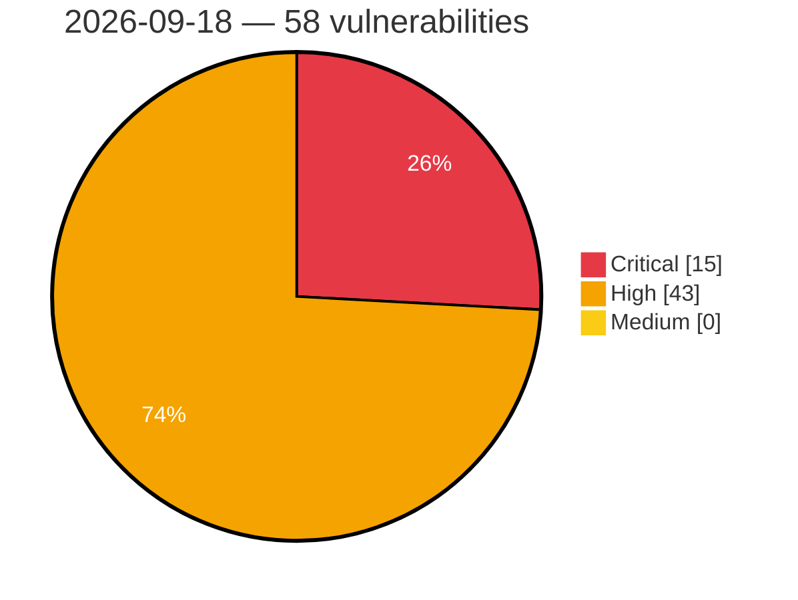

# Critical, High & Medium Severity Vulnerabilities — 2026-09-18

**Source status for this day:**

| Source | Critical | High | Medium | Total |
|--------|---------:|-----:|-------:|------:|
| cvefeed.io (High/Critical) | 15 | 43 | 0 | 58 |

**KEV (actively exploited):** 0  **Watchlist matches:** 38

## Critical (15)

| CVSS | Flags | Source | CVE / Title | Reported |
|------|-------|--------|-------------|----------|
| 10.0 | — | cvefeed.io (High/Critical) | [CVE-2026-10747 - IBM MQ Appliance is affected by a heap buffer overflow vulnerability in protocol message processing](https://cvefeed.io/vuln/detail/CVE-2026-10747) | 43 minutes ago |
| 9.9 | ⭐ | cvefeed.io (High/Critical) | [CVE-2026-61682 - kcp front-proxy does not strip inbound X-Remote-* identity headers, allowing any authenticated client to inject groups/warrants and impersonate system:masters in any workspace](https://cvefeed.io/vuln/detail/CVE-2026-61682) | 43 minutes ago |
| 9.9 | — | cvefeed.io (High/Critical) | [CVE-2026-10858 - IBM MQ for HPE NonStop is vulnerable to a denial of service attack](https://cvefeed.io/vuln/detail/CVE-2026-10858) | 43 minutes ago |
| 9.9 | ⭐ | cvefeed.io (High/Critical) | [CVE-2025-53837 - org.xwiki.rendering:xwiki-rendering-xml has an Eval Injection issue](https://cvefeed.io/vuln/detail/CVE-2025-53837) | 43 minutes ago |
| 9.8 | ⭐ | cvefeed.io (High/Critical) | [CVE-2026-93467 - HGiga｜OAKlouds - Insecure Deserialization](https://cvefeed.io/vuln/detail/CVE-2026-93467) | 1 hour, 28 minutes ago |
| 9.8 | — | cvefeed.io (High/Critical) | [CVE-2026-13639 - Synology DiskStation Manager Insufficient Entropy Vulnerability](https://cvefeed.io/vuln/detail/CVE-2026-13639) | 38 minutes ago |
| 9.8 | ⭐ | cvefeed.io (High/Critical) | [CVE-2026-13684 - Synology DiskStation Manager SCGI Improper Output Neutralization Vulnerability](https://cvefeed.io/vuln/detail/CVE-2026-13684) | 40 minutes ago |
| 9.8 | ⭐ | cvefeed.io (High/Critical) | [CVE-2026-67100 - HCL BigFix Service Management is affected by multiple security vulnerabilities.](https://cvefeed.io/vuln/detail/CVE-2026-67100) | 43 minutes ago |
| 9.8 | — | cvefeed.io (High/Critical) | [CVE-2026-81321 - CareCam CM2507 Cleartext Storage of Sensitive Information](https://cvefeed.io/vuln/detail/CVE-2026-81321) | 37 minutes ago |
| 9.8 | — | cvefeed.io (High/Critical) | [CVE-2026-85497 - CareCam CM2507 Use of Password Hash With Insufficient Computational Effort](https://cvefeed.io/vuln/detail/CVE-2026-85497) | 41 minutes ago |
| 9.8 | — | cvefeed.io (High/Critical) | [CVE-2026-84383 - libheif: Heap buffer overflow in `scale_nearest_neighbor()` via duplicate Alpha planes from nested `iden`/`auxl` items](https://cvefeed.io/vuln/detail/CVE-2026-84383) | 43 minutes ago |
| 9.4 | ⭐ | cvefeed.io (High/Critical) | [CVE-2026-28198 - Privilege Escalation via Cryptographic Signature Verification Bypass in NetBackup Flex OS Shell](https://cvefeed.io/vuln/detail/CVE-2026-28198) | 42 minutes ago |
| 9.4 | ⭐ | cvefeed.io (High/Critical) | [CVE-2026-28197 - Privilege Escalation via Argument Injection in NetBackup Flex OS Shell](https://cvefeed.io/vuln/detail/CVE-2026-28197) | 42 minutes ago |
| 9.3 | ⭐ | cvefeed.io (High/Critical) | [CVE-2026-67101 - HCL BigFix Service Management is affected by multiple security vulnerabilities.](https://cvefeed.io/vuln/detail/CVE-2026-67101) | 43 minutes ago |
| 9.1 | ⭐ | cvefeed.io (High/Critical) | [CVE-2026-84738 - AF Companion < 2.2.0 - Shop Manager+ Arbitrary File Upload to RCE](https://cvefeed.io/vuln/detail/CVE-2026-84738) | 6 hours, 43 minutes ago |

## High (43)

| CVSS | Flags | Source | CVE / Title | Reported |
|------|-------|--------|-------------|----------|
| 8.8 | ⭐ | cvefeed.io (High/Critical) | [CVE-2026-17086 - ShortPixel Image Optimizer <= 6.5.5 - Authenticated (Author+) PHP Object Injection via Nested JSON Post Content](https://cvefeed.io/vuln/detail/CVE-2026-17086) | 27 minutes ago |
| 8.8 | ⭐ | cvefeed.io (High/Critical) | [CVE-2026-13673 - Synology DiskStation Manager LDAP API Improper Privilege Management Vulnerability](https://cvefeed.io/vuln/detail/CVE-2026-13673) | 38 minutes ago |
| 8.8 | ⭐ | cvefeed.io (High/Critical) | [CVE-2026-12954 - Mapster WP Maps <= 1.23.0 - Authenticated (Subscriber+) Arbitrary User Meta Write via 'acf-photo-gallery-groups' Parameter](https://cvefeed.io/vuln/detail/CVE-2026-12954) | 43 minutes ago |
| 8.8 | ⭐ | cvefeed.io (High/Critical) | [CVE-2026-12384 - Broken Access Control in TECHIN2B Application](https://cvefeed.io/vuln/detail/CVE-2026-12384) | 43 minutes ago |
| 8.8 | — | cvefeed.io (High/Critical) | [CVE-2026-15579 - Ethernet Switch Web Interface Buffer Overflow Denial of Service](https://cvefeed.io/vuln/detail/CVE-2026-15579) | 2 hours, 43 minutes ago |
| 8.8 | ⭐ | cvefeed.io (High/Critical) | [CVE-2026-88825 - iGMS Direct Booking < 2.0 - Unauthenticated Stored XSS via Widget Settings](https://cvefeed.io/vuln/detail/CVE-2026-88825) | 6 hours, 43 minutes ago |
| 8.8 | ⭐ | cvefeed.io (High/Critical) | [CVE-2026-85127 - VikBooking 1.8.8 - 1.8.14 - Unauthenticated Stored XSS via SVG Chat Attachment](https://cvefeed.io/vuln/detail/CVE-2026-85127) | 6 hours, 43 minutes ago |
| 8.8 | ⭐ | cvefeed.io (High/Critical) | [CVE-2026-85122 - Easy Form Builder 4.0.0 - 4.1.3 - Unauthenticated Stored XSS via Form Type Confusion](https://cvefeed.io/vuln/detail/CVE-2026-85122) | 6 hours, 43 minutes ago |
| 8.8 | ⭐ | cvefeed.io (High/Critical) | [CVE-2026-81942 - PLANET IGS-5225-8P2T4S V1/V2 OS Command Injection via Web Server](https://cvefeed.io/vuln/detail/CVE-2026-81942) | 43 minutes ago |
| 8.8 | — | cvefeed.io (High/Critical) | [CVE-2026-11381 - IBM MQ for HPE NonStop is vulnerable to a denial of service issue](https://cvefeed.io/vuln/detail/CVE-2026-11381) | 43 minutes ago |
| 8.8 | ⭐ | cvefeed.io (High/Critical) | [CVE-2026-11378 - IBM MQ queue manager is vulnerable to remote code execution](https://cvefeed.io/vuln/detail/CVE-2026-11378) | 43 minutes ago |
| 8.8 | ⭐ | cvefeed.io (High/Critical) | [CVE-2026-11375 - IBM MQ queue manager is vulnerable to remote code execution](https://cvefeed.io/vuln/detail/CVE-2026-11375) | 43 minutes ago |
| 8.8 | ⭐ | cvefeed.io (High/Critical) | [CVE-2026-10575 - IBM MQ queue manager is vulnerable to remote code execution](https://cvefeed.io/vuln/detail/CVE-2026-10575) | 43 minutes ago |
| 8.7 | ⭐ | cvefeed.io (High/Critical) | [CVE-2026-93468 - HGiga｜OAKlouds - Arbitrary File Read](https://cvefeed.io/vuln/detail/CVE-2026-93468) | 1 hour, 28 minutes ago |
| 8.7 | — | cvefeed.io (High/Critical) | [CVE-2026-79954 - NASA CryptoLib 1.5.0 - TC receive path accepts Security Associations from the wrong GVCID](https://cvefeed.io/vuln/detail/CVE-2026-79954) | 3 hours, 28 minutes ago |
| 8.7 | ⭐ | cvefeed.io (High/Critical) | [CVE-2026-93453 - SOGo before 5.12.11 Password Reset Token Interception via Origin Header](https://cvefeed.io/vuln/detail/CVE-2026-93453) | 4 hours, 27 minutes ago |
| 8.7 | — | cvefeed.io (High/Critical) | [CVE-2026-93452 - snappy-java through 1.1.10.8 Buffer Overflow in Snappy.compress](https://cvefeed.io/vuln/detail/CVE-2026-93452) | 4 hours, 27 minutes ago |
| 8.7 | ⭐ | cvefeed.io (High/Critical) | [CVE-2026-93450 - go-openapi/swag jsonutils before 0.27.1 Uncontrolled Recursion in Ordered JSON Marshal and Unmarshal](https://cvefeed.io/vuln/detail/CVE-2026-93450) | 4 hours, 27 minutes ago |
| 8.7 | — | cvefeed.io (High/Critical) | [CVE-2026-93690 - uri-js through 4.4.1 Denial of Service via removeDotSegments](https://cvefeed.io/vuln/detail/CVE-2026-93690) | 43 minutes ago |
| 8.7 | — | cvefeed.io (High/Critical) | [CVE-2026-93688 - SGLang through 0.5.19 Unbounded Memory Allocation via bootstrap_room](https://cvefeed.io/vuln/detail/CVE-2026-93688) | 43 minutes ago |
| 8.7 | — | cvefeed.io (High/Critical) | [CVE-2026-93687 - braces through 3.0.3 Stack Overflow via Deeply Nested Patterns](https://cvefeed.io/vuln/detail/CVE-2026-93687) | 43 minutes ago |
| 8.7 | — | cvefeed.io (High/Critical) | [CVE-2026-88259 - CareCam CM2507 Missing Authentication for Critical Function](https://cvefeed.io/vuln/detail/CVE-2026-88259) | 43 minutes ago |
| 8.7 | — | cvefeed.io (High/Critical) | [CVE-2026-86520 - Use of Hard-coded Credentials in Bransys ELD](https://cvefeed.io/vuln/detail/CVE-2026-86520) | 43 minutes ago |
| 8.7 | — | cvefeed.io (High/Critical) | [CVE-2026-84398 - CareCam CM2507 Empty Password in Configuration File](https://cvefeed.io/vuln/detail/CVE-2026-84398) | 43 minutes ago |
| 8.7 | ⭐ | cvefeed.io (High/Critical) | [CVE-2026-68914 - Mojolicious pure-Perl Mojo::JSON decoder allows memory exhaustion via deeply nested data](https://cvefeed.io/vuln/detail/CVE-2026-68914) | 43 minutes ago |
| 8.6 | ⭐ | cvefeed.io (High/Critical) | [CVE-2026-87775 - Tz Weekly Radio Schedule <= 1.8.1 - Unauthenticated SQLi via tzwrs_update_cell](https://cvefeed.io/vuln/detail/CVE-2026-87775) | 6 hours, 43 minutes ago |
| 8.6 | ⭐ | cvefeed.io (High/Critical) | [CVE-2026-87774 - Tz Weekly Radio Schedule <= 1.8.1 - Unauthenticated SQL Injection via week](https://cvefeed.io/vuln/detail/CVE-2026-87774) | 6 hours, 43 minutes ago |
| 8.6 | ⭐ | cvefeed.io (High/Critical) | [CVE-2026-87771 - Product Question and Answer <= 1.1.0 - Unauthenticated SQL Injection via p_id and read](https://cvefeed.io/vuln/detail/CVE-2026-87771) | 6 hours, 43 minutes ago |
| 8.6 | ⭐ | cvefeed.io (High/Critical) | [CVE-2026-87770 - Price Drop Alert for WooCommerce <= 1.1 - Unauthenticated SQL Injection via product](https://cvefeed.io/vuln/detail/CVE-2026-87770) | 6 hours, 43 minutes ago |
| 8.6 | ⭐ | cvefeed.io (High/Critical) | [CVE-2026-87767 - WP Shortcut Link <= 1.2.0 - Unauthenticated SQL Injection via url](https://cvefeed.io/vuln/detail/CVE-2026-87767) | 6 hours, 43 minutes ago |
| 8.6 | ⭐ | cvefeed.io (High/Critical) | [CVE-2025-61682 - Semantic MediaWiki vulnerable to stored XSS through wikitext via improper use of non-reserved data attributes](https://cvefeed.io/vuln/detail/CVE-2025-61682) | 43 minutes ago |
| 8.4 | ⭐ | cvefeed.io (High/Critical) | [CVE-2026-93456 - django-page-cms through 2.0.13 CSRF via admin mutation views](https://cvefeed.io/vuln/detail/CVE-2026-93456) | 2 hours, 28 minutes ago |
| 8.4 | ⭐ | cvefeed.io (High/Critical) | [CVE-2026-81943 - PLANET IGS-5225-8P2T4S V1/V2 Debug Mode RCE](https://cvefeed.io/vuln/detail/CVE-2026-81943) | 43 minutes ago |
| 8.3 | ⭐ | cvefeed.io (High/Critical) | [CVE-2026-93371 - marcopiovanello yt-dlp-web-ui generic.go NewGenericDownload command injection](https://cvefeed.io/vuln/detail/CVE-2026-93371) | 1 hour, 28 minutes ago |
| 8.3 | ⭐ | cvefeed.io (High/Critical) | [CVE-2026-63638 - OpenImageIO: Cineon invalid bit depth heap out-of-bounds write](https://cvefeed.io/vuln/detail/CVE-2026-63638) | 43 minutes ago |
| 8.2 | — | cvefeed.io (High/Critical) | [CVE-2026-86689 - Cleartext Transmission of Sensitive Information in Bransys ELD](https://cvefeed.io/vuln/detail/CVE-2026-86689) | 43 minutes ago |
| 8.1 | ⭐ | cvefeed.io (High/Critical) | [CVE-2026-6205 - Synology DiskStation Manager Upload API Arbitrary File Write Vulnerability](https://cvefeed.io/vuln/detail/CVE-2026-6205) | 37 minutes ago |
| 8.1 | ⭐ | cvefeed.io (High/Critical) | [CVE-2026-67102 - HCL BigFix Service Management is affected by multiple security vulnerabilities.](https://cvefeed.io/vuln/detail/CVE-2026-67102) | 43 minutes ago |
| 8.1 | — | cvefeed.io (High/Critical) | [CVE-2026-89413 - Filter Gallery <= 1.1.4 - Missing Authorization to Authenticated (Subscriber+) Arbitrary Gallery Deletion via 'ufg_gallery_id' Parameter](https://cvefeed.io/vuln/detail/CVE-2026-89413) | 1 hour, 43 minutes ago |
| 8.1 | — | cvefeed.io (High/Critical) | [CVE-2026-85410 - Master Addons for Elementor <= 3.2.2 - Missing Authorization to Authenticated (Contributor+) Arbitrary Post Modification/Deletion via 'popup_id' Parameter](https://cvefeed.io/vuln/detail/CVE-2026-85410) | 3 hours, 43 minutes ago |
| 8.1 | — | cvefeed.io (High/Critical) | [CVE-2026-54148 - http4k: `DigestAuthProvider.verify` did not bind to request URI](https://cvefeed.io/vuln/detail/CVE-2026-54148) | 43 minutes ago |
| 8.1 | ⭐ | cvefeed.io (High/Critical) | [CVE-2026-10027 - IBM MQ queue manager is vulnerable to unauthenticated remote code execution](https://cvefeed.io/vuln/detail/CVE-2026-10027) | 43 minutes ago |
| 8.0 | ⭐ | cvefeed.io (High/Critical) | [CVE-2026-40530 - Synology DiskStation Manager User API CRLF Injection](https://cvefeed.io/vuln/detail/CVE-2026-40530) | 34 minutes ago |
