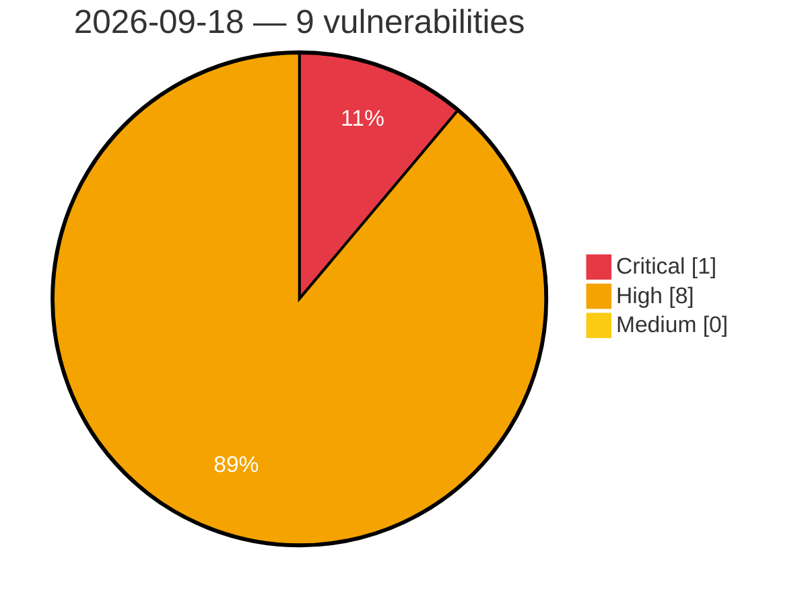

# Critical, High & Medium Severity Vulnerabilities — 2026-09-18

**Source status for this day:**

| Source | Critical | High | Medium | Total |
|--------|---------:|-----:|-------:|------:|
| cvefeed.io (High/Critical) | 1 | 8 | 0 | 9 |

**KEV (actively exploited):** 0  **Watchlist matches:** 7

## Critical (1)

| CVSS | Flags | Source | CVE / Title | Reported |
|------|-------|--------|-------------|----------|
| 9.8 | ⭐ | cvefeed.io (High/Critical) | [CVE-2026-93467 - HGiga｜OAKlouds - Insecure Deserialization](https://cvefeed.io/vuln/detail/CVE-2026-93467) | 1 hour, 28 minutes ago |

## High (8)

| CVSS | Flags | Source | CVE / Title | Reported |
|------|-------|--------|-------------|----------|
| 8.8 | ⭐ | cvefeed.io (High/Critical) | [CVE-2026-17086 - ShortPixel Image Optimizer <= 6.5.5 - Authenticated (Author+) PHP Object Injection via Nested JSON Post Content](https://cvefeed.io/vuln/detail/CVE-2026-17086) | 27 minutes ago |
| 8.7 | ⭐ | cvefeed.io (High/Critical) | [CVE-2026-93468 - HGiga｜OAKlouds - Arbitrary File Read](https://cvefeed.io/vuln/detail/CVE-2026-93468) | 1 hour, 28 minutes ago |
| 8.7 | — | cvefeed.io (High/Critical) | [CVE-2026-79954 - NASA CryptoLib 1.5.0 - TC receive path accepts Security Associations from the wrong GVCID](https://cvefeed.io/vuln/detail/CVE-2026-79954) | 3 hours, 28 minutes ago |
| 8.7 | ⭐ | cvefeed.io (High/Critical) | [CVE-2026-93453 - SOGo before 5.12.11 Password Reset Token Interception via Origin Header](https://cvefeed.io/vuln/detail/CVE-2026-93453) | 4 hours, 27 minutes ago |
| 8.7 | — | cvefeed.io (High/Critical) | [CVE-2026-93452 - snappy-java through 1.1.10.8 Buffer Overflow in Snappy.compress](https://cvefeed.io/vuln/detail/CVE-2026-93452) | 4 hours, 27 minutes ago |
| 8.7 | ⭐ | cvefeed.io (High/Critical) | [CVE-2026-93450 - go-openapi/swag jsonutils before 0.27.1 Uncontrolled Recursion in Ordered JSON Marshal and Unmarshal](https://cvefeed.io/vuln/detail/CVE-2026-93450) | 4 hours, 27 minutes ago |
| 8.4 | ⭐ | cvefeed.io (High/Critical) | [CVE-2026-93456 - django-page-cms through 2.0.13 CSRF via admin mutation views](https://cvefeed.io/vuln/detail/CVE-2026-93456) | 2 hours, 28 minutes ago |
| 8.3 | ⭐ | cvefeed.io (High/Critical) | [CVE-2026-93371 - marcopiovanello yt-dlp-web-ui generic.go NewGenericDownload command injection](https://cvefeed.io/vuln/detail/CVE-2026-93371) | 1 hour, 28 minutes ago |
