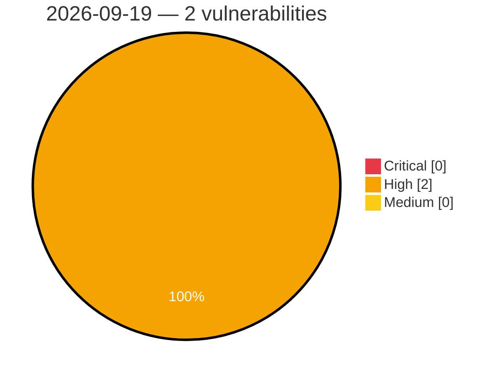

# Critical, High & Medium Severity Vulnerabilities — 2026-09-19

**Source status for this day:**

| Source | Critical | High | Medium | Total |
|--------|---------:|-----:|-------:|------:|
| cvefeed.io (High/Critical) | 0 | 2 | 0 | 2 |

**KEV (actively exploited):** 0  **Watchlist matches:** 2

## High (2)

| CVSS | Flags | Source | CVE / Title | Reported |
|------|-------|--------|-------------|----------|
| 8.8 | ⭐ | cvefeed.io (High/Critical) | [CVE-2026-93923 - SiYuan through 3.8.4 Stored XSS via Heading Style Attribute](https://cvefeed.io/vuln/detail/CVE-2026-93923) | 2 hours, 40 minutes ago |
| 8.8 | ⭐ | cvefeed.io (High/Critical) | [CVE-2026-93922 - SiYuan through 3.8.4 Stored XSS via notebook names](https://cvefeed.io/vuln/detail/CVE-2026-93922) | 2 hours, 40 minutes ago |
