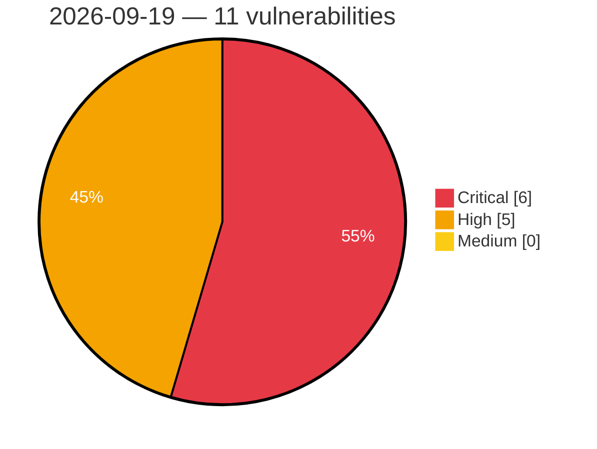

# Critical, High & Medium Severity Vulnerabilities — 2026-09-19

**Source status for this day:**

| Source | Critical | High | Medium | Total |
|--------|---------:|-----:|-------:|------:|
| cvefeed.io (High/Critical) | 6 | 5 | 0 | 11 |

**KEV (actively exploited):** 0  **Watchlist matches:** 8

## Critical (6)

| CVSS | Flags | Source | CVE / Title | Reported |
|------|-------|--------|-------------|----------|
| 10.0 | — | cvefeed.io (High/Critical) | [CVE-2026-93741 - Totolink A3002MU formWlWds buffer overflow](https://cvefeed.io/vuln/detail/CVE-2026-93741) | 2 hours, 55 minutes ago |
| 9.9 | ⭐ | cvefeed.io (High/Critical) | [CVE-2026-93985 - OpenPanel js-runtime JavaScript Template Sandbox Escape RCE](https://cvefeed.io/vuln/detail/CVE-2026-93985) | 29 minutes ago |
| 9.9 | ⭐ | cvefeed.io (High/Critical) | [CVE-2026-93742 - Totolink A3002MU formWsc command injection](https://cvefeed.io/vuln/detail/CVE-2026-93742) | 3 hours, 29 minutes ago |
| 9.8 | ⭐ | cvefeed.io (High/Critical) | [CVE-2026-84434 - Gravity Forms <= 3.1.0.4 - Unauthenticated Arbitrary File Upload via Hidden File Upload Field](https://cvefeed.io/vuln/detail/CVE-2026-84434) | 5 hours, 55 minutes ago |
| 9.1 | — | cvefeed.io (High/Critical) | [CVE-2026-92229 - Forminator Forms <= 1.57.2 - Unauthenticated Arbitrary Shortcode Execution via 'current_url' Parameter](https://cvefeed.io/vuln/detail/CVE-2026-92229) | 5 hours, 55 minutes ago |
| 9.1 | — | cvefeed.io (High/Critical) | [CVE-2026-89274 - WP Recipe Maker <= 10.8.1 - Unauthenticated Arbitrary Shortcode Execution via Recipe Comment Content](https://cvefeed.io/vuln/detail/CVE-2026-89274) | 5 hours, 55 minutes ago |

## High (5)

| CVSS | Flags | Source | CVE / Title | Reported |
|------|-------|--------|-------------|----------|
| 8.8 | ⭐ | cvefeed.io (High/Critical) | [CVE-2026-93923 - SiYuan through 3.8.4 Stored XSS via Heading Style Attribute](https://cvefeed.io/vuln/detail/CVE-2026-93923) | 2 hours, 40 minutes ago |
| 8.8 | ⭐ | cvefeed.io (High/Critical) | [CVE-2026-93922 - SiYuan through 3.8.4 Stored XSS via notebook names](https://cvefeed.io/vuln/detail/CVE-2026-93922) | 2 hours, 40 minutes ago |
| 8.8 | ⭐ | cvefeed.io (High/Critical) | [CVE-2026-4327 - The Welcomizer <= 2.8.1 - Missing Authorization to Authenticated (Subscriber+) Remote Code Execution via 'twiz_custom_logic' Parameter](https://cvefeed.io/vuln/detail/CVE-2026-4327) | 55 minutes ago |
| 8.8 | ⭐ | cvefeed.io (High/Critical) | [CVE-2026-92807 - Save as PDF Plugin by PDFCrowd <= 4.6.1 - Authenticated (Contributor+) Arbitrary Function Invocation / Code Injection via 'pdf_created_callback' Shortcode Attribute](https://cvefeed.io/vuln/detail/CVE-2026-92807) | 5 hours, 55 minutes ago |
| 8.1 | ⭐ | cvefeed.io (High/Critical) | [CVE-2026-85658 - Paid Membership Plugin, Ecommerce, User Registration Form, Login Form, User Profile & Restrict Content <= 4.17.2 - Authenticated (Subscriber+) Arbitrary Shortcode Execution via 'eup_bio' Biography Field (Entity-Encoded Shortcode Bracket)](https://cvefeed.io/vuln/detail/CVE-2026-85658) | 55 minutes ago |
