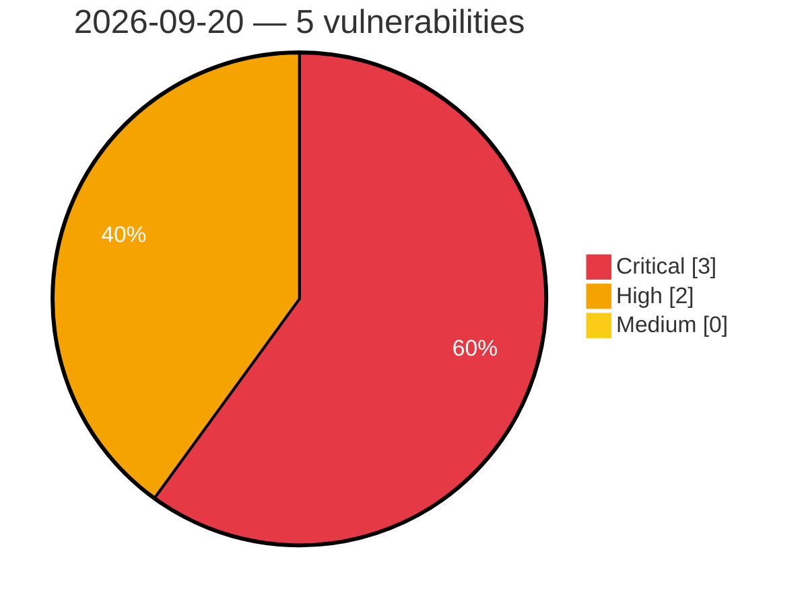

# Critical, High & Medium Severity Vulnerabilities — 2026-09-20

**Source status for this day:**

| Source | Critical | High | Medium | Total |
|--------|---------:|-----:|-------:|------:|
| cvefeed.io (High/Critical) | 3 | 2 | 0 | 5 |

**KEV (actively exploited):** 0  **Watchlist matches:** 1

## Critical (3)

| CVSS | Flags | Source | CVE / Title | Reported |
|------|-------|--------|-------------|----------|
| 9.4 | — | cvefeed.io (High/Critical) | [CVE-2026-94084 - Suricata Http2ThreadMultiBuf Use-After-Free](https://cvefeed.io/vuln/detail/CVE-2026-94084) | 4 hours, 4 minutes ago |
| 9.4 | — | cvefeed.io (High/Critical) | [CVE-2026-94083 - Suricata DoH2 Type Confusion Vulnerability](https://cvefeed.io/vuln/detail/CVE-2026-94083) | 4 hours, 4 minutes ago |
| 9.1 | ⭐ | cvefeed.io (High/Critical) | [CVE-2026-93958 - D-Link R95 DHMAPI ssi system os command injection](https://cvefeed.io/vuln/detail/CVE-2026-93958) | 4 hours, 4 minutes ago |

## High (2)

| CVSS | Flags | Source | CVE / Title | Reported |
|------|-------|--------|-------------|----------|
| 8.5 | — | cvefeed.io (High/Critical) | [CVE-2026-86553 - A password reset vulnerability in ZTE SmartLife APP](https://cvefeed.io/vuln/detail/CVE-2026-86553) | 2 hours, 3 minutes ago |
| 8.3 | — | cvefeed.io (High/Critical) | [CVE-2026-93962 - Kamailio CDP Diameter Receiver receiver.c shm_malloc heap-based overflow](https://cvefeed.io/vuln/detail/CVE-2026-93962) | 1 hour, 4 minutes ago |
