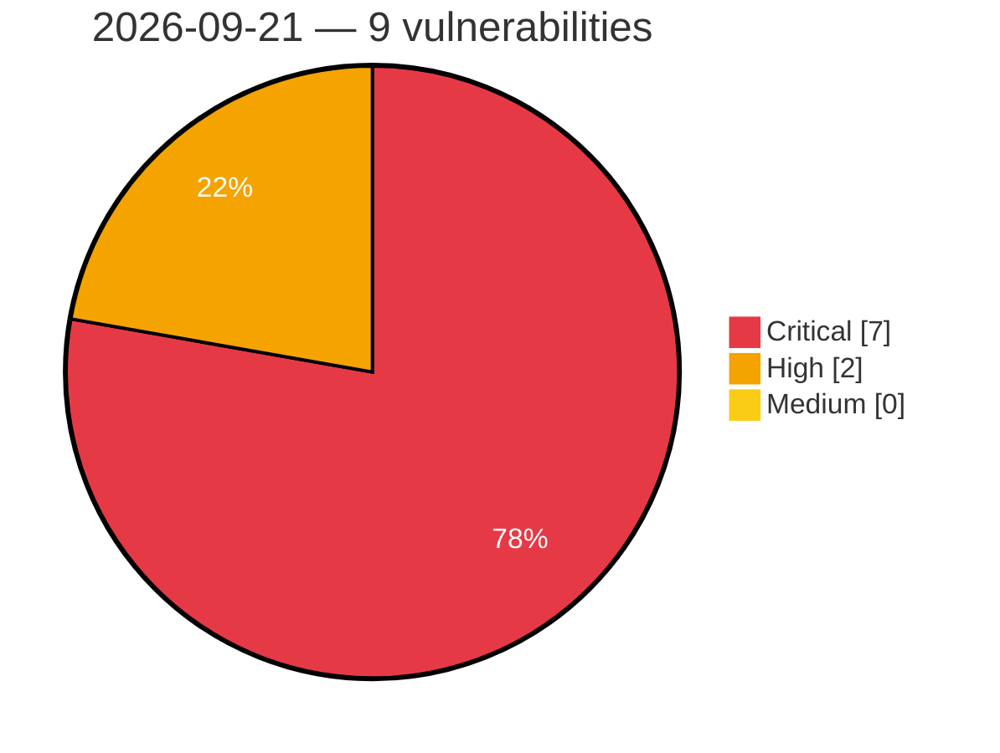

# Critical, High & Medium Severity Vulnerabilities — 2026-09-21

**Source status for this day:**

| Source | Critical | High | Medium | Total |
|--------|---------:|-----:|-------:|------:|
| cvefeed.io (High/Critical) | 7 | 2 | 0 | 9 |

**KEV (actively exploited):** 0  **Watchlist matches:** 5

## Critical (7)

| CVSS | Flags | Source | CVE / Title | Reported |
|------|-------|--------|-------------|----------|
| 10.0 | ⭐ | cvefeed.io (High/Critical) | [CVE-2026-94097 - Netcore NBR200V2 CGI Diagnostic Endpoint network_tools command injection](https://cvefeed.io/vuln/detail/CVE-2026-94097) | 41 minutes ago |
| 9.9 | ⭐ | cvefeed.io (High/Critical) | [CVE-2026-94096 - Netcore NBR200V2 LAN IP Configuration network_tools command injection](https://cvefeed.io/vuln/detail/CVE-2026-94096) | 41 minutes ago |
| 9.9 | ⭐ | cvefeed.io (High/Critical) | [CVE-2026-94095 - Netcore NBR200V2 Traceroute Diagnostic Feature network_tools command injection](https://cvefeed.io/vuln/detail/CVE-2026-94095) | 41 minutes ago |
| 9.9 | — | cvefeed.io (High/Critical) | [CVE-2026-94101 - Netcore NBR200V2 routerd vlan_load_form_uci buffer overflow](https://cvefeed.io/vuln/detail/CVE-2026-94101) | 2 hours, 33 minutes ago |
| 9.9 | — | cvefeed.io (High/Critical) | [CVE-2026-94100 - Netcore NBR200V2 WAN VLAN Reconfiguration routerd wan_config_set_vlan buffer overflow](https://cvefeed.io/vuln/detail/CVE-2026-94100) | 3 hours, 34 minutes ago |
| 9.9 | ⭐ | cvefeed.io (High/Critical) | [CVE-2026-94099 - Netcore NBR200V2 Backup Restore restore.cgi command injection](https://cvefeed.io/vuln/detail/CVE-2026-94099) | 3 hours, 34 minutes ago |
| 9.1 | ⭐ | cvefeed.io (High/Critical) | [CVE-2026-94098 - Netcore NBR200V2 Firmware Upgrade CGI Endpoint upgrade command injection](https://cvefeed.io/vuln/detail/CVE-2026-94098) | 3 hours, 34 minutes ago |

## High (2)

| CVSS | Flags | Source | CVE / Title | Reported |
|------|-------|--------|-------------|----------|
| 8.8 | — | cvefeed.io (High/Critical) | [CVE-2026-94129 - BioStar VALKYRIE AURORA IOCTL BS_RVSIO64.sys sub_1105C write-what-where](https://cvefeed.io/vuln/detail/CVE-2026-94129) | 2 hours, 33 minutes ago |
| 8.8 | — | cvefeed.io (High/Critical) | [CVE-2026-94128 - BioStar VIVID LED DJ IOCTL BS_LED64.sys sub_1105C write-what-where](https://cvefeed.io/vuln/detail/CVE-2026-94128) | 2 hours, 33 minutes ago |
