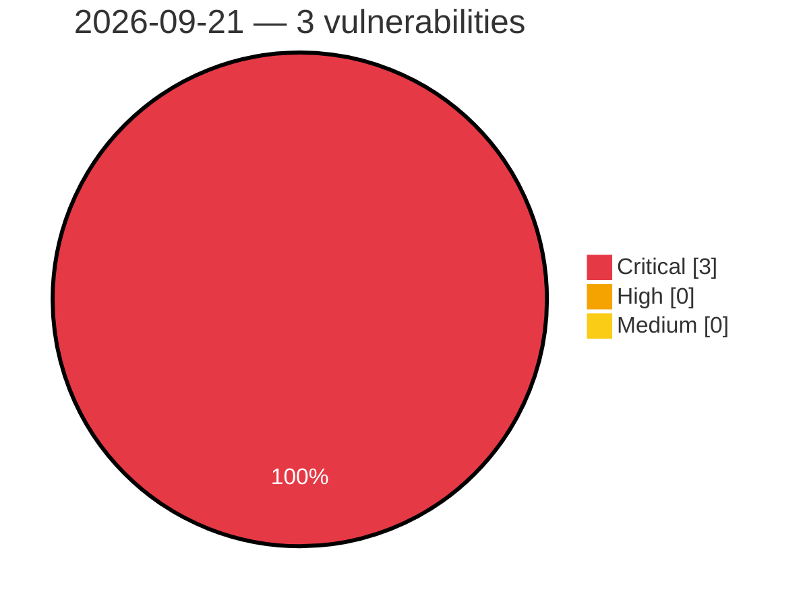

# Critical, High & Medium Severity Vulnerabilities — 2026-09-21

**Source status for this day:**

| Source | Critical | High | Medium | Total |
|--------|---------:|-----:|-------:|------:|
| cvefeed.io (High/Critical) | 3 | 0 | 0 | 3 |

**KEV (actively exploited):** 0  **Watchlist matches:** 3

## Critical (3)

| CVSS | Flags | Source | CVE / Title | Reported |
|------|-------|--------|-------------|----------|
| 10.0 | ⭐ | cvefeed.io (High/Critical) | [CVE-2026-94097 - Netcore NBR200V2 CGI Diagnostic Endpoint network_tools command injection](https://cvefeed.io/vuln/detail/CVE-2026-94097) | 41 minutes ago |
| 9.9 | ⭐ | cvefeed.io (High/Critical) | [CVE-2026-94096 - Netcore NBR200V2 LAN IP Configuration network_tools command injection](https://cvefeed.io/vuln/detail/CVE-2026-94096) | 41 minutes ago |
| 9.9 | ⭐ | cvefeed.io (High/Critical) | [CVE-2026-94095 - Netcore NBR200V2 Traceroute Diagnostic Feature network_tools command injection](https://cvefeed.io/vuln/detail/CVE-2026-94095) | 41 minutes ago |
