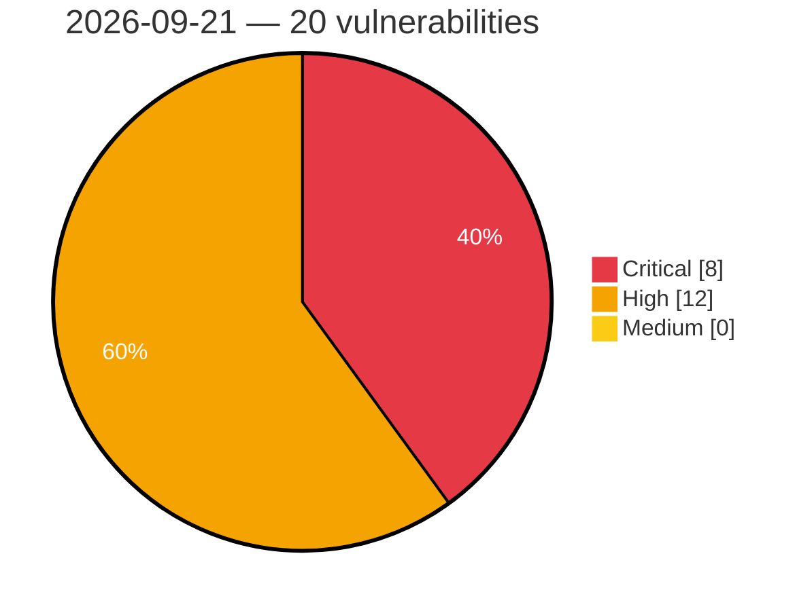

# Critical, High & Medium Severity Vulnerabilities — 2026-09-21

**Source status for this day:**

| Source | Critical | High | Medium | Total |
|--------|---------:|-----:|-------:|------:|
| cvefeed.io (High/Critical) | 8 | 12 | 0 | 20 |

**KEV (actively exploited):** 0  **Watchlist matches:** 9

## Critical (8)

| CVSS | Flags | Source | CVE / Title | Reported |
|------|-------|--------|-------------|----------|
| 10.0 | ⭐ | cvefeed.io (High/Critical) | [CVE-2026-94097 - Netcore NBR200V2 CGI Diagnostic Endpoint network_tools command injection](https://cvefeed.io/vuln/detail/CVE-2026-94097) | 41 minutes ago |
| 9.9 | ⭐ | cvefeed.io (High/Critical) | [CVE-2026-94096 - Netcore NBR200V2 LAN IP Configuration network_tools command injection](https://cvefeed.io/vuln/detail/CVE-2026-94096) | 41 minutes ago |
| 9.9 | ⭐ | cvefeed.io (High/Critical) | [CVE-2026-94095 - Netcore NBR200V2 Traceroute Diagnostic Feature network_tools command injection](https://cvefeed.io/vuln/detail/CVE-2026-94095) | 41 minutes ago |
| 9.9 | — | cvefeed.io (High/Critical) | [CVE-2026-94101 - Netcore NBR200V2 routerd vlan_load_form_uci buffer overflow](https://cvefeed.io/vuln/detail/CVE-2026-94101) | 2 hours, 33 minutes ago |
| 9.9 | — | cvefeed.io (High/Critical) | [CVE-2026-94100 - Netcore NBR200V2 WAN VLAN Reconfiguration routerd wan_config_set_vlan buffer overflow](https://cvefeed.io/vuln/detail/CVE-2026-94100) | 3 hours, 34 minutes ago |
| 9.9 | ⭐ | cvefeed.io (High/Critical) | [CVE-2026-94099 - Netcore NBR200V2 Backup Restore restore.cgi command injection](https://cvefeed.io/vuln/detail/CVE-2026-94099) | 3 hours, 34 minutes ago |
| 9.1 | ⭐ | cvefeed.io (High/Critical) | [CVE-2026-94098 - Netcore NBR200V2 Firmware Upgrade CGI Endpoint upgrade command injection](https://cvefeed.io/vuln/detail/CVE-2026-94098) | 3 hours, 34 minutes ago |
| 9.1 | ⭐ | cvefeed.io (High/Critical) | [CVE-2025-12999 - Open VSX Cache Poisoning via Header Injection](https://cvefeed.io/vuln/detail/CVE-2025-12999) | 3 hours, 5 minutes ago |

## High (12)

| CVSS | Flags | Source | CVE / Title | Reported |
|------|-------|--------|-------------|----------|
| 8.8 | — | cvefeed.io (High/Critical) | [CVE-2026-94129 - BioStar VALKYRIE AURORA IOCTL BS_RVSIO64.sys sub_1105C write-what-where](https://cvefeed.io/vuln/detail/CVE-2026-94129) | 2 hours, 33 minutes ago |
| 8.8 | — | cvefeed.io (High/Critical) | [CVE-2026-94128 - BioStar VIVID LED DJ IOCTL BS_LED64.sys sub_1105C write-what-where](https://cvefeed.io/vuln/detail/CVE-2026-94128) | 2 hours, 33 minutes ago |
| 8.8 | ⭐ | cvefeed.io (High/Critical) | [CVE-2026-92574 - Cri-o: cri-o checkpoint restore bypasses destination security context](https://cvefeed.io/vuln/detail/CVE-2026-92574) | 2 hours, 5 minutes ago |
| 8.8 | — | cvefeed.io (High/Critical) | [CVE-2026-94146 - BioStar BIOS Update Utility IOCTL BSMEM64_W10.sys sub_110BC write-what-where](https://cvefeed.io/vuln/detail/CVE-2026-94146) | 5 hours, 5 minutes ago |
| 8.8 | — | cvefeed.io (High/Critical) | [CVE-2026-94142 - BioStar Temperature Monitor Utility IOCTL BS_HWMIO64_W10.sys sub_1105C write-what-where](https://cvefeed.io/vuln/detail/CVE-2026-94142) | 7 hours, 5 minutes ago |
| 8.7 | — | cvefeed.io (High/Critical) | [CVE-2026-89139 - Temporal Server worker deployment compute provider executes a caller-supplied command on the Worker Service host](https://cvefeed.io/vuln/detail/CVE-2026-89139) | 41 minutes ago |
| 8.7 | ⭐ | cvefeed.io (High/Critical) | [CVE-2026-65654 - temporalio/ringpop-go fails to enforce configured label limits on inbound membership gossip](https://cvefeed.io/vuln/detail/CVE-2026-65654) | 44 minutes ago |
| 8.7 | — | cvefeed.io (High/Critical) | [CVE-2026-65653 - temporalio/tchannel-go zero-chunk call fragment causes process termination](https://cvefeed.io/vuln/detail/CVE-2026-65653) | 45 minutes ago |
| 8.7 | — | cvefeed.io (High/Critical) | [CVE-2026-65652 - temporalio/tchannel-go malformed checksum type causes process termination](https://cvefeed.io/vuln/detail/CVE-2026-65652) | 46 minutes ago |
| 8.7 | — | cvefeed.io (High/Critical) | [CVE-2026-65651 - temporalio/sqlparser deeply nested unary expressions can cause a fatal stack overflow during AST traversal](https://cvefeed.io/vuln/detail/CVE-2026-65651) | 48 minutes ago |
| 8.7 | ⭐ | cvefeed.io (High/Critical) | [CVE-2026-16651 - temporalio/sqlparser malformed MySQL version comments can cause a panic](https://cvefeed.io/vuln/detail/CVE-2026-16651) | 49 minutes ago |
| 8.0 | — | cvefeed.io (High/Critical) | [CVE-2026-15801 - Cri-o: cri-o: insufficient validation during container checkpoint restore](https://cvefeed.io/vuln/detail/CVE-2026-15801) | 3 hours, 5 minutes ago |
