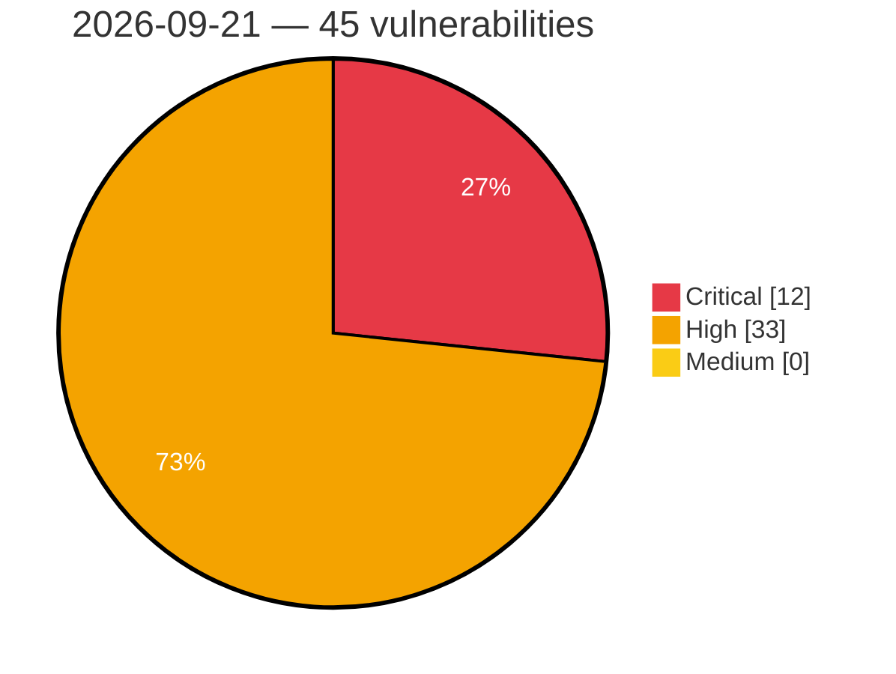

# Critical, High & Medium Severity Vulnerabilities — 2026-09-21

**Source status for this day:**

| Source | Critical | High | Medium | Total |
|--------|---------:|-----:|-------:|------:|
| cvefeed.io (High/Critical) | 12 | 33 | 0 | 45 |

**KEV (actively exploited):** 0  **Watchlist matches:** 29

## Critical (12)

| CVSS | Flags | Source | CVE / Title | Reported |
|------|-------|--------|-------------|----------|
| 10.0 | ⭐ | cvefeed.io (High/Critical) | [CVE-2026-94097 - Netcore NBR200V2 CGI Diagnostic Endpoint network_tools command injection](https://cvefeed.io/vuln/detail/CVE-2026-94097) | 41 minutes ago |
| 9.9 | ⭐ | cvefeed.io (High/Critical) | [CVE-2026-94096 - Netcore NBR200V2 LAN IP Configuration network_tools command injection](https://cvefeed.io/vuln/detail/CVE-2026-94096) | 41 minutes ago |
| 9.9 | ⭐ | cvefeed.io (High/Critical) | [CVE-2026-94095 - Netcore NBR200V2 Traceroute Diagnostic Feature network_tools command injection](https://cvefeed.io/vuln/detail/CVE-2026-94095) | 41 minutes ago |
| 9.9 | — | cvefeed.io (High/Critical) | [CVE-2026-94101 - Netcore NBR200V2 routerd vlan_load_form_uci buffer overflow](https://cvefeed.io/vuln/detail/CVE-2026-94101) | 2 hours, 33 minutes ago |
| 9.9 | — | cvefeed.io (High/Critical) | [CVE-2026-94100 - Netcore NBR200V2 WAN VLAN Reconfiguration routerd wan_config_set_vlan buffer overflow](https://cvefeed.io/vuln/detail/CVE-2026-94100) | 3 hours, 34 minutes ago |
| 9.9 | ⭐ | cvefeed.io (High/Critical) | [CVE-2026-94099 - Netcore NBR200V2 Backup Restore restore.cgi command injection](https://cvefeed.io/vuln/detail/CVE-2026-94099) | 3 hours, 34 minutes ago |
| 9.9 | ⭐ | cvefeed.io (High/Critical) | [CVE-2026-79920 - Ajenti: Privilege escalation to root via unauthenticated/unauthorized plugin install task](https://cvefeed.io/vuln/detail/CVE-2026-79920) | 23 minutes ago |
| 9.8 | ⭐ | cvefeed.io (High/Critical) | [CVE-2026-85751 - Mailu: Authentication bypass in header-based proxy authentication via spoofable `X-Forwarded-By` trust](https://cvefeed.io/vuln/detail/CVE-2026-85751) | 1 hour, 24 minutes ago |
| 9.8 | — | cvefeed.io (High/Critical) | [CVE-2026-94301 - Apache MINA: CVE-2026-47065 resolveProxyClass fix missing from 2.0.X and 2.1.X branches (2.0.30 / 2.1.14) ZDRES-232](https://cvefeed.io/vuln/detail/CVE-2026-94301) | 2 hours, 24 minutes ago |
| 9.2 | ⭐ | cvefeed.io (High/Critical) | [CVE-2026-61674 - Fluent Bit: Remote stack buffer overflow in Fluent Bit `out_forward` Secure-Forward `PONG` handler](https://cvefeed.io/vuln/detail/CVE-2026-61674) | 24 minutes ago |
| 9.1 | ⭐ | cvefeed.io (High/Critical) | [CVE-2026-94098 - Netcore NBR200V2 Firmware Upgrade CGI Endpoint upgrade command injection](https://cvefeed.io/vuln/detail/CVE-2026-94098) | 3 hours, 34 minutes ago |
| 9.1 | ⭐ | cvefeed.io (High/Critical) | [CVE-2025-12999 - Open VSX Cache Poisoning via Header Injection](https://cvefeed.io/vuln/detail/CVE-2025-12999) | 3 hours, 5 minutes ago |

## High (33)

| CVSS | Flags | Source | CVE / Title | Reported |
|------|-------|--------|-------------|----------|
| 8.9 | ⭐ | cvefeed.io (High/Critical) | [CVE-2026-55563 - Feast: `pull_request_target` integration tests run untrusted fork code with production cloud secrets; the `ok-to-test` label guard is bypassable via label persistence on `synchronize`](https://cvefeed.io/vuln/detail/CVE-2026-55563) | 1 hour, 25 minutes ago |
| 8.9 | — | cvefeed.io (High/Critical) | [CVE-2026-88807 - libXrender RenderQueryPictFormats Reply Heap-based Buffer Overflow](https://cvefeed.io/vuln/detail/CVE-2026-88807) | 3 hours, 24 minutes ago |
| 8.8 | — | cvefeed.io (High/Critical) | [CVE-2026-94129 - BioStar VALKYRIE AURORA IOCTL BS_RVSIO64.sys sub_1105C write-what-where](https://cvefeed.io/vuln/detail/CVE-2026-94129) | 2 hours, 33 minutes ago |
| 8.8 | — | cvefeed.io (High/Critical) | [CVE-2026-94128 - BioStar VIVID LED DJ IOCTL BS_LED64.sys sub_1105C write-what-where](https://cvefeed.io/vuln/detail/CVE-2026-94128) | 2 hours, 33 minutes ago |
| 8.8 | ⭐ | cvefeed.io (High/Critical) | [CVE-2026-92574 - Cri-o: cri-o checkpoint restore bypasses destination security context](https://cvefeed.io/vuln/detail/CVE-2026-92574) | 2 hours, 5 minutes ago |
| 8.8 | — | cvefeed.io (High/Critical) | [CVE-2026-94146 - BioStar BIOS Update Utility IOCTL BSMEM64_W10.sys sub_110BC write-what-where](https://cvefeed.io/vuln/detail/CVE-2026-94146) | 5 hours, 5 minutes ago |
| 8.8 | — | cvefeed.io (High/Critical) | [CVE-2026-94142 - BioStar Temperature Monitor Utility IOCTL BS_HWMIO64_W10.sys sub_1105C write-what-where](https://cvefeed.io/vuln/detail/CVE-2026-94142) | 7 hours, 5 minutes ago |
| 8.8 | ⭐ | cvefeed.io (High/Critical) | [CVE-2026-84990 - ntopng: Missing Authorization on System Configuration Backup Download and Listing](https://cvefeed.io/vuln/detail/CVE-2026-84990) | 23 minutes ago |
| 8.8 | — | cvefeed.io (High/Critical) | [CVE-2026-63116 - deepstream: PATCH_MULTI action bypasses Valve permission system allowing unauthorized record writes](https://cvefeed.io/vuln/detail/CVE-2026-63116) | 24 minutes ago |
| 8.8 | ⭐ | cvefeed.io (High/Critical) | [CVE-2026-62371 - KubeEdge: Command Injection in NodeUpgradeJob - RCE on edge nodes via v1alpha2 API](https://cvefeed.io/vuln/detail/CVE-2026-62371) | 24 minutes ago |
| 8.8 | ⭐ | cvefeed.io (High/Critical) | [CVE-2026-82412 - ntopng: Remote Code Execution via OS Command Injection in Vulnerability-Scan REST API](https://cvefeed.io/vuln/detail/CVE-2026-82412) | 1 hour, 24 minutes ago |
| 8.8 | ⭐ | cvefeed.io (High/Critical) | [CVE-2026-53940 - Conda: Entry-point path traversal in noarch:python install (arbitrary file write) — canonical Python implementation](https://cvefeed.io/vuln/detail/CVE-2026-53940) | 1 hour, 25 minutes ago |
| 8.8 | ⭐ | cvefeed.io (High/Critical) | [CVE-2026-84285 - OS Command Injection vulnerability affecting Tuleap Enterprise Edition from 17.3 through 17.5](https://cvefeed.io/vuln/detail/CVE-2026-84285) | 4 hours, 25 minutes ago |
| 8.7 | — | cvefeed.io (High/Critical) | [CVE-2026-89139 - Temporal Server worker deployment compute provider executes a caller-supplied command on the Worker Service host](https://cvefeed.io/vuln/detail/CVE-2026-89139) | 41 minutes ago |
| 8.7 | ⭐ | cvefeed.io (High/Critical) | [CVE-2026-65654 - temporalio/ringpop-go fails to enforce configured label limits on inbound membership gossip](https://cvefeed.io/vuln/detail/CVE-2026-65654) | 44 minutes ago |
| 8.7 | — | cvefeed.io (High/Critical) | [CVE-2026-65653 - temporalio/tchannel-go zero-chunk call fragment causes process termination](https://cvefeed.io/vuln/detail/CVE-2026-65653) | 45 minutes ago |
| 8.7 | — | cvefeed.io (High/Critical) | [CVE-2026-65652 - temporalio/tchannel-go malformed checksum type causes process termination](https://cvefeed.io/vuln/detail/CVE-2026-65652) | 46 minutes ago |
| 8.7 | — | cvefeed.io (High/Critical) | [CVE-2026-65651 - temporalio/sqlparser deeply nested unary expressions can cause a fatal stack overflow during AST traversal](https://cvefeed.io/vuln/detail/CVE-2026-65651) | 48 minutes ago |
| 8.7 | ⭐ | cvefeed.io (High/Critical) | [CVE-2026-16651 - temporalio/sqlparser malformed MySQL version comments can cause a panic](https://cvefeed.io/vuln/detail/CVE-2026-16651) | 49 minutes ago |
| 8.7 | ⭐ | cvefeed.io (High/Critical) | [CVE-2026-94381 - MISP Privilege Escalation: Read-Only API Key User Can Regain Full Role via updateLoginTime](https://cvefeed.io/vuln/detail/CVE-2026-94381) | 4 hours, 25 minutes ago |
| 8.6 | ⭐ | cvefeed.io (High/Critical) | [CVE-2025-71421 - UVdesk core-framework before 1.1.7 Privilege Escalation via editAgent](https://cvefeed.io/vuln/detail/CVE-2025-71421) | 3 hours, 25 minutes ago |
| 8.6 | — | cvefeed.io (High/Critical) | [CVE-2026-94383 - MISP Blocklist Workflow Module: Arbitrary Script Execution via Unrestricted File Extension](https://cvefeed.io/vuln/detail/CVE-2026-94383) | 4 hours, 25 minutes ago |
| 8.4 | ⭐ | cvefeed.io (High/Critical) | [CVE-2026-55071 - MCP-for-Stata: Stata Command Injection via Unsanitized `package` in `ado_package_install`](https://cvefeed.io/vuln/detail/CVE-2026-55071) | 2 hours, 24 minutes ago |
| 8.3 | ⭐ | cvefeed.io (High/Critical) | [CVE-2026-94488 - Telegram Desktop Cross-Site Scripting Vulnerability](https://cvefeed.io/vuln/detail/CVE-2026-94488) | 13 minutes ago |
| 8.3 | ⭐ | cvefeed.io (High/Critical) | [CVE-2026-94401 - MISP Arbitrary Local File Read and SSRF via MISP Export Upload](https://cvefeed.io/vuln/detail/CVE-2026-94401) | 3 hours, 24 minutes ago |
| 8.3 | ⭐ | cvefeed.io (High/Critical) | [CVE-2026-94374 - MISP: IDOR via Client-Supplied Report ID in Module Results Processing Allows Reparenting and Overwriting of Other Events' Reports](https://cvefeed.io/vuln/detail/CVE-2026-94374) | 4 hours, 25 minutes ago |
| 8.2 | — | cvefeed.io (High/Critical) | [CVE-2026-55074 - Ansible FreeBSD Jail Connection Plugin: Jail escape via symlink following in put_file (host-side root mv)](https://cvefeed.io/vuln/detail/CVE-2026-55074) | 2 hours, 24 minutes ago |
| 8.1 | ⭐ | cvefeed.io (High/Critical) | [CVE-2026-83621 - ntopng: Missing Authorization Check in REST API Allows Non-Admin Users to Tamper Threat Intelligence Blacklist URLs](https://cvefeed.io/vuln/detail/CVE-2026-83621) | 23 minutes ago |
| 8.1 | ⭐ | cvefeed.io (High/Critical) | [CVE-2026-77560 - Tinyauth: forward-auth per-app ACL is matched case-sensitively against the (case-insensitive) hostname, letting an authenticated user reach apps they are not on the allowlist for](https://cvefeed.io/vuln/detail/CVE-2026-77560) | 23 minutes ago |
| 8.1 | ⭐ | cvefeed.io (High/Critical) | [CVE-2026-94184 - Fetchmail: fetchmail: stack-based buffer overflow in ntlm authentication (fetchmail-sa-2026-01)](https://cvefeed.io/vuln/detail/CVE-2026-94184) | 2 hours, 24 minutes ago |
| 8.1 | ⭐ | cvefeed.io (High/Critical) | [CVE-2026-80110 - Pki-core: dogtag pki v2 rest acl filter's reverse-lexicographic tie-break lets a ca agent invoke the admin-only raw profile creation endpoint](https://cvefeed.io/vuln/detail/CVE-2026-80110) | 2 hours, 24 minutes ago |
| 8.1 | ⭐ | cvefeed.io (High/Critical) | [CVE-2026-61628 - nginx ignition has Unauthenticated Admin Account Creation via Onboarding Race Condition](https://cvefeed.io/vuln/detail/CVE-2026-61628) | 2 hours, 24 minutes ago |
| 8.0 | — | cvefeed.io (High/Critical) | [CVE-2026-15801 - Cri-o: cri-o: insufficient validation during container checkpoint restore](https://cvefeed.io/vuln/detail/CVE-2026-15801) | 3 hours, 5 minutes ago |
