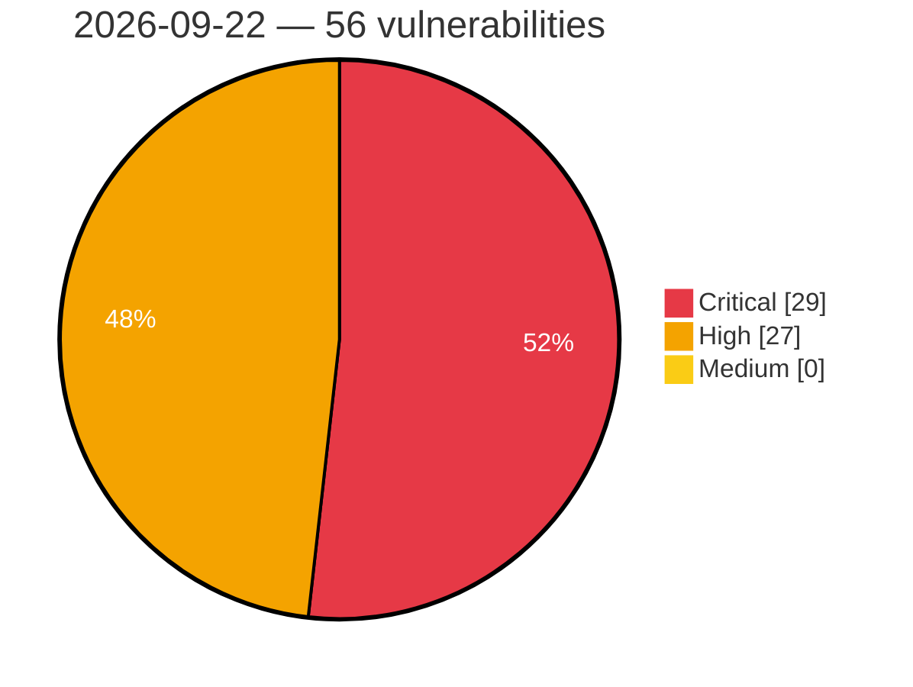

# Critical, High & Medium Severity Vulnerabilities — 2026-09-22

**Source status for this day:**

| Source | Critical | High | Medium | Total |
|--------|---------:|-----:|-------:|------:|
| cvefeed.io (High/Critical) | 29 | 27 | 0 | 56 |

**KEV (actively exploited):** 0  **Watchlist matches:** 41

## Critical (29)

| CVSS | Flags | Source | CVE / Title | Reported |
|------|-------|--------|-------------|----------|
| 10.0 | — | cvefeed.io (High/Critical) | [CVE-2026-94493 - Gigatech PDV5701 WebSocket Service index.html missing authentication](https://cvefeed.io/vuln/detail/CVE-2026-94493) | 4 hours, 25 minutes ago |
| 10.0 | ⭐ | cvefeed.io (High/Critical) | [CVE-2026-93952 - Security Advisory 0183](https://cvefeed.io/vuln/detail/CVE-2026-93952) | 3 hours, 20 minutes ago |
| 10.0 | ⭐ | cvefeed.io (High/Critical) | [CVE-2026-80155 - Lantronix Autonomous Out-of-Band Devices Unauthenticated Authentication Bypass via snprintf Path Truncation](https://cvefeed.io/vuln/detail/CVE-2026-80155) | 1 hour, 24 minutes ago |
| 9.9 | — | cvefeed.io (High/Critical) | [CVE-2026-80147 - Lantronix Autonomous Out-of-Band Devices Stack-Based Buffer Overflow via mfc eeprom write](https://cvefeed.io/vuln/detail/CVE-2026-80147) | 1 hour, 24 minutes ago |
| 9.9 | — | cvefeed.io (High/Critical) | [CVE-2026-80146 - Lantronix Autonomous Out-of-Band Devices Stack-Based Buffer Overflow via mfc eeprom read](https://cvefeed.io/vuln/detail/CVE-2026-80146) | 1 hour, 24 minutes ago |
| 9.9 | ⭐ | cvefeed.io (High/Critical) | [CVE-2026-80144 - Lantronix Autonomous Out-of-Band Devices CLI Command Injection via mfc eeprom write](https://cvefeed.io/vuln/detail/CVE-2026-80144) | 1 hour, 24 minutes ago |
| 9.9 | ⭐ | cvefeed.io (High/Critical) | [CVE-2026-80143 - Lantronix Autonomous Out-of-Band Devices CLI Command Injection via mfc eeprom read](https://cvefeed.io/vuln/detail/CVE-2026-80143) | 1 hour, 24 minutes ago |
| 9.8 | ⭐ | cvefeed.io (High/Critical) | [CVE-2026-19658 - Give Tributes <= 2.3.1 - Unauthenticated PHP Object Injection via 'give_tributes_ecard_notify[recipient][personalized][]' Parameter](https://cvefeed.io/vuln/detail/CVE-2026-19658) | 25 minutes ago |
| 9.8 | ⭐ | cvefeed.io (High/Critical) | [CVE-2026-13355 - Meta Box AIO <= 3.11.0 And Standalone Plugin Extensions - Unauthenticated Privilege Escalation to Administrator to 'rwmb_frontend_field_object_id' Parameter](https://cvefeed.io/vuln/detail/CVE-2026-13355) | 25 minutes ago |
| 9.8 | ⭐ | cvefeed.io (High/Critical) | [CVE-2026-25254 - Improper authorization in Qualcomm Software Center](https://cvefeed.io/vuln/detail/CVE-2026-25254) | 1 hour, 19 minutes ago |
| 9.8 | ⭐ | cvefeed.io (High/Critical) | [CVE-2026-94127 - BIG-IP APM OAuth vulnerability](https://cvefeed.io/vuln/detail/CVE-2026-94127) | 33 minutes ago |
| 9.8 | ⭐ | cvefeed.io (High/Critical) | [CVE-2026-95675 - D-Link DAP-1360 6.14 Unauthenticated RCE via Web Management Interface](https://cvefeed.io/vuln/detail/CVE-2026-95675) | 34 minutes ago |
| 9.8 | ⭐ | cvefeed.io (High/Critical) | [CVE-2026-12718 - SQLi in Karel Electronics' KarelIPS](https://cvefeed.io/vuln/detail/CVE-2026-12718) | 34 minutes ago |
| 9.8 | — | cvefeed.io (High/Critical) | [CVE-2026-65113 - NVIDIA Infrastructure Controller Hard-Coded Credentials Vulnerability](https://cvefeed.io/vuln/detail/CVE-2026-65113) | 41 minutes ago |
| 9.8 | ⭐ | cvefeed.io (High/Critical) | [CVE-2026-93616 - Directory Traversal and File upload allows execution of arbitrary script on the Management Server](https://cvefeed.io/vuln/detail/CVE-2026-93616) | 1 hour, 34 minutes ago |
| 9.8 | ⭐ | cvefeed.io (High/Critical) | [CVE-2026-74849 - Remote code execution vulnerability](https://cvefeed.io/vuln/detail/CVE-2026-74849) | 2 hours, 34 minutes ago |
| 9.6 | ⭐ | cvefeed.io (High/Critical) | [CVE-2026-86059 - Dokploy: Git Provider Credential Exposure via Unprotected .one Endpoints and application.one](https://cvefeed.io/vuln/detail/CVE-2026-86059) | 25 minutes ago |
| 9.6 | ⭐ | cvefeed.io (High/Critical) | [CVE-2026-80154 - Lantronix Autonomous Out-of-Band Devices Predictable Session Token with Validation Bypass](https://cvefeed.io/vuln/detail/CVE-2026-80154) | 1 hour, 24 minutes ago |
| 9.4 | ⭐ | cvefeed.io (High/Critical) | [CVE-2026-80156 - Lantronix Autonomous Out-of-Band Devices Arbitrary File Write via Upload Filename Validation Bypass](https://cvefeed.io/vuln/detail/CVE-2026-80156) | 1 hour, 24 minutes ago |
| 9.4 | ⭐ | cvefeed.io (High/Critical) | [CVE-2026-80152 - Lantronix Autonomous Out-of-Band Devices OS Command Injection via set script schedule](https://cvefeed.io/vuln/detail/CVE-2026-80152) | 1 hour, 24 minutes ago |
| 9.4 | ⭐ | cvefeed.io (High/Critical) | [CVE-2026-80151 - Lantronix Autonomous Out-of-Band Devices OS Command Injection via set nfs download](https://cvefeed.io/vuln/detail/CVE-2026-80151) | 1 hour, 24 minutes ago |
| 9.4 | ⭐ | cvefeed.io (High/Critical) | [CVE-2026-80145 - Lantronix Autonomous Out-of-Band Devices CLI Command Injection via set cifs password](https://cvefeed.io/vuln/detail/CVE-2026-80145) | 1 hour, 24 minutes ago |
| 9.3 | ⭐ | cvefeed.io (High/Critical) | [CVE-2026-93556 - Direct references to unsafe objects (IDOR) in Tankuam Places by Kompini](https://cvefeed.io/vuln/detail/CVE-2026-93556) | 2 hours, 20 minutes ago |
| 9.3 | — | cvefeed.io (High/Critical) | [CVE-2026-89422 - TLS 1.3 client skips server authentication when ServerHello carries an unsolicited pre_shared_key extension](https://cvefeed.io/vuln/detail/CVE-2026-89422) | 2 hours, 20 minutes ago |
| 9.3 | ⭐ | cvefeed.io (High/Critical) | [CVE-2026-77621 - Vector: Arbitrary file write in the file sink via templated path (path traversal).](https://cvefeed.io/vuln/detail/CVE-2026-77621) | 1 hour, 24 minutes ago |
| 9.1 | — | cvefeed.io (High/Critical) | [CVE-2026-84388 - Fortinet FortiPAM Chrome Extension UI Redressing Information Disclosure](https://cvefeed.io/vuln/detail/CVE-2026-84388) | 38 minutes ago |
| 9.1 | ⭐ | cvefeed.io (High/Critical) | [CVE-2026-94456 - Unauthenticated recovery of the Math.random() state behind OAuth tokens, authorization codes, client secrets and organization API keys](https://cvefeed.io/vuln/detail/CVE-2026-94456) | 25 minutes ago |
| 9.1 | ⭐ | cvefeed.io (High/Critical) | [CVE-2026-85734 - LightRAG: No Rate Limiting on /login Endpoint Allows Brute-Force Attacks](https://cvefeed.io/vuln/detail/CVE-2026-85734) | 25 minutes ago |
| 9.1 | — | cvefeed.io (High/Critical) | [CVE-2026-95654 - Databasement before 1.7.14 Authorization Bypass via Stale Invitation Token](https://cvefeed.io/vuln/detail/CVE-2026-95654) | 1 hour, 24 minutes ago |

## High (27)

| CVSS | Flags | Source | CVE / Title | Reported |
|------|-------|--------|-------------|----------|
| 8.8 | ⭐ | cvefeed.io (High/Critical) | [CVE-2026-25265 - Creation of Temporary File with Insecure Permissions in Qualcomm Software Center](https://cvefeed.io/vuln/detail/CVE-2026-25265) | 1 hour, 19 minutes ago |
| 8.8 | ⭐ | cvefeed.io (High/Critical) | [CVE-2026-25264 - Uncontrolled Search Path Element in Qualcomm Software Center](https://cvefeed.io/vuln/detail/CVE-2026-25264) | 1 hour, 19 minutes ago |
| 8.8 | ⭐ | cvefeed.io (High/Critical) | [CVE-2026-25255 - Exposed function in Qualcomm Package Manager and Qualcomm Software Center.](https://cvefeed.io/vuln/detail/CVE-2026-25255) | 1 hour, 19 minutes ago |
| 8.8 | ⭐ | cvefeed.io (High/Critical) | [CVE-2025-1281 - BM Content Builder < 3.17.1 - Authenticated (Subscriber+) Arbitrary File Deletion](https://cvefeed.io/vuln/detail/CVE-2025-1281) | 3 hours, 20 minutes ago |
| 8.8 | ⭐ | cvefeed.io (High/Critical) | [CVE-2026-92438 - Ninja Forms 3.15.3 - Unauthenticated Stored XSS via Paragraph Text Field in Submissions Admin](https://cvefeed.io/vuln/detail/CVE-2026-92438) | 4 hours, 20 minutes ago |
| 8.8 | ⭐ | cvefeed.io (High/Critical) | [CVE-2026-65128 - NVIDIA Infrastructure Controller SQL Injection Vulnerability](https://cvefeed.io/vuln/detail/CVE-2026-65128) | 41 minutes ago |
| 8.8 | ⭐ | cvefeed.io (High/Critical) | [CVE-2026-65179 - NVIDIA NeMo Insecure Deserialization Vulnerability](https://cvefeed.io/vuln/detail/CVE-2026-65179) | 47 minutes ago |
| 8.8 | — | cvefeed.io (High/Critical) | [CVE-2026-13087 - Kernel: heap out-of-bounds write in the linux kernel rpc-over-rdma server reply path...](https://cvefeed.io/vuln/detail/CVE-2026-13087) | 25 minutes ago |
| 8.7 | ⭐ | cvefeed.io (High/Critical) | [CVE-2026-90882 - Reflected arbitrary origins with credentials, allowing cross-origin reads of authenticated user data](https://cvefeed.io/vuln/detail/CVE-2026-90882) | 1 hour, 19 minutes ago |
| 8.7 | — | cvefeed.io (High/Critical) | [CVE-2026-93345 - MikroTik RouterOS < 7.25beta4 Improper Input Validation DoS via BGP Labelled-VPN NLRI](https://cvefeed.io/vuln/detail/CVE-2026-93345) | 34 minutes ago |
| 8.7 | — | cvefeed.io (High/Critical) | [CVE-2026-95653 - Concrete CMS Community Store before 2.7.8 Predictable Digital Download Token](https://cvefeed.io/vuln/detail/CVE-2026-95653) | 1 hour, 24 minutes ago |
| 8.7 | ⭐ | cvefeed.io (High/Critical) | [CVE-2026-77620 - Vector: Unauthenticated denial of service in the `logstash` source via nested compressed frames (stack exhaustion and decompression amplification).](https://cvefeed.io/vuln/detail/CVE-2026-77620) | 1 hour, 24 minutes ago |
| 8.6 | ⭐ | cvefeed.io (High/Critical) | [CVE-2026-75791 - Authentication bypass vulnerability](https://cvefeed.io/vuln/detail/CVE-2026-75791) | 1 hour, 34 minutes ago |
| 8.6 | — | cvefeed.io (High/Critical) | [CVE-2026-95655 - Aureus ERP before 1.5.0 Unscoped Message Access via ChatterPanel](https://cvefeed.io/vuln/detail/CVE-2026-95655) | 1 hour, 24 minutes ago |
| 8.6 | ⭐ | cvefeed.io (High/Critical) | [CVE-2026-80149 - Lantronix Autonomous Out-of-Band Devices WebSSH SSRF via rooturl Parameter](https://cvefeed.io/vuln/detail/CVE-2026-80149) | 1 hour, 24 minutes ago |
| 8.6 | ⭐ | cvefeed.io (High/Critical) | [CVE-2026-80148 - Lantronix Autonomous Out-of-Band Devices WebSSH SSRF via Username Truncation](https://cvefeed.io/vuln/detail/CVE-2026-80148) | 1 hour, 24 minutes ago |
| 8.4 | ⭐ | cvefeed.io (High/Critical) | [CVE-2026-83603 - Netdata: Local Root via ndsudo Arbitrary socket_path → fail2ban-client Pickle RCE](https://cvefeed.io/vuln/detail/CVE-2026-83603) | 25 minutes ago |
| 8.3 | — | cvefeed.io (High/Critical) | [CVE-2026-65114 - NVIDIA Infrastructure Controller Missing Authentication Vulnerability](https://cvefeed.io/vuln/detail/CVE-2026-65114) | 41 minutes ago |
| 8.2 | ⭐ | cvefeed.io (High/Critical) | [CVE-2026-87119 - mpp Tempo subscription key authorization is not bound to the issuing challenge, allowing a captured activation credential to be replayed](https://cvefeed.io/vuln/detail/CVE-2026-87119) | 20 minutes ago |
| 8.2 | ⭐ | cvefeed.io (High/Critical) | [CVE-2026-95511 - Cups: cups-filters: cups-filters: lpadmin can escalate to root via privileged serial backend (cups2root)](https://cvefeed.io/vuln/detail/CVE-2026-95511) | 2 hours, 20 minutes ago |
| 8.2 | — | cvefeed.io (High/Critical) | [CVE-2026-65634 - Superlinear CPU denial of service in Erlang/OTP ASN.1 OBJECT IDENTIFIER decoder](https://cvefeed.io/vuln/detail/CVE-2026-65634) | 2 hours, 20 minutes ago |
| 8.2 | — | cvefeed.io (High/Critical) | [CVE-2026-65121 - NVIDIA Infrastructure Controller Improper Authentication Vulnerability](https://cvefeed.io/vuln/detail/CVE-2026-65121) | 41 minutes ago |
| 8.1 | ⭐ | cvefeed.io (High/Critical) | [CVE-2026-92969 - HUSKY <= 1.4.4 - Unauthenticated Local File Inclusion via 'custom_tpl' Shortcode Attribute via 'woof_draw_products' AJAX](https://cvefeed.io/vuln/detail/CVE-2026-92969) | 3 hours, 20 minutes ago |
| 8.1 | — | cvefeed.io (High/Critical) | [CVE-2026-92235 - WP Ultimate Review <= 2.4.2 - Authenticated (Subscriber+) Arbitrary Shortcode Execution via 'xs_submit_review_data[xs_reviw_summery]' Parameter](https://cvefeed.io/vuln/detail/CVE-2026-92235) | 3 hours, 20 minutes ago |
| 8.1 | ⭐ | cvefeed.io (High/Critical) | [CVE-2026-87902 - WordPress Local File Inclusion Vulnerability](https://cvefeed.io/vuln/detail/CVE-2026-87902) | 25 minutes ago |
| 8.1 | ⭐ | cvefeed.io (High/Critical) | [CVE-2026-94384 - Missing Authorization in sfExecuteAWSService Lambda Dispatcher in Amazon Connect Salesforce Lambda](https://cvefeed.io/vuln/detail/CVE-2026-94384) | 35 minutes ago |
| 8.0 | ⭐ | cvefeed.io (High/Critical) | [CVE-2026-65130 - NVIDIA Infrastructure Controller OS Command Injection Vulnerability](https://cvefeed.io/vuln/detail/CVE-2026-65130) | 41 minutes ago |
