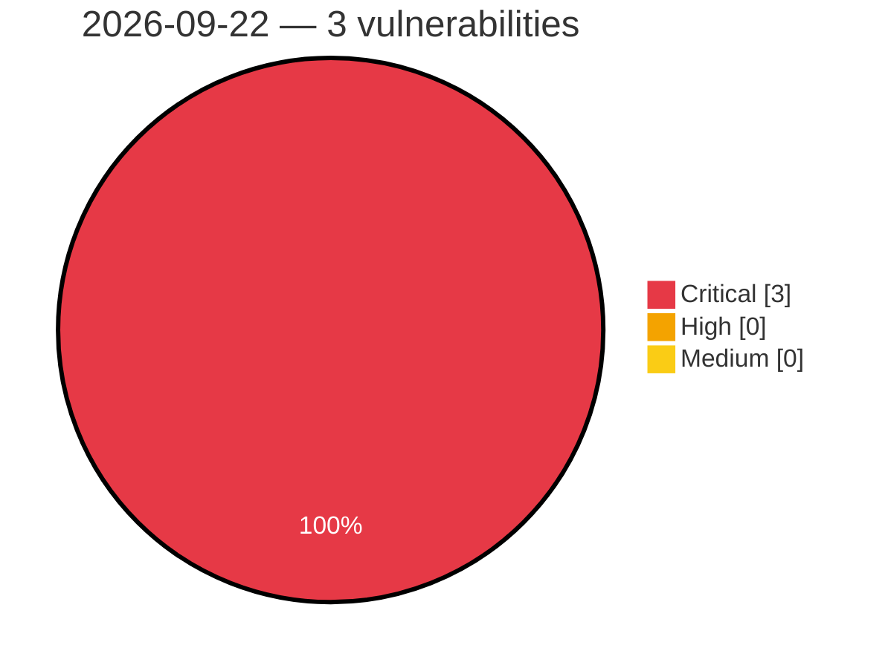

# Critical, High & Medium Severity Vulnerabilities — 2026-09-22

**Source status for this day:**

| Source | Critical | High | Medium | Total |
|--------|---------:|-----:|-------:|------:|
| cvefeed.io (High/Critical) | 3 | 0 | 0 | 3 |

**KEV (actively exploited):** 0  **Watchlist matches:** 2

## Critical (3)

| CVSS | Flags | Source | CVE / Title | Reported |
|------|-------|--------|-------------|----------|
| 10.0 | — | cvefeed.io (High/Critical) | [CVE-2026-94493 - Gigatech PDV5701 WebSocket Service index.html missing authentication](https://cvefeed.io/vuln/detail/CVE-2026-94493) | 4 hours, 25 minutes ago |
| 9.8 | ⭐ | cvefeed.io (High/Critical) | [CVE-2026-19658 - Give Tributes <= 2.3.1 - Unauthenticated PHP Object Injection via 'give_tributes_ecard_notify[recipient][personalized][]' Parameter](https://cvefeed.io/vuln/detail/CVE-2026-19658) | 25 minutes ago |
| 9.8 | ⭐ | cvefeed.io (High/Critical) | [CVE-2026-13355 - Meta Box AIO <= 3.11.0 And Standalone Plugin Extensions - Unauthenticated Privilege Escalation to Administrator to 'rwmb_frontend_field_object_id' Parameter](https://cvefeed.io/vuln/detail/CVE-2026-13355) | 25 minutes ago |
