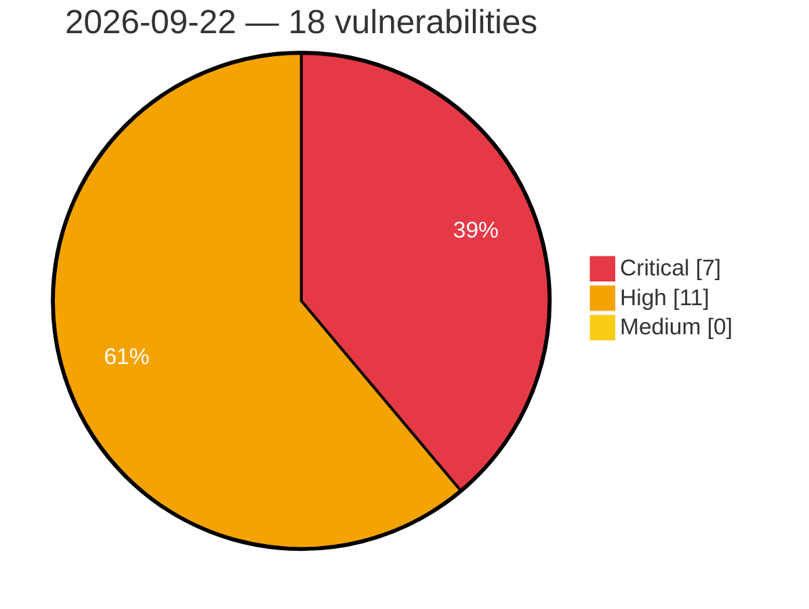

# Critical, High & Medium Severity Vulnerabilities — 2026-09-22

**Source status for this day:**

| Source | Critical | High | Medium | Total |
|--------|---------:|-----:|-------:|------:|
| cvefeed.io (High/Critical) | 7 | 11 | 0 | 18 |

**KEV (actively exploited):** 0  **Watchlist matches:** 14

## Critical (7)

| CVSS | Flags | Source | CVE / Title | Reported |
|------|-------|--------|-------------|----------|
| 10.0 | — | cvefeed.io (High/Critical) | [CVE-2026-94493 - Gigatech PDV5701 WebSocket Service index.html missing authentication](https://cvefeed.io/vuln/detail/CVE-2026-94493) | 4 hours, 25 minutes ago |
| 10.0 | ⭐ | cvefeed.io (High/Critical) | [CVE-2026-93952 - Security Advisory 0183](https://cvefeed.io/vuln/detail/CVE-2026-93952) | 3 hours, 20 minutes ago |
| 9.8 | ⭐ | cvefeed.io (High/Critical) | [CVE-2026-19658 - Give Tributes <= 2.3.1 - Unauthenticated PHP Object Injection via 'give_tributes_ecard_notify[recipient][personalized][]' Parameter](https://cvefeed.io/vuln/detail/CVE-2026-19658) | 25 minutes ago |
| 9.8 | ⭐ | cvefeed.io (High/Critical) | [CVE-2026-13355 - Meta Box AIO <= 3.11.0 And Standalone Plugin Extensions - Unauthenticated Privilege Escalation to Administrator to 'rwmb_frontend_field_object_id' Parameter](https://cvefeed.io/vuln/detail/CVE-2026-13355) | 25 minutes ago |
| 9.8 | ⭐ | cvefeed.io (High/Critical) | [CVE-2026-25254 - Improper authorization in Qualcomm Software Center](https://cvefeed.io/vuln/detail/CVE-2026-25254) | 1 hour, 19 minutes ago |
| 9.3 | ⭐ | cvefeed.io (High/Critical) | [CVE-2026-93556 - Direct references to unsafe objects (IDOR) in Tankuam Places by Kompini](https://cvefeed.io/vuln/detail/CVE-2026-93556) | 2 hours, 20 minutes ago |
| 9.3 | — | cvefeed.io (High/Critical) | [CVE-2026-89422 - TLS 1.3 client skips server authentication when ServerHello carries an unsolicited pre_shared_key extension](https://cvefeed.io/vuln/detail/CVE-2026-89422) | 2 hours, 20 minutes ago |

## High (11)

| CVSS | Flags | Source | CVE / Title | Reported |
|------|-------|--------|-------------|----------|
| 8.8 | ⭐ | cvefeed.io (High/Critical) | [CVE-2026-25265 - Creation of Temporary File with Insecure Permissions in Qualcomm Software Center](https://cvefeed.io/vuln/detail/CVE-2026-25265) | 1 hour, 19 minutes ago |
| 8.8 | ⭐ | cvefeed.io (High/Critical) | [CVE-2026-25264 - Uncontrolled Search Path Element in Qualcomm Software Center](https://cvefeed.io/vuln/detail/CVE-2026-25264) | 1 hour, 19 minutes ago |
| 8.8 | ⭐ | cvefeed.io (High/Critical) | [CVE-2026-25255 - Exposed function in Qualcomm Package Manager and Qualcomm Software Center.](https://cvefeed.io/vuln/detail/CVE-2026-25255) | 1 hour, 19 minutes ago |
| 8.8 | ⭐ | cvefeed.io (High/Critical) | [CVE-2025-1281 - BM Content Builder < 3.17.1 - Authenticated (Subscriber+) Arbitrary File Deletion](https://cvefeed.io/vuln/detail/CVE-2025-1281) | 3 hours, 20 minutes ago |
| 8.8 | ⭐ | cvefeed.io (High/Critical) | [CVE-2026-92438 - Ninja Forms 3.15.3 - Unauthenticated Stored XSS via Paragraph Text Field in Submissions Admin](https://cvefeed.io/vuln/detail/CVE-2026-92438) | 4 hours, 20 minutes ago |
| 8.7 | ⭐ | cvefeed.io (High/Critical) | [CVE-2026-90882 - Reflected arbitrary origins with credentials, allowing cross-origin reads of authenticated user data](https://cvefeed.io/vuln/detail/CVE-2026-90882) | 1 hour, 19 minutes ago |
| 8.2 | ⭐ | cvefeed.io (High/Critical) | [CVE-2026-87119 - mpp Tempo subscription key authorization is not bound to the issuing challenge, allowing a captured activation credential to be replayed](https://cvefeed.io/vuln/detail/CVE-2026-87119) | 20 minutes ago |
| 8.2 | ⭐ | cvefeed.io (High/Critical) | [CVE-2026-95511 - Cups: cups-filters: cups-filters: lpadmin can escalate to root via privileged serial backend (cups2root)](https://cvefeed.io/vuln/detail/CVE-2026-95511) | 2 hours, 20 minutes ago |
| 8.2 | — | cvefeed.io (High/Critical) | [CVE-2026-65634 - Superlinear CPU denial of service in Erlang/OTP ASN.1 OBJECT IDENTIFIER decoder](https://cvefeed.io/vuln/detail/CVE-2026-65634) | 2 hours, 20 minutes ago |
| 8.1 | ⭐ | cvefeed.io (High/Critical) | [CVE-2026-92969 - HUSKY <= 1.4.4 - Unauthenticated Local File Inclusion via 'custom_tpl' Shortcode Attribute via 'woof_draw_products' AJAX](https://cvefeed.io/vuln/detail/CVE-2026-92969) | 3 hours, 20 minutes ago |
| 8.1 | — | cvefeed.io (High/Critical) | [CVE-2026-92235 - WP Ultimate Review <= 2.4.2 - Authenticated (Subscriber+) Arbitrary Shortcode Execution via 'xs_submit_review_data[xs_reviw_summery]' Parameter](https://cvefeed.io/vuln/detail/CVE-2026-92235) | 3 hours, 20 minutes ago |
