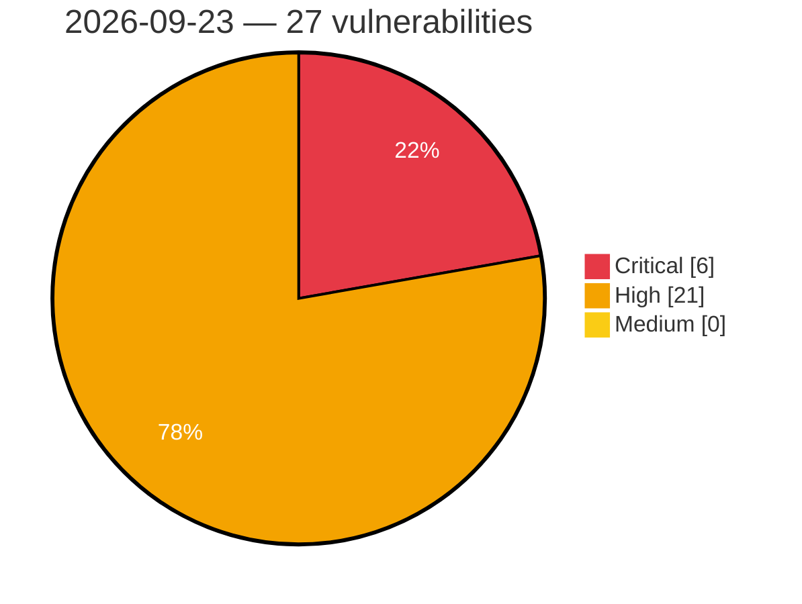

# Critical, High & Medium Severity Vulnerabilities — 2026-09-23

**Source status for this day:**

| Source | Critical | High | Medium | Total |
|--------|---------:|-----:|-------:|------:|
| cvefeed.io (High/Critical) | 6 | 21 | 0 | 27 |

**KEV (actively exploited):** 0  **Watchlist matches:** 24

## Critical (6)

| CVSS | Flags | Source | CVE / Title | Reported |
|------|-------|--------|-------------|----------|
| 10.0 | — | cvefeed.io (High/Critical) | [CVE-2026-96257 - Fast FAC1203R Gigabit Edition Device Discovery Service copy_msg_element stack-based overflow](https://cvefeed.io/vuln/detail/CVE-2026-96257) | 25 minutes ago |
| 10.0 | ⭐ | cvefeed.io (High/Critical) | [CVE-2026-86708 - Sensitive data exposure](https://cvefeed.io/vuln/detail/CVE-2026-86708) | 55 minutes ago |
| 9.9 | ⭐ | cvefeed.io (High/Critical) | [CVE-2026-19599 - Remote Code Execution vulnerability](https://cvefeed.io/vuln/detail/CVE-2026-19599) | 49 minutes ago |
| 9.8 | ⭐ | cvefeed.io (High/Critical) | [CVE-2026-96560 - LightLLM through 1.2.0 Unauthenticated Remote Code Execution via NCCL PD RPyC Control Channel](https://cvefeed.io/vuln/detail/CVE-2026-96560) | 34 minutes ago |
| 9.0 | ⭐ | cvefeed.io (High/Critical) | [CVE-2026-82843 - WP OAuth Server < 6.4.0 - Subscriber+ Cross-User Account Takeover via OIDC ID Token Substitution](https://cvefeed.io/vuln/detail/CVE-2026-82843) | 7 hours, 49 minutes ago |
| 9.0 | ⭐ | cvefeed.io (High/Critical) | [CVE-2026-75799 - YAHMAN Add-ons < 0.9.31 - Unauthenticated Arbitrary File Upload via Blog Card Cache](https://cvefeed.io/vuln/detail/CVE-2026-75799) | 7 hours, 49 minutes ago |

## High (21)

| CVSS | Flags | Source | CVE / Title | Reported |
|------|-------|--------|-------------|----------|
| 8.8 | ⭐ | cvefeed.io (High/Critical) | [CVE-2026-15027 - Changing｜CGServiSign - OS Command Injection](https://cvefeed.io/vuln/detail/CVE-2026-15027) | 25 minutes ago |
| 8.8 | ⭐ | cvefeed.io (High/Critical) | [CVE-2026-91813 - Foxit PDF Editor/Reader FoxitUpdater Race Condition Local Privilege Escalation Vulnerability](https://cvefeed.io/vuln/detail/CVE-2026-91813) | 1 hour, 25 minutes ago |
| 8.8 | ⭐ | cvefeed.io (High/Critical) | [CVE-2026-91803 - Security Vulnerability Report – Foxit PDF Editor/Reader Updater DLL Search Path Hijacking](https://cvefeed.io/vuln/detail/CVE-2026-91803) | 1 hour, 25 minutes ago |
| 8.8 | ⭐ | cvefeed.io (High/Critical) | [CVE-2026-91800 - Foxit PDF Editor installer local privilege escalation](https://cvefeed.io/vuln/detail/CVE-2026-91800) | 1 hour, 25 minutes ago |
| 8.8 | ⭐ | cvefeed.io (High/Critical) | [CVE-2026-91798 - Foxit PDF Editor/Reader Updater Privilege Escalation](https://cvefeed.io/vuln/detail/CVE-2026-91798) | 1 hour, 25 minutes ago |
| 8.8 | ⭐ | cvefeed.io (High/Critical) | [CVE-2026-86678 - Broken Authentication vulnerability](https://cvefeed.io/vuln/detail/CVE-2026-86678) | 25 minutes ago |
| 8.8 | ⭐ | cvefeed.io (High/Critical) | [CVE-2026-86677 - Broken Authentication vulnerability](https://cvefeed.io/vuln/detail/CVE-2026-86677) | 30 minutes ago |
| 8.8 | ⭐ | cvefeed.io (High/Critical) | [CVE-2026-76978 - Command Injection vulnerability](https://cvefeed.io/vuln/detail/CVE-2026-76978) | 49 minutes ago |
| 8.8 | ⭐ | cvefeed.io (High/Critical) | [CVE-2026-75825 - Authentication Bypass vulnerability](https://cvefeed.io/vuln/detail/CVE-2026-75825) | 49 minutes ago |
| 8.8 | ⭐ | cvefeed.io (High/Critical) | [CVE-2026-14913 - SQL Injection vulnerability](https://cvefeed.io/vuln/detail/CVE-2026-14913) | 1 hour, 49 minutes ago |
| 8.8 | ⭐ | cvefeed.io (High/Critical) | [CVE-2026-96455 - Reachy Mini daemon allows unauthenticated remote code execution through the app installation endpoint](https://cvefeed.io/vuln/detail/CVE-2026-96455) | 2 hours, 49 minutes ago |
| 8.7 | ⭐ | cvefeed.io (High/Critical) | [CVE-2026-96272 - ClipBucket v5 before 5.5.3-#182 SQL Injection via search_result.php](https://cvefeed.io/vuln/detail/CVE-2026-96272) | 2 hours, 26 minutes ago |
| 8.4 | ⭐ | cvefeed.io (High/Critical) | [CVE-2026-5695 - Multiple vulnerabilities in the Microweber administration panel](https://cvefeed.io/vuln/detail/CVE-2026-5695) | 2 hours, 49 minutes ago |
| 8.3 | ⭐ | cvefeed.io (High/Critical) | [CVE-2026-95626 - Tauri framework v2 CSP nonce protection bypass via data and blob URI schemes allows an XSS to RCE chains](https://cvefeed.io/vuln/detail/CVE-2026-95626) | 3 hours, 49 minutes ago |
| 8.2 | ⭐ | cvefeed.io (High/Critical) | [CVE-2026-19438 - Mint Workbench I Path traversal Vulnerability](https://cvefeed.io/vuln/detail/CVE-2026-19438) | 3 hours, 25 minutes ago |
| 8.2 | ⭐ | cvefeed.io (High/Critical) | [CVE-2026-96454 - Pake grants unrestricted IPC access to every HTTPS origin loaded in generated applications](https://cvefeed.io/vuln/detail/CVE-2026-96454) | 3 hours, 49 minutes ago |
| 8.2 | — | cvefeed.io (High/Critical) | [CVE-2026-86608 - WP Recipe Maker 9.8.0 - 10.8.1 - Unauthenticated DoS via Unbounded User Meta Insertion](https://cvefeed.io/vuln/detail/CVE-2026-86608) | 7 hours, 49 minutes ago |
| 8.2 | ⭐ | cvefeed.io (High/Critical) | [CVE-2026-14321 - Divi Dash < 1.0.7 - Unauthenticated Denial of Service via IP Address Spoofing](https://cvefeed.io/vuln/detail/CVE-2026-14321) | 7 hours, 49 minutes ago |
| 8.1 | — | cvefeed.io (High/Critical) | [CVE-2026-86683 - Broken Authentication Vulnerability](https://cvefeed.io/vuln/detail/CVE-2026-86683) | 42 minutes ago |
| 8.1 | ⭐ | cvefeed.io (High/Critical) | [CVE-2026-84787 - Privilege Escalation vulnerability](https://cvefeed.io/vuln/detail/CVE-2026-84787) | 1 hour, 49 minutes ago |
| 8.1 | ⭐ | cvefeed.io (High/Critical) | [CVE-2026-93508 - WC Fields Factory < 4.1.11 - Subscriber+ Arbitrary Post Meta Manipulation via AJAX](https://cvefeed.io/vuln/detail/CVE-2026-93508) | 7 hours, 49 minutes ago |
