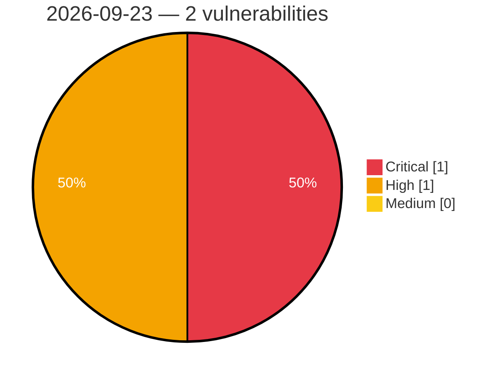

# Critical, High & Medium Severity Vulnerabilities — 2026-09-23

**Source status for this day:**

| Source | Critical | High | Medium | Total |
|--------|---------:|-----:|-------:|------:|
| cvefeed.io (High/Critical) | 1 | 1 | 0 | 2 |

**KEV (actively exploited):** 0  **Watchlist matches:** 1

## Critical (1)

| CVSS | Flags | Source | CVE / Title | Reported |
|------|-------|--------|-------------|----------|
| 10.0 | — | cvefeed.io (High/Critical) | [CVE-2026-96257 - Fast FAC1203R Gigabit Edition Device Discovery Service copy_msg_element stack-based overflow](https://cvefeed.io/vuln/detail/CVE-2026-96257) | 25 minutes ago |

## High (1)

| CVSS | Flags | Source | CVE / Title | Reported |
|------|-------|--------|-------------|----------|
| 8.7 | ⭐ | cvefeed.io (High/Critical) | [CVE-2026-96272 - ClipBucket v5 before 5.5.3-#182 SQL Injection via search_result.php](https://cvefeed.io/vuln/detail/CVE-2026-96272) | 2 hours, 26 minutes ago |
