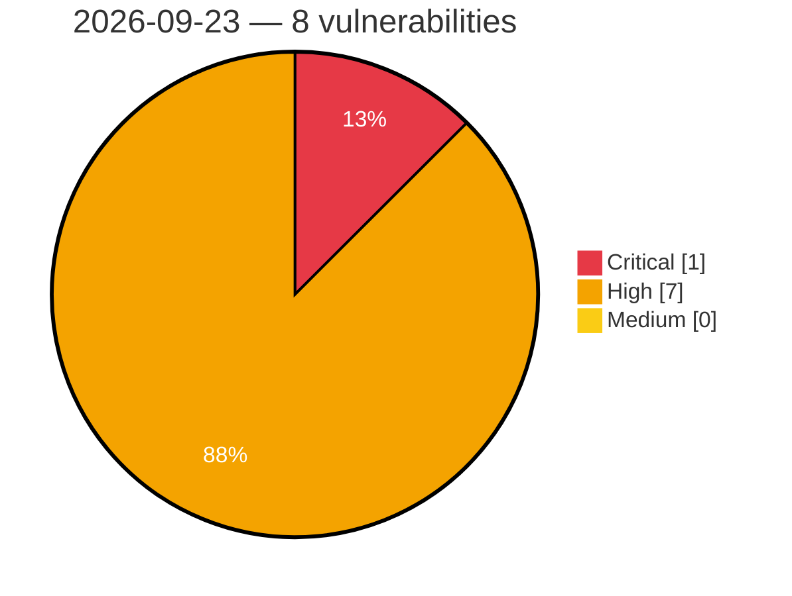

# Critical, High & Medium Severity Vulnerabilities — 2026-09-23

**Source status for this day:**

| Source | Critical | High | Medium | Total |
|--------|---------:|-----:|-------:|------:|
| cvefeed.io (High/Critical) | 1 | 7 | 0 | 8 |

**KEV (actively exploited):** 0  **Watchlist matches:** 7

## Critical (1)

| CVSS | Flags | Source | CVE / Title | Reported |
|------|-------|--------|-------------|----------|
| 10.0 | — | cvefeed.io (High/Critical) | [CVE-2026-96257 - Fast FAC1203R Gigabit Edition Device Discovery Service copy_msg_element stack-based overflow](https://cvefeed.io/vuln/detail/CVE-2026-96257) | 25 minutes ago |

## High (7)

| CVSS | Flags | Source | CVE / Title | Reported |
|------|-------|--------|-------------|----------|
| 8.8 | ⭐ | cvefeed.io (High/Critical) | [CVE-2026-15027 - Changing｜CGServiSign - OS Command Injection](https://cvefeed.io/vuln/detail/CVE-2026-15027) | 25 minutes ago |
| 8.8 | ⭐ | cvefeed.io (High/Critical) | [CVE-2026-91813 - Foxit PDF Editor/Reader FoxitUpdater Race Condition Local Privilege Escalation Vulnerability](https://cvefeed.io/vuln/detail/CVE-2026-91813) | 1 hour, 25 minutes ago |
| 8.8 | ⭐ | cvefeed.io (High/Critical) | [CVE-2026-91803 - Security Vulnerability Report – Foxit PDF Editor/Reader Updater DLL Search Path Hijacking](https://cvefeed.io/vuln/detail/CVE-2026-91803) | 1 hour, 25 minutes ago |
| 8.8 | ⭐ | cvefeed.io (High/Critical) | [CVE-2026-91800 - Foxit PDF Editor installer local privilege escalation](https://cvefeed.io/vuln/detail/CVE-2026-91800) | 1 hour, 25 minutes ago |
| 8.8 | ⭐ | cvefeed.io (High/Critical) | [CVE-2026-91798 - Foxit PDF Editor/Reader Updater Privilege Escalation](https://cvefeed.io/vuln/detail/CVE-2026-91798) | 1 hour, 25 minutes ago |
| 8.7 | ⭐ | cvefeed.io (High/Critical) | [CVE-2026-96272 - ClipBucket v5 before 5.5.3-#182 SQL Injection via search_result.php](https://cvefeed.io/vuln/detail/CVE-2026-96272) | 2 hours, 26 minutes ago |
| 8.2 | ⭐ | cvefeed.io (High/Critical) | [CVE-2026-19438 - Mint Workbench I Path traversal Vulnerability](https://cvefeed.io/vuln/detail/CVE-2026-19438) | 3 hours, 25 minutes ago |
