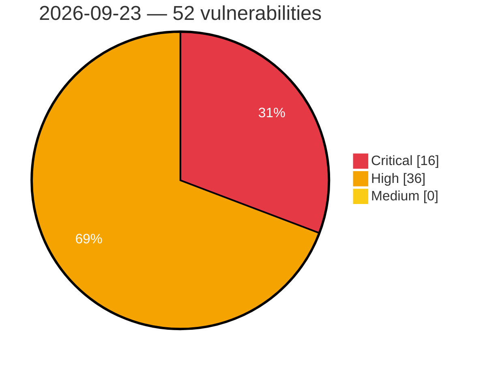

# Critical, High & Medium Severity Vulnerabilities — 2026-09-23

**Source status for this day:**

| Source | Critical | High | Medium | Total |
|--------|---------:|-----:|-------:|------:|
| cvefeed.io (High/Critical) | 16 | 36 | 0 | 52 |

**KEV (actively exploited):** 0  **Watchlist matches:** 38

## Critical (16)

| CVSS | Flags | Source | CVE / Title | Reported |
|------|-------|--------|-------------|----------|
| 10.0 | — | cvefeed.io (High/Critical) | [CVE-2026-96257 - Fast FAC1203R Gigabit Edition Device Discovery Service copy_msg_element stack-based overflow](https://cvefeed.io/vuln/detail/CVE-2026-96257) | 25 minutes ago |
| 10.0 | ⭐ | cvefeed.io (High/Critical) | [CVE-2026-86708 - Sensitive data exposure](https://cvefeed.io/vuln/detail/CVE-2026-86708) | 55 minutes ago |
| 9.9 | ⭐ | cvefeed.io (High/Critical) | [CVE-2026-19599 - Remote Code Execution vulnerability](https://cvefeed.io/vuln/detail/CVE-2026-19599) | 49 minutes ago |
| 9.8 | ⭐ | cvefeed.io (High/Critical) | [CVE-2026-96560 - LightLLM through 1.2.0 Unauthenticated Remote Code Execution via NCCL PD RPyC Control Channel](https://cvefeed.io/vuln/detail/CVE-2026-96560) | 34 minutes ago |
| 9.8 | ⭐ | cvefeed.io (High/Critical) | [CVE-2026-96759 - orval before 8.29.0 Code Injection via operationId](https://cvefeed.io/vuln/detail/CVE-2026-96759) | 50 minutes ago |
| 9.8 | ⭐ | cvefeed.io (High/Critical) | [CVE-2026-96758 - orval @orval/core before 8.28.0 Code Injection via Form-Data](https://cvefeed.io/vuln/detail/CVE-2026-96758) | 50 minutes ago |
| 9.8 | ⭐ | cvefeed.io (High/Critical) | [CVE-2026-96757 - orval before 8.29.0 Code Injection via unescaped OpenAPI media-type](https://cvefeed.io/vuln/detail/CVE-2026-96757) | 50 minutes ago |
| 9.8 | ⭐ | cvefeed.io (High/Critical) | [CVE-2026-96755 - orval @orval/effect 8.14.0 through 8.28.1 Code Injection](https://cvefeed.io/vuln/detail/CVE-2026-96755) | 50 minutes ago |
| 9.8 | ⭐ | cvefeed.io (High/Critical) | [CVE-2026-96754 - orval @orval/hono before 8.29.0 Code Injection via OpenAPI Path](https://cvefeed.io/vuln/detail/CVE-2026-96754) | 50 minutes ago |
| 9.8 | — | cvefeed.io (High/Critical) | [CVE-2026-96276 - Flatpak: flatpak: arbitrary write in host context via flatpak build-init](https://cvefeed.io/vuln/detail/CVE-2026-96276) | 2 hours, 50 minutes ago |
| 9.6 | — | cvefeed.io (High/Critical) | [CVE-2026-85724 - Moquette pattern ACL wildcard injection allows cross-tenant authorization bypass](https://cvefeed.io/vuln/detail/CVE-2026-85724) | 50 minutes ago |
| 9.3 | — | cvefeed.io (High/Critical) | [CVE-2026-95848 - Moquette fails open when configured authentication or authorization classes cannot load](https://cvefeed.io/vuln/detail/CVE-2026-95848) | 50 minutes ago |
| 9.3 | ⭐ | cvefeed.io (High/Critical) | [CVE-2026-18872 - IBM Financial Transaction Manager (FTM) is Impacted by Multiple Vulnerabilities](https://cvefeed.io/vuln/detail/CVE-2026-18872) | 1 hour, 51 minutes ago |
| 9.2 | ⭐ | cvefeed.io (High/Critical) | [CVE-2026-96756 - orval before 8.30.0 Code Injection via Factory Generation](https://cvefeed.io/vuln/detail/CVE-2026-96756) | 50 minutes ago |
| 9.0 | ⭐ | cvefeed.io (High/Critical) | [CVE-2026-82843 - WP OAuth Server < 6.4.0 - Subscriber+ Cross-User Account Takeover via OIDC ID Token Substitution](https://cvefeed.io/vuln/detail/CVE-2026-82843) | 7 hours, 49 minutes ago |
| 9.0 | ⭐ | cvefeed.io (High/Critical) | [CVE-2026-75799 - YAHMAN Add-ons < 0.9.31 - Unauthenticated Arbitrary File Upload via Blog Card Cache](https://cvefeed.io/vuln/detail/CVE-2026-75799) | 7 hours, 49 minutes ago |

## High (36)

| CVSS | Flags | Source | CVE / Title | Reported |
|------|-------|--------|-------------|----------|
| 8.8 | ⭐ | cvefeed.io (High/Critical) | [CVE-2026-15027 - Changing｜CGServiSign - OS Command Injection](https://cvefeed.io/vuln/detail/CVE-2026-15027) | 25 minutes ago |
| 8.8 | ⭐ | cvefeed.io (High/Critical) | [CVE-2026-91813 - Foxit PDF Editor/Reader FoxitUpdater Race Condition Local Privilege Escalation Vulnerability](https://cvefeed.io/vuln/detail/CVE-2026-91813) | 1 hour, 25 minutes ago |
| 8.8 | ⭐ | cvefeed.io (High/Critical) | [CVE-2026-91803 - Security Vulnerability Report – Foxit PDF Editor/Reader Updater DLL Search Path Hijacking](https://cvefeed.io/vuln/detail/CVE-2026-91803) | 1 hour, 25 minutes ago |
| 8.8 | ⭐ | cvefeed.io (High/Critical) | [CVE-2026-91800 - Foxit PDF Editor installer local privilege escalation](https://cvefeed.io/vuln/detail/CVE-2026-91800) | 1 hour, 25 minutes ago |
| 8.8 | ⭐ | cvefeed.io (High/Critical) | [CVE-2026-91798 - Foxit PDF Editor/Reader Updater Privilege Escalation](https://cvefeed.io/vuln/detail/CVE-2026-91798) | 1 hour, 25 minutes ago |
| 8.8 | ⭐ | cvefeed.io (High/Critical) | [CVE-2026-86678 - Broken Authentication vulnerability](https://cvefeed.io/vuln/detail/CVE-2026-86678) | 25 minutes ago |
| 8.8 | ⭐ | cvefeed.io (High/Critical) | [CVE-2026-86677 - Broken Authentication vulnerability](https://cvefeed.io/vuln/detail/CVE-2026-86677) | 30 minutes ago |
| 8.8 | ⭐ | cvefeed.io (High/Critical) | [CVE-2026-76978 - Command Injection vulnerability](https://cvefeed.io/vuln/detail/CVE-2026-76978) | 49 minutes ago |
| 8.8 | ⭐ | cvefeed.io (High/Critical) | [CVE-2026-75825 - Authentication Bypass vulnerability](https://cvefeed.io/vuln/detail/CVE-2026-75825) | 49 minutes ago |
| 8.8 | ⭐ | cvefeed.io (High/Critical) | [CVE-2026-14913 - SQL Injection vulnerability](https://cvefeed.io/vuln/detail/CVE-2026-14913) | 1 hour, 49 minutes ago |
| 8.8 | ⭐ | cvefeed.io (High/Critical) | [CVE-2026-96455 - Reachy Mini daemon allows unauthenticated remote code execution through the app installation endpoint](https://cvefeed.io/vuln/detail/CVE-2026-96455) | 2 hours, 49 minutes ago |
| 8.8 | ⭐ | cvefeed.io (High/Critical) | [CVE-2026-96804 - CVE-2026-96804](https://cvefeed.io/vuln/detail/CVE-2026-96804) | 50 minutes ago |
| 8.8 | — | cvefeed.io (High/Critical) | [CVE-2026-95847 - Moquette client IDs can cause cross-session H2 durable-queue corruption](https://cvefeed.io/vuln/detail/CVE-2026-95847) | 50 minutes ago |
| 8.8 | ⭐ | cvefeed.io (High/Critical) | [CVE-2026-93349 - Frictionless OS Command Injection via explore Console Command](https://cvefeed.io/vuln/detail/CVE-2026-93349) | 50 minutes ago |
| 8.8 | ⭐ | cvefeed.io (High/Critical) | [CVE-2026-18490 - IBM Financial Transaction Manager (FTM) is Impacted by Multiple Vulnerabilities](https://cvefeed.io/vuln/detail/CVE-2026-18490) | 1 hour, 51 minutes ago |
| 8.8 | ⭐ | cvefeed.io (High/Critical) | [CVE-2026-96275 - Flatpak: flatpak: arbitrary write access as root via extra-data extraction](https://cvefeed.io/vuln/detail/CVE-2026-96275) | 2 hours, 50 minutes ago |
| 8.7 | ⭐ | cvefeed.io (High/Critical) | [CVE-2026-96272 - ClipBucket v5 before 5.5.3-#182 SQL Injection via search_result.php](https://cvefeed.io/vuln/detail/CVE-2026-96272) | 2 hours, 26 minutes ago |
| 8.7 | — | cvefeed.io (High/Critical) | [CVE-2026-95846 - Moquette publishes Last-Will messages without enforcing write authorization](https://cvefeed.io/vuln/detail/CVE-2026-95846) | 50 minutes ago |
| 8.7 | ⭐ | cvefeed.io (High/Critical) | [CVE-2026-95845 - Moquette unbounded per-session message queues allow memory exhaustion](https://cvefeed.io/vuln/detail/CVE-2026-95845) | 50 minutes ago |
| 8.7 | — | cvefeed.io (High/Critical) | [CVE-2026-95844 - Moquette deeply nested MQTT topics can cause stack exhaustion](https://cvefeed.io/vuln/detail/CVE-2026-95844) | 50 minutes ago |
| 8.7 | — | cvefeed.io (High/Critical) | [CVE-2026-95843 - Moquette malformed shared subscriptions can crash command processing](https://cvefeed.io/vuln/detail/CVE-2026-95843) | 50 minutes ago |
| 8.7 | — | cvefeed.io (High/Critical) | [CVE-2026-95842 - Moquette uncaught MQTT command exceptions can terminate shared session event loops](https://cvefeed.io/vuln/detail/CVE-2026-95842) | 50 minutes ago |
| 8.7 | ⭐ | cvefeed.io (High/Critical) | [CVE-2026-96673 - Photoview through 2.4.0 SQL Injection via album download route](https://cvefeed.io/vuln/detail/CVE-2026-96673) | 1 hour, 51 minutes ago |
| 8.6 | — | cvefeed.io (High/Critical) | [CVE-2026-96656 - Plex Media Server arbitrary file write](https://cvefeed.io/vuln/detail/CVE-2026-96656) | 50 minutes ago |
| 8.4 | ⭐ | cvefeed.io (High/Critical) | [CVE-2026-5695 - Multiple vulnerabilities in the Microweber administration panel](https://cvefeed.io/vuln/detail/CVE-2026-5695) | 2 hours, 49 minutes ago |
| 8.3 | ⭐ | cvefeed.io (High/Critical) | [CVE-2026-95626 - Tauri framework v2 CSP nonce protection bypass via data and blob URI schemes allows an XSS to RCE chains](https://cvefeed.io/vuln/detail/CVE-2026-95626) | 3 hours, 49 minutes ago |
| 8.2 | ⭐ | cvefeed.io (High/Critical) | [CVE-2026-19438 - Mint Workbench I Path traversal Vulnerability](https://cvefeed.io/vuln/detail/CVE-2026-19438) | 3 hours, 25 minutes ago |
| 8.2 | ⭐ | cvefeed.io (High/Critical) | [CVE-2026-96454 - Pake grants unrestricted IPC access to every HTTPS origin loaded in generated applications](https://cvefeed.io/vuln/detail/CVE-2026-96454) | 3 hours, 49 minutes ago |
| 8.2 | — | cvefeed.io (High/Critical) | [CVE-2026-86608 - WP Recipe Maker 9.8.0 - 10.8.1 - Unauthenticated DoS via Unbounded User Meta Insertion](https://cvefeed.io/vuln/detail/CVE-2026-86608) | 7 hours, 49 minutes ago |
| 8.2 | ⭐ | cvefeed.io (High/Critical) | [CVE-2026-14321 - Divi Dash < 1.0.7 - Unauthenticated Denial of Service via IP Address Spoofing](https://cvefeed.io/vuln/detail/CVE-2026-14321) | 7 hours, 49 minutes ago |
| 8.2 | — | cvefeed.io (High/Critical) | [CVE-2026-19179 - IBM Financial Transaction Manager (FTM) is Impacted by Multiple Vulnerabilities](https://cvefeed.io/vuln/detail/CVE-2026-19179) | 1 hour, 51 minutes ago |
| 8.2 | ⭐ | cvefeed.io (High/Critical) | [CVE-2026-96599 - Isotope eCommerce through 2.9.10 Weak Order Identifier Generation](https://cvefeed.io/vuln/detail/CVE-2026-96599) | 2 hours, 50 minutes ago |
| 8.1 | — | cvefeed.io (High/Critical) | [CVE-2026-86683 - Broken Authentication Vulnerability](https://cvefeed.io/vuln/detail/CVE-2026-86683) | 42 minutes ago |
| 8.1 | ⭐ | cvefeed.io (High/Critical) | [CVE-2026-84787 - Privilege Escalation vulnerability](https://cvefeed.io/vuln/detail/CVE-2026-84787) | 1 hour, 49 minutes ago |
| 8.1 | ⭐ | cvefeed.io (High/Critical) | [CVE-2026-93508 - WC Fields Factory < 4.1.11 - Subscriber+ Arbitrary Post Meta Manipulation via AJAX](https://cvefeed.io/vuln/detail/CVE-2026-93508) | 7 hours, 49 minutes ago |
| 8.1 | — | cvefeed.io (High/Critical) | [CVE-2026-18181 - IBM Financial Transaction Manager (FTM) is Impacted by Multiple Vulnerabilities](https://cvefeed.io/vuln/detail/CVE-2026-18181) | 1 hour, 51 minutes ago |
