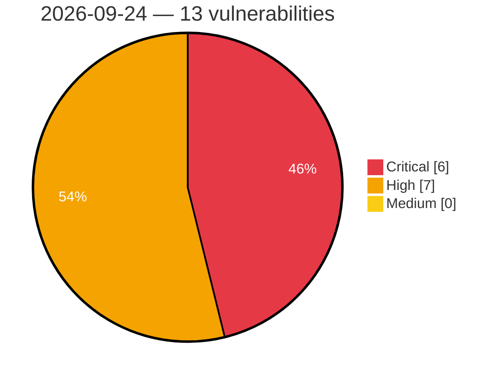

# Critical, High & Medium Severity Vulnerabilities — 2026-09-24

**Source status for this day:**

| Source | Critical | High | Medium | Total |
|--------|---------:|-----:|-------:|------:|
| cvefeed.io (High/Critical) | 6 | 7 | 0 | 13 |

**KEV (actively exploited):** 0  **Watchlist matches:** 7

## Critical (6)

| CVSS | Flags | Source | CVE / Title | Reported |
|------|-------|--------|-------------|----------|
| 9.9 | — | cvefeed.io (High/Critical) | [CVE-2026-93577 - Integer Overflow or Wraparound in GitLab](https://cvefeed.io/vuln/detail/CVE-2026-93577) | 3 hours, 58 minutes ago |
| 9.9 | — | cvefeed.io (High/Critical) | [CVE-2026-89078 - Double Free in GitLab](https://cvefeed.io/vuln/detail/CVE-2026-89078) | 3 hours, 58 minutes ago |
| 9.8 | ⭐ | cvefeed.io (High/Critical) | [CVE-2026-18467 - Paytium: Mollie payment forms & donations <= 5.0.3 - Unauthenticated Privilege Escalation via 'pt_form_field[pt-user-role]' Parameter](https://cvefeed.io/vuln/detail/CVE-2026-18467) | 1 hour, 58 minutes ago |
| 9.8 | ⭐ | cvefeed.io (High/Critical) | [CVE-2026-78308 - Authentication Bypass in DIAEnergie](https://cvefeed.io/vuln/detail/CVE-2026-78308) | 26 minutes ago |
| 9.2 | ⭐ | cvefeed.io (High/Critical) | [CVE-2026-97055 - SigNoz before 0.143.0 Authentication Bypass via Empty JWT Secret](https://cvefeed.io/vuln/detail/CVE-2026-97055) | 1 hour, 58 minutes ago |
| 9.1 | ⭐ | cvefeed.io (High/Critical) | [CVE-2026-78312 - Path Traversal in DIAEnergie](https://cvefeed.io/vuln/detail/CVE-2026-78312) | 26 minutes ago |

## High (7)

| CVSS | Flags | Source | CVE / Title | Reported |
|------|-------|--------|-------------|----------|
| 10.0 | — | cvefeed.io (High/Critical) | [CVE-2026-96891 - D-Link DIR-825 rp-l2tp tunnel.c tunnel_set_params out-of-bounds write](https://cvefeed.io/vuln/detail/CVE-2026-96891) | 58 minutes ago |
| 8.8 | — | cvefeed.io (High/Critical) | [CVE-2026-85682 - YOP Poll <= 7.0.10 - Unauthenticated Origin Validation Error to Administrator Account Takeover via '/auth/wp-login-redirect' REST Route](https://cvefeed.io/vuln/detail/CVE-2026-85682) | 26 minutes ago |
| 8.8 | ⭐ | cvefeed.io (High/Critical) | [CVE-2026-78311 - SQL Injection in DIAEnergie](https://cvefeed.io/vuln/detail/CVE-2026-78311) | 26 minutes ago |
| 8.8 | ⭐ | cvefeed.io (High/Critical) | [CVE-2026-78309 - SQL Injection in DIAEnergie](https://cvefeed.io/vuln/detail/CVE-2026-78309) | 26 minutes ago |
| 8.6 | — | cvefeed.io (High/Critical) | [CVE-2026-97152 - Nanomsg WebSocket Transport Buffer Overflow](https://cvefeed.io/vuln/detail/CVE-2026-97152) | 58 minutes ago |
| 8.6 | ⭐ | cvefeed.io (High/Critical) | [CVE-2026-82370 - Unauthenticated remote command injection in the Brocade SANnav orchestrator HTTP service](https://cvefeed.io/vuln/detail/CVE-2026-82370) | 3 hours, 58 minutes ago |
| 8.4 | — | cvefeed.io (High/Critical) | [CVE-2026-97151 - Mammoth.js Prototype Pollution and Arbitrary File Disclosure](https://cvefeed.io/vuln/detail/CVE-2026-97151) | 1 hour, 7 minutes ago |
