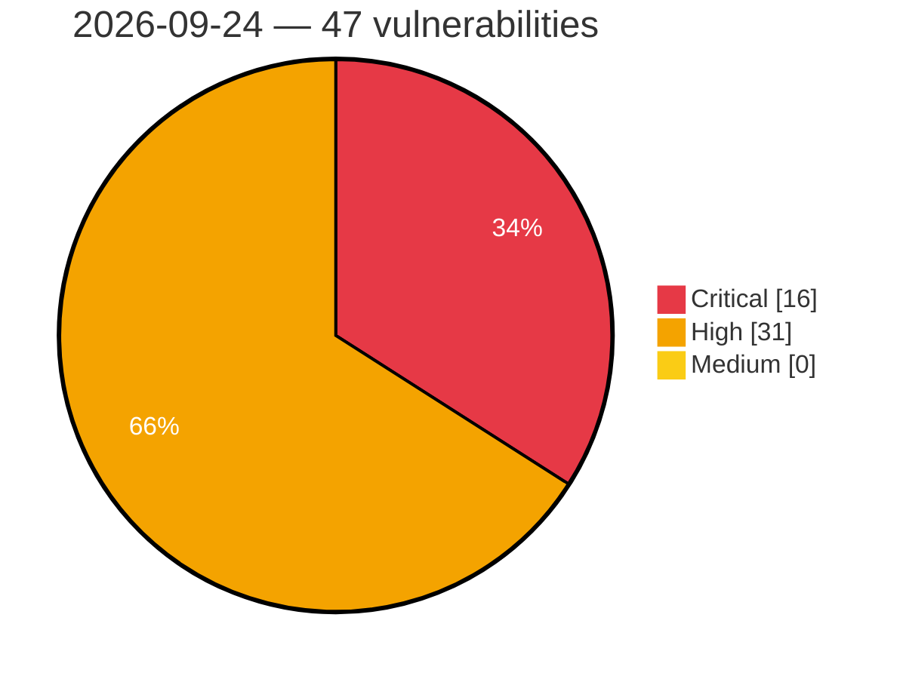

# Critical, High & Medium Severity Vulnerabilities — 2026-09-24

**Source status for this day:**

| Source | Critical | High | Medium | Total |
|--------|---------:|-----:|-------:|------:|
| cvefeed.io (High/Critical) | 16 | 31 | 0 | 47 |

**KEV (actively exploited):** 0  **Watchlist matches:** 35

## Critical (16)

| CVSS | Flags | Source | CVE / Title | Reported |
|------|-------|--------|-------------|----------|
| 10.0 | — | cvefeed.io (High/Critical) | [CVE-2026-97360 - HFS2 2.4.0 Unauthenticated Arbitrary File Read/Write via Template Engine](https://cvefeed.io/vuln/detail/CVE-2026-97360) | 49 minutes ago |
| 10.0 | ⭐ | cvefeed.io (High/Critical) | [CVE-2026-97359 - HFS2 2.4.0 RCE via Multipart Upload Filename Template Injection](https://cvefeed.io/vuln/detail/CVE-2026-97359) | 53 minutes ago |
| 9.9 | — | cvefeed.io (High/Critical) | [CVE-2026-93577 - Integer Overflow or Wraparound in GitLab](https://cvefeed.io/vuln/detail/CVE-2026-93577) | 3 hours, 58 minutes ago |
| 9.9 | — | cvefeed.io (High/Critical) | [CVE-2026-89078 - Double Free in GitLab](https://cvefeed.io/vuln/detail/CVE-2026-89078) | 3 hours, 58 minutes ago |
| 9.9 | ⭐ | cvefeed.io (High/Critical) | [CVE-2026-19072 - Velociraptor Investigator reaches SuperUser via hunt EffectivePrincipal](https://cvefeed.io/vuln/detail/CVE-2026-19072) | 1 hour, 5 minutes ago |
| 9.9 | ⭐ | cvefeed.io (High/Critical) | [CVE-2026-93425 - Dokploy: Authenticated OS Command Injection in patch.readRepoDirectories (repoPath) leads to RCE as root](https://cvefeed.io/vuln/detail/CVE-2026-93425) | 1 hour, 21 minutes ago |
| 9.8 | ⭐ | cvefeed.io (High/Critical) | [CVE-2026-18467 - Paytium: Mollie payment forms & donations <= 5.0.3 - Unauthenticated Privilege Escalation via 'pt_form_field[pt-user-role]' Parameter](https://cvefeed.io/vuln/detail/CVE-2026-18467) | 1 hour, 58 minutes ago |
| 9.8 | ⭐ | cvefeed.io (High/Critical) | [CVE-2026-78308 - Authentication Bypass in DIAEnergie](https://cvefeed.io/vuln/detail/CVE-2026-78308) | 26 minutes ago |
| 9.8 | ⭐ | cvefeed.io (High/Critical) | [CVE-2026-12227 - Visual Composer Website Builder <= 45.16.0 - Unauthenticated Local File Inclusion via 'vcv-template' Parameter](https://cvefeed.io/vuln/detail/CVE-2026-12227) | 4 hours, 4 minutes ago |
| 9.6 | ⭐ | cvefeed.io (High/Critical) | [CVE-2026-81549 - DataStage on Cloud Pak for Data has several vulnerabilities](https://cvefeed.io/vuln/detail/CVE-2026-81549) | 2 hours, 21 minutes ago |
| 9.3 | ⭐ | cvefeed.io (High/Critical) | [CVE-2026-91187 - Improper Verification of Cryptographic Signature in dashbit nimble_zta Cloudflare strategy](https://cvefeed.io/vuln/detail/CVE-2026-91187) | 1 hour, 1 minute ago |
| 9.2 | ⭐ | cvefeed.io (High/Critical) | [CVE-2026-97055 - SigNoz before 0.143.0 Authentication Bypass via Empty JWT Secret](https://cvefeed.io/vuln/detail/CVE-2026-97055) | 1 hour, 58 minutes ago |
| 9.2 | ⭐ | cvefeed.io (High/Critical) | [CVE-2026-97404 - OpenStack Zaqar Authentication Bypass Vulnerability](https://cvefeed.io/vuln/detail/CVE-2026-97404) | 2 hours, 21 minutes ago |
| 9.2 | ⭐ | cvefeed.io (High/Critical) | [CVE-2026-90481 - PortSwigger Burp Suite Authentication Bypass](https://cvefeed.io/vuln/detail/CVE-2026-90481) | 2 hours, 21 minutes ago |
| 9.1 | ⭐ | cvefeed.io (High/Critical) | [CVE-2026-78312 - Path Traversal in DIAEnergie](https://cvefeed.io/vuln/detail/CVE-2026-78312) | 26 minutes ago |
| 9.1 | ⭐ | cvefeed.io (High/Critical) | [CVE-2026-79766 - Termix: OS command injection in ACME/Let's Encrypt certificate-request handler via admin-controlled domain/email](https://cvefeed.io/vuln/detail/CVE-2026-79766) | 21 minutes ago |

## High (31)

| CVSS | Flags | Source | CVE / Title | Reported |
|------|-------|--------|-------------|----------|
| 10.0 | — | cvefeed.io (High/Critical) | [CVE-2026-96891 - D-Link DIR-825 rp-l2tp tunnel.c tunnel_set_params out-of-bounds write](https://cvefeed.io/vuln/detail/CVE-2026-96891) | 58 minutes ago |
| 8.9 | ⭐ | cvefeed.io (High/Critical) | [CVE-2026-94606 - authentik: MFA Bypass via State Confusion / Parameter Injection in AuthenticatorEmailStage](https://cvefeed.io/vuln/detail/CVE-2026-94606) | 21 minutes ago |
| 8.8 | — | cvefeed.io (High/Critical) | [CVE-2026-85682 - YOP Poll <= 7.0.10 - Unauthenticated Origin Validation Error to Administrator Account Takeover via '/auth/wp-login-redirect' REST Route](https://cvefeed.io/vuln/detail/CVE-2026-85682) | 26 minutes ago |
| 8.8 | ⭐ | cvefeed.io (High/Critical) | [CVE-2026-78311 - SQL Injection in DIAEnergie](https://cvefeed.io/vuln/detail/CVE-2026-78311) | 26 minutes ago |
| 8.8 | ⭐ | cvefeed.io (High/Critical) | [CVE-2026-78309 - SQL Injection in DIAEnergie](https://cvefeed.io/vuln/detail/CVE-2026-78309) | 26 minutes ago |
| 8.8 | — | cvefeed.io (High/Critical) | [CVE-2026-97059 - DCMTK through 3.7.0 Heap Over-read via NumberOfFrames](https://cvefeed.io/vuln/detail/CVE-2026-97059) | 30 minutes ago |
| 8.8 | ⭐ | cvefeed.io (High/Critical) | [CVE-2026-94609 - authentik: Privilege Escalation to Superuser via Group Hierarchy](https://cvefeed.io/vuln/detail/CVE-2026-94609) | 21 minutes ago |
| 8.8 | — | cvefeed.io (High/Critical) | [CVE-2026-95985 - Kiro IDE Allows Agentic Writes to Global Configurations While Working in Untrusted Workspaces](https://cvefeed.io/vuln/detail/CVE-2026-95985) | 31 minutes ago |
| 8.8 | ⭐ | cvefeed.io (High/Critical) | [CVE-2026-82093 - DataStage on Cloud Pak for Data has several vulnerabilities](https://cvefeed.io/vuln/detail/CVE-2026-82093) | 2 hours, 21 minutes ago |
| 8.8 | ⭐ | cvefeed.io (High/Critical) | [CVE-2026-81552 - DataStage on Cloud Pak for Data has several vulnerabilities](https://cvefeed.io/vuln/detail/CVE-2026-81552) | 2 hours, 21 minutes ago |
| 8.8 | ⭐ | cvefeed.io (High/Critical) | [CVE-2026-81548 - DataStage on Cloud Pak for Data has several vulnerabilities](https://cvefeed.io/vuln/detail/CVE-2026-81548) | 2 hours, 21 minutes ago |
| 8.7 | — | cvefeed.io (High/Critical) | [CVE-2026-97057 - redis-parser through 3.0.0 Denial of Service via Invalid Array Length](https://cvefeed.io/vuln/detail/CVE-2026-97057) | 30 minutes ago |
| 8.7 | ⭐ | cvefeed.io (High/Critical) | [CVE-2026-91122 - Discourse: Chat MessageBus delivers read-restricted messages to unauthorized users](https://cvefeed.io/vuln/detail/CVE-2026-91122) | 21 minutes ago |
| 8.7 | ⭐ | cvefeed.io (High/Critical) | [CVE-2026-63498 - Snipe-IT: Stored XSS via Inline XML Rendering in the Uploaded Files API](https://cvefeed.io/vuln/detail/CVE-2026-63498) | 21 minutes ago |
| 8.7 | ⭐ | cvefeed.io (High/Critical) | [CVE-2026-56744 - `@bsv/wallet-toolbox` / `-client` / `-mobile` don't verify storage-supplied recipient output scripts against caller-requested outputs in createAction (can redirect payments when using remote storage)](https://cvefeed.io/vuln/detail/CVE-2026-56744) | 22 minutes ago |
| 8.7 | — | cvefeed.io (High/Critical) | [CVE-2026-97362 - HFS2 2.4.0 Unauthenticated Denial of Service via Hung Serving Thread](https://cvefeed.io/vuln/detail/CVE-2026-97362) | 2 hours, 21 minutes ago |
| 8.6 | — | cvefeed.io (High/Critical) | [CVE-2026-97152 - Nanomsg WebSocket Transport Buffer Overflow](https://cvefeed.io/vuln/detail/CVE-2026-97152) | 58 minutes ago |
| 8.6 | ⭐ | cvefeed.io (High/Critical) | [CVE-2026-82370 - Unauthenticated remote command injection in the Brocade SANnav orchestrator HTTP service](https://cvefeed.io/vuln/detail/CVE-2026-82370) | 3 hours, 58 minutes ago |
| 8.6 | ⭐ | cvefeed.io (High/Critical) | [CVE-2026-96515 - Command Injection Vulnerability in Netlink ICT HG323RW Router](https://cvefeed.io/vuln/detail/CVE-2026-96515) | 1 hour, 5 minutes ago |
| 8.6 | ⭐ | cvefeed.io (High/Critical) | [CVE-2026-63493 - Snipe-IT: 2FA bypass via the API token flow](https://cvefeed.io/vuln/detail/CVE-2026-63493) | 21 minutes ago |
| 8.6 | ⭐ | cvefeed.io (High/Critical) | [CVE-2026-77581 - BentoPDF: SSRF in cors-proxy-worker.js via DNS-based hostname allowlist bypass](https://cvefeed.io/vuln/detail/CVE-2026-77581) | 1 hour, 21 minutes ago |
| 8.5 | ⭐ | cvefeed.io (High/Critical) | [CVE-2026-56738 - phpMyFAQ has SQL Injection in `StopWords::add()` — Unescaped Stop Word Insertion](https://cvefeed.io/vuln/detail/CVE-2026-56738) | 22 minutes ago |
| 8.5 | ⭐ | cvefeed.io (High/Critical) | [CVE-2026-56739 - Logto: SSRF via Webhooks and Custom OAuth2 Connector UserInfo Endpoint](https://cvefeed.io/vuln/detail/CVE-2026-56739) | 1 hour, 21 minutes ago |
| 8.4 | — | cvefeed.io (High/Critical) | [CVE-2026-97151 - Mammoth.js Prototype Pollution and Arbitrary File Disclosure](https://cvefeed.io/vuln/detail/CVE-2026-97151) | 1 hour, 7 minutes ago |
| 8.3 | — | cvefeed.io (High/Critical) | [CVE-2026-96746 - Heap buffer overflow via mid-scan command list growth in client topology monitoring](https://cvefeed.io/vuln/detail/CVE-2026-96746) | 1 hour, 21 minutes ago |
| 8.2 | ⭐ | cvefeed.io (High/Critical) | [CVE-2026-91160 - OpenWA: A read-only API key can receive a session pairing QR over the WebSocket event stream](https://cvefeed.io/vuln/detail/CVE-2026-91160) | 21 minutes ago |
| 8.1 | ⭐ | cvefeed.io (High/Critical) | [CVE-2026-57590 - Apache DolphinScheduler: Missing Authorization in Task Group APIs Allows Unauthorized Cross-Project Operations](https://cvefeed.io/vuln/detail/CVE-2026-57590) | 4 hours, 4 minutes ago |
| 8.1 | ⭐ | cvefeed.io (High/Critical) | [CVE-2026-94611 - authentik: Stored credentials are readable with view permission alone](https://cvefeed.io/vuln/detail/CVE-2026-94611) | 21 minutes ago |
| 8.1 | ⭐ | cvefeed.io (High/Critical) | [CVE-2026-62368 - Snipe-IT: Stored XSS via Custom Field name in asset-list column headers](https://cvefeed.io/vuln/detail/CVE-2026-62368) | 21 minutes ago |
| 8.1 | ⭐ | cvefeed.io (High/Critical) | [CVE-2026-56737 - phpMyFAQ's two-factor authentication login bypasses the password factor](https://cvefeed.io/vuln/detail/CVE-2026-56737) | 1 hour, 21 minutes ago |
| 8.1 | ⭐ | cvefeed.io (High/Critical) | [CVE-2026-90959 - Pulpcore: pulpcore: file:// scheme allowlist bypass in content upload file_url field enables arbitrary file read and pulp container registry signing key theft](https://cvefeed.io/vuln/detail/CVE-2026-90959) | 2 hours, 21 minutes ago |
