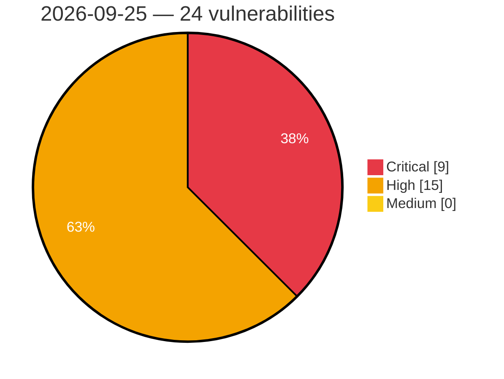

# Critical, High & Medium Severity Vulnerabilities — 2026-09-25

**Source status for this day:**

| Source | Critical | High | Medium | Total |
|--------|---------:|-----:|-------:|------:|
| cvefeed.io (High/Critical) | 9 | 15 | 0 | 24 |

**KEV (actively exploited):** 0  **Watchlist matches:** 20

## Critical (9)

| CVSS | Flags | Source | CVE / Title | Reported |
|------|-------|--------|-------------|----------|
| 9.8 | ⭐ | cvefeed.io (High/Critical) | [CVE-2026-14281 - Automation Web Platform <= 4.8.6 - Unauthenticated Privilege Escalation via 'wawp_custom_fields' Parameter](https://cvefeed.io/vuln/detail/CVE-2026-14281) | 3 hours, 44 minutes ago |
| 9.8 | ⭐ | cvefeed.io (High/Critical) | [CVE-2026-93643 - Zimbra Collaboration Suite OnlyOffice Integration Path Traversal Leading to Remote Code Execution via Unauthenticated /downloadas Request](https://cvefeed.io/vuln/detail/CVE-2026-93643) | 43 minutes ago |
| 9.8 | — | cvefeed.io (High/Critical) | [CVE-2026-92609 - Apache Qpid Broker-J: Missing HTTP-session renewal after successful authentication](https://cvefeed.io/vuln/detail/CVE-2026-92609) | 6 hours, 44 minutes ago |
| 9.3 | ⭐ | cvefeed.io (High/Critical) | [CVE-2026-93647 - Zimbra Collaboration Suite Classic Web Client Stored Cross-Site Scripting via Crafted Calendar COUNTER Message From Address](https://cvefeed.io/vuln/detail/CVE-2026-93647) | 43 minutes ago |
| 9.3 | ⭐ | cvefeed.io (High/Critical) | [CVE-2026-93642 - Zimbra Collaboration Suite Modern Web Client Stored Cross-Site Scripting via Forged Share Invitation](https://cvefeed.io/vuln/detail/CVE-2026-93642) | 43 minutes ago |
| 9.3 | ⭐ | cvefeed.io (High/Critical) | [CVE-2026-93641 - Zimbra Collaboration Suite Classic Web Client Stored Cross-Site Scripting via Forged Share Invitation](https://cvefeed.io/vuln/detail/CVE-2026-93641) | 43 minutes ago |
| 9.3 | — | cvefeed.io (High/Critical) | [CVE-2026-95832 - Reflected unknown field names in the kitty colour control escape code allow command execution in the user's shell](https://cvefeed.io/vuln/detail/CVE-2026-95832) | 1 hour, 43 minutes ago |
| 9.1 | — | cvefeed.io (High/Critical) | [CVE-2026-93399 - Online Scheduling and Appointment Booking System <= 28.2 - Insecure Direct Object Reference to Unauthenticated Arbitrary Booking Token Disclosure and Deletion via 'order_id' Parameter](https://cvefeed.io/vuln/detail/CVE-2026-93399) | 3 hours, 44 minutes ago |
| 9.1 | ⭐ | cvefeed.io (High/Critical) | [CVE-2026-89055 - Customer Reviews for WooCommerce <= 5.120.0 - Missing Authorization to Unauthenticated Arbitrary Attachment Deletion via 'items[][media]' Parameter](https://cvefeed.io/vuln/detail/CVE-2026-89055) | 3 hours, 44 minutes ago |

## High (15)

| CVSS | Flags | Source | CVE / Title | Reported |
|------|-------|--------|-------------|----------|
| 8.8 | ⭐ | cvefeed.io (High/Critical) | [CVE-2026-89426 - Knit Pay <= 9.6.1.0 - Authenticated (Subscriber+) Privilege Escalation via Gravity Forms Role Field](https://cvefeed.io/vuln/detail/CVE-2026-89426) | 2 hours, 44 minutes ago |
| 8.8 | ⭐ | cvefeed.io (High/Critical) | [CVE-2026-19804 - s2Member <= 260814 - Unauthenticated Remote Code Execution via 'first_name' Parameter in PayPal Proxy Return](https://cvefeed.io/vuln/detail/CVE-2026-19804) | 2 hours, 44 minutes ago |
| 8.8 | ⭐ | cvefeed.io (High/Critical) | [CVE-2026-62062 - WordPress Elementor Website Builder plugin <= 4.3.1 - Cross Site Request Forgery (CSRF) vulnerability](https://cvefeed.io/vuln/detail/CVE-2026-62062) | 3 hours, 44 minutes ago |
| 8.8 | ⭐ | cvefeed.io (High/Critical) | [CVE-2026-96812 - Host Root Sandbox Escape in gVisor via Character Device Passthrough and CUSE](https://cvefeed.io/vuln/detail/CVE-2026-96812) | 13 minutes ago |
| 8.8 | ⭐ | cvefeed.io (High/Critical) | [CVE-2026-93834 - Qemu-kvm: 9pfs: use-after-free race in tlcreate/twalk allows vm guest escape](https://cvefeed.io/vuln/detail/CVE-2026-93834) | 43 minutes ago |
| 8.8 | ⭐ | cvefeed.io (High/Critical) | [CVE-2026-85542 - IBM Guardium Data Protection is affected by multiple vulnerabilities.](https://cvefeed.io/vuln/detail/CVE-2026-85542) | 43 minutes ago |
| 8.6 | ⭐ | cvefeed.io (High/Critical) | [CVE-2026-97818 - phpIPAM User API Authorization Bypass](https://cvefeed.io/vuln/detail/CVE-2026-97818) | 26 minutes ago |
| 8.5 | ⭐ | cvefeed.io (High/Critical) | [CVE-2026-97730 - Netgate pfSense Dashboard Local File Inclusion Vulnerability](https://cvefeed.io/vuln/detail/CVE-2026-97730) | 2 hours, 26 minutes ago |
| 8.5 | ⭐ | cvefeed.io (High/Critical) | [CVE-2026-85082 - Maple Media Root Browser Classic 3.3.0 - OS command injection through crafted SQLite filenames](https://cvefeed.io/vuln/detail/CVE-2026-85082) | 5 hours, 26 minutes ago |
| 8.5 | ⭐ | cvefeed.io (High/Critical) | [CVE-2026-100176 - Stored Cross-Site Scripting (XSS) in AIL Framework Username Timeline Tooltip](https://cvefeed.io/vuln/detail/CVE-2026-100176) | 43 minutes ago |
| 8.5 | ⭐ | cvefeed.io (High/Critical) | [CVE-2026-100172 - Stored XSS in AIL Framework extracted-match popovers via unescaped dynamic values in HTML-enabled data-content attributes](https://cvefeed.io/vuln/detail/CVE-2026-100172) | 43 minutes ago |
| 8.4 | ⭐ | cvefeed.io (High/Critical) | [CVE-2026-97898 - Broken authorization in Akia keyless entry lets an authenticated guest unlock other rooms](https://cvefeed.io/vuln/detail/CVE-2026-97898) | 43 minutes ago |
| 8.1 | — | cvefeed.io (High/Critical) | [CVE-2026-92713 - Modula Image Gallery <= 3.0.2 - Missing Authorization to Authenticated (Author+) Arbitrary File Deletion (Non-PHP) via 'file' Parameter](https://cvefeed.io/vuln/detail/CVE-2026-92713) | 2 hours, 44 minutes ago |
| 8.1 | ⭐ | cvefeed.io (High/Critical) | [CVE-2026-97875 - DNS rebinding vulnerability in rojo serve HTTP API](https://cvefeed.io/vuln/detail/CVE-2026-97875) | 3 hours, 43 minutes ago |
| 8.0 | ⭐ | cvefeed.io (High/Critical) | [CVE-2026-97735 - ITFlow SVG File Upload Vulnerability](https://cvefeed.io/vuln/detail/CVE-2026-97735) | 1 hour, 25 minutes ago |
