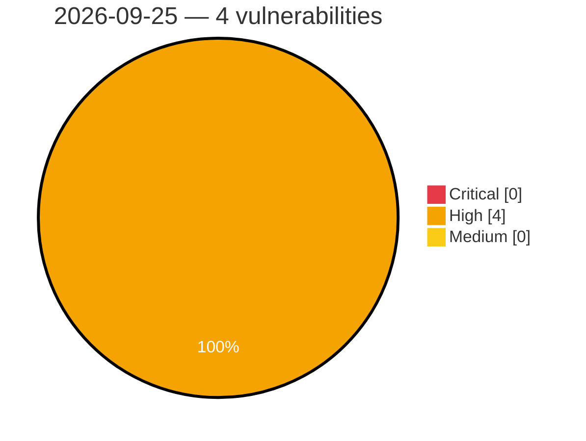

# Critical, High & Medium Severity Vulnerabilities — 2026-09-25

**Source status for this day:**

| Source | Critical | High | Medium | Total |
|--------|---------:|-----:|-------:|------:|
| cvefeed.io (High/Critical) | 0 | 4 | 0 | 4 |

**KEV (actively exploited):** 0  **Watchlist matches:** 4

## High (4)

| CVSS | Flags | Source | CVE / Title | Reported |
|------|-------|--------|-------------|----------|
| 8.6 | ⭐ | cvefeed.io (High/Critical) | [CVE-2026-97818 - phpIPAM User API Authorization Bypass](https://cvefeed.io/vuln/detail/CVE-2026-97818) | 26 minutes ago |
| 8.5 | ⭐ | cvefeed.io (High/Critical) | [CVE-2026-97730 - Netgate pfSense Dashboard Local File Inclusion Vulnerability](https://cvefeed.io/vuln/detail/CVE-2026-97730) | 2 hours, 26 minutes ago |
| 8.5 | ⭐ | cvefeed.io (High/Critical) | [CVE-2026-85082 - Maple Media Root Browser Classic 3.3.0 - OS command injection through crafted SQLite filenames](https://cvefeed.io/vuln/detail/CVE-2026-85082) | 5 hours, 26 minutes ago |
| 8.0 | ⭐ | cvefeed.io (High/Critical) | [CVE-2026-97735 - ITFlow SVG File Upload Vulnerability](https://cvefeed.io/vuln/detail/CVE-2026-97735) | 1 hour, 25 minutes ago |
