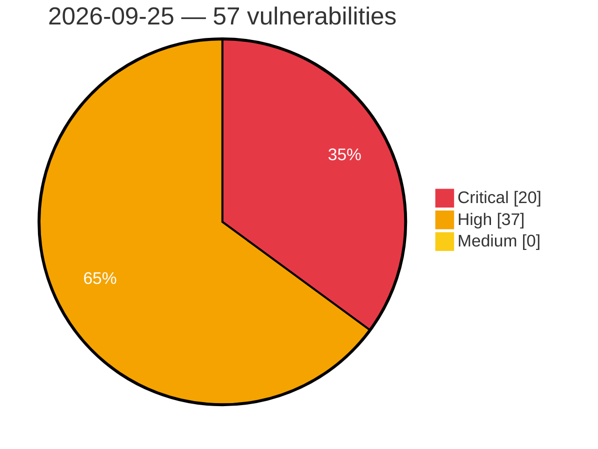

# Critical, High & Medium Severity Vulnerabilities — 2026-09-25

**Source status for this day:**

| Source | Critical | High | Medium | Total |
|--------|---------:|-----:|-------:|------:|
| cvefeed.io (High/Critical) | 20 | 37 | 0 | 57 |

**KEV (actively exploited):** 0  **Watchlist matches:** 49

## Critical (20)

| CVSS | Flags | Source | CVE / Title | Reported |
|------|-------|--------|-------------|----------|
| 10.0 | ⭐ | cvefeed.io (High/Critical) | [CVE-2026-100382 - Unauthenticated remote code execution through wikitext in ExternalData](https://cvefeed.io/vuln/detail/CVE-2026-100382) | 40 minutes ago |
| 9.8 | ⭐ | cvefeed.io (High/Critical) | [CVE-2026-14281 - Automation Web Platform <= 4.8.6 - Unauthenticated Privilege Escalation via 'wawp_custom_fields' Parameter](https://cvefeed.io/vuln/detail/CVE-2026-14281) | 3 hours, 44 minutes ago |
| 9.8 | ⭐ | cvefeed.io (High/Critical) | [CVE-2026-93643 - Zimbra Collaboration Suite OnlyOffice Integration Path Traversal Leading to Remote Code Execution via Unauthenticated /downloadas Request](https://cvefeed.io/vuln/detail/CVE-2026-93643) | 43 minutes ago |
| 9.8 | — | cvefeed.io (High/Critical) | [CVE-2026-92609 - Apache Qpid Broker-J: Missing HTTP-session renewal after successful authentication](https://cvefeed.io/vuln/detail/CVE-2026-92609) | 6 hours, 44 minutes ago |
| 9.8 | ⭐ | cvefeed.io (High/Critical) | [CVE-2026-92161 - FriendsOfFlarum OAuth: Unauthenticated account takeover via unverified email trust in Discord OAuth provider](https://cvefeed.io/vuln/detail/CVE-2026-92161) | 2 hours, 43 minutes ago |
| 9.4 | ⭐ | cvefeed.io (High/Critical) | [CVE-2026-48482 - GLPI: RCE via Form import](https://cvefeed.io/vuln/detail/CVE-2026-48482) | 3 hours, 40 minutes ago |
| 9.3 | ⭐ | cvefeed.io (High/Critical) | [CVE-2026-93647 - Zimbra Collaboration Suite Classic Web Client Stored Cross-Site Scripting via Crafted Calendar COUNTER Message From Address](https://cvefeed.io/vuln/detail/CVE-2026-93647) | 43 minutes ago |
| 9.3 | ⭐ | cvefeed.io (High/Critical) | [CVE-2026-93642 - Zimbra Collaboration Suite Modern Web Client Stored Cross-Site Scripting via Forged Share Invitation](https://cvefeed.io/vuln/detail/CVE-2026-93642) | 43 minutes ago |
| 9.3 | ⭐ | cvefeed.io (High/Critical) | [CVE-2026-93641 - Zimbra Collaboration Suite Classic Web Client Stored Cross-Site Scripting via Forged Share Invitation](https://cvefeed.io/vuln/detail/CVE-2026-93641) | 43 minutes ago |
| 9.3 | — | cvefeed.io (High/Critical) | [CVE-2026-95832 - Reflected unknown field names in the kitty colour control escape code allow command execution in the user's shell](https://cvefeed.io/vuln/detail/CVE-2026-95832) | 1 hour, 43 minutes ago |
| 9.3 | ⭐ | cvefeed.io (High/Critical) | [CVE-2026-97064 - X-SpringBoot through 6.0 Authentication Bypass via Static Master Code](https://cvefeed.io/vuln/detail/CVE-2026-97064) | 48 minutes ago |
| 9.3 | ⭐ | cvefeed.io (High/Critical) | [CVE-2026-97063 - X-SpringBoot through 6.0 Authentication Bypass via Login Code](https://cvefeed.io/vuln/detail/CVE-2026-97063) | 48 minutes ago |
| 9.2 | ⭐ | cvefeed.io (High/Critical) | [CVE-2026-100389 - GestSup before 3.2.61 Remote Code Execution via IMAP Attachment](https://cvefeed.io/vuln/detail/CVE-2026-100389) | 1 hour, 39 minutes ago |
| 9.1 | — | cvefeed.io (High/Critical) | [CVE-2026-93399 - Online Scheduling and Appointment Booking System <= 28.2 - Insecure Direct Object Reference to Unauthenticated Arbitrary Booking Token Disclosure and Deletion via 'order_id' Parameter](https://cvefeed.io/vuln/detail/CVE-2026-93399) | 3 hours, 44 minutes ago |
| 9.1 | ⭐ | cvefeed.io (High/Critical) | [CVE-2026-89055 - Customer Reviews for WooCommerce <= 5.120.0 - Missing Authorization to Unauthenticated Arbitrary Attachment Deletion via 'items[][media]' Parameter](https://cvefeed.io/vuln/detail/CVE-2026-89055) | 3 hours, 44 minutes ago |
| 9.1 | ⭐ | cvefeed.io (High/Critical) | [CVE-2026-62262 - Piwigo: Unauthenticated SQL injection in `pwg.images.filteredSearch.create`](https://cvefeed.io/vuln/detail/CVE-2026-62262) | 2 hours, 43 minutes ago |
| 9.1 | ⭐ | cvefeed.io (High/Critical) | [CVE-2026-42322 - Piwigo: Authenticated RCE via File Upload in Logo Upload Feature](https://cvefeed.io/vuln/detail/CVE-2026-42322) | 2 hours, 43 minutes ago |
| 9.1 | ⭐ | cvefeed.io (High/Critical) | [CVE-2026-39353 - InvoicePlane: Remote Code Execution via Writable Templates Directory](https://cvefeed.io/vuln/detail/CVE-2026-39353) | 2 hours, 43 minutes ago |
| 9.1 | ⭐ | cvefeed.io (High/Critical) | [CVE-2026-100390 - Zoraxy 3.2.3 through 3.3.4 Client IP Spoofing via X-Forwarded-For IPv6](https://cvefeed.io/vuln/detail/CVE-2026-100390) | 1 hour, 39 minutes ago |
| 9.1 | ⭐ | cvefeed.io (High/Critical) | [CVE-2026-84458 - Zammad: Account takeover via unverified email matching during SSO auto-link](https://cvefeed.io/vuln/detail/CVE-2026-84458) | 3 hours, 39 minutes ago |

## High (37)

| CVSS | Flags | Source | CVE / Title | Reported |
|------|-------|--------|-------------|----------|
| 8.8 | ⭐ | cvefeed.io (High/Critical) | [CVE-2026-89426 - Knit Pay <= 9.6.1.0 - Authenticated (Subscriber+) Privilege Escalation via Gravity Forms Role Field](https://cvefeed.io/vuln/detail/CVE-2026-89426) | 2 hours, 44 minutes ago |
| 8.8 | ⭐ | cvefeed.io (High/Critical) | [CVE-2026-19804 - s2Member <= 260814 - Unauthenticated Remote Code Execution via 'first_name' Parameter in PayPal Proxy Return](https://cvefeed.io/vuln/detail/CVE-2026-19804) | 2 hours, 44 minutes ago |
| 8.8 | ⭐ | cvefeed.io (High/Critical) | [CVE-2026-62062 - WordPress Elementor Website Builder plugin <= 4.3.1 - Cross Site Request Forgery (CSRF) vulnerability](https://cvefeed.io/vuln/detail/CVE-2026-62062) | 3 hours, 44 minutes ago |
| 8.8 | ⭐ | cvefeed.io (High/Critical) | [CVE-2026-96812 - Host Root Sandbox Escape in gVisor via Character Device Passthrough and CUSE](https://cvefeed.io/vuln/detail/CVE-2026-96812) | 13 minutes ago |
| 8.8 | ⭐ | cvefeed.io (High/Critical) | [CVE-2026-93834 - Qemu-kvm: 9pfs: use-after-free race in tlcreate/twalk allows vm guest escape](https://cvefeed.io/vuln/detail/CVE-2026-93834) | 43 minutes ago |
| 8.8 | ⭐ | cvefeed.io (High/Critical) | [CVE-2026-85542 - IBM Guardium Data Protection is affected by multiple vulnerabilities.](https://cvefeed.io/vuln/detail/CVE-2026-85542) | 43 minutes ago |
| 8.8 | ⭐ | cvefeed.io (High/Critical) | [CVE-2026-61525 - Zammad: Arbitrary File Deletion via Unvalidated Session Identifier in Long Polling Controller](https://cvefeed.io/vuln/detail/CVE-2026-61525) | 43 minutes ago |
| 8.8 | ⭐ | cvefeed.io (High/Critical) | [CVE-2026-94445 - Malicious user input may lead to RCE in golang.org/x/playground](https://cvefeed.io/vuln/detail/CVE-2026-94445) | 1 hour, 43 minutes ago |
| 8.8 | ⭐ | cvefeed.io (High/Critical) | [CVE-2026-100391 - MediaFlow Proxy through 2.4.9 Server-Side Request Forgery via Incomplete Validation](https://cvefeed.io/vuln/detail/CVE-2026-100391) | 1 hour, 39 minutes ago |
| 8.7 | ⭐ | cvefeed.io (High/Critical) | [CVE-2026-56733 - Zammad: Incorrect Authorization and Improper Privilege Management](https://cvefeed.io/vuln/detail/CVE-2026-56733) | 43 minutes ago |
| 8.7 | ⭐ | cvefeed.io (High/Critical) | [CVE-2026-56725 - Zammad: Denial of Service via OTRS Import Controller](https://cvefeed.io/vuln/detail/CVE-2026-56725) | 43 minutes ago |
| 8.7 | ⭐ | cvefeed.io (High/Critical) | [CVE-2026-89032 - BerriAI LiteLLM < 1.101.0-rc.1 Tenant Isolation Bypass via Semantic Cache Layer](https://cvefeed.io/vuln/detail/CVE-2026-89032) | 1 hour, 43 minutes ago |
| 8.6 | ⭐ | cvefeed.io (High/Critical) | [CVE-2026-97818 - phpIPAM User API Authorization Bypass](https://cvefeed.io/vuln/detail/CVE-2026-97818) | 26 minutes ago |
| 8.6 | ⭐ | cvefeed.io (High/Critical) | [CVE-2026-84462 - Zammad: AI Agent template sanitizer bypass leads to remote code execution](https://cvefeed.io/vuln/detail/CVE-2026-84462) | 43 minutes ago |
| 8.6 | — | cvefeed.io (High/Critical) | [CVE-2026-97060 - X-SpringBoot through 6.0 Authorization Bypass via User Management](https://cvefeed.io/vuln/detail/CVE-2026-97060) | 48 minutes ago |
| 8.6 | ⭐ | cvefeed.io (High/Critical) | [CVE-2026-100372 - ClipBucket v5 before 5.5.3-#197 Path Traversal via template_editor.php](https://cvefeed.io/vuln/detail/CVE-2026-100372) | 2 hours, 40 minutes ago |
| 8.5 | ⭐ | cvefeed.io (High/Critical) | [CVE-2026-97730 - Netgate pfSense Dashboard Local File Inclusion Vulnerability](https://cvefeed.io/vuln/detail/CVE-2026-97730) | 2 hours, 26 minutes ago |
| 8.5 | ⭐ | cvefeed.io (High/Critical) | [CVE-2026-85082 - Maple Media Root Browser Classic 3.3.0 - OS command injection through crafted SQLite filenames](https://cvefeed.io/vuln/detail/CVE-2026-85082) | 5 hours, 26 minutes ago |
| 8.5 | ⭐ | cvefeed.io (High/Critical) | [CVE-2026-100176 - Stored Cross-Site Scripting (XSS) in AIL Framework Username Timeline Tooltip](https://cvefeed.io/vuln/detail/CVE-2026-100176) | 43 minutes ago |
| 8.5 | ⭐ | cvefeed.io (High/Critical) | [CVE-2026-100172 - Stored XSS in AIL Framework extracted-match popovers via unescaped dynamic values in HTML-enabled data-content attributes](https://cvefeed.io/vuln/detail/CVE-2026-100172) | 43 minutes ago |
| 8.5 | ⭐ | cvefeed.io (High/Critical) | [CVE-2026-71483 - Horilla: Reflected Cross-Site Scripting (XSS) in Employee Filter View](https://cvefeed.io/vuln/detail/CVE-2026-71483) | 38 minutes ago |
| 8.5 | ⭐ | cvefeed.io (High/Critical) | [CVE-2026-55214 - GLPI: Stored XSS in suppliers](https://cvefeed.io/vuln/detail/CVE-2026-55214) | 3 hours, 39 minutes ago |
| 8.5 | — | cvefeed.io (High/Critical) | [CVE-2026-47679 - GLPI: arbitrary file deletion](https://cvefeed.io/vuln/detail/CVE-2026-47679) | 3 hours, 40 minutes ago |
| 8.4 | ⭐ | cvefeed.io (High/Critical) | [CVE-2026-97898 - Broken authorization in Akia keyless entry lets an authenticated guest unlock other rooms](https://cvefeed.io/vuln/detail/CVE-2026-97898) | 43 minutes ago |
| 8.4 | ⭐ | cvefeed.io (High/Critical) | [CVE-2026-56731 - Zammad: Cross-Site Scripting in Ticket Notifications](https://cvefeed.io/vuln/detail/CVE-2026-56731) | 43 minutes ago |
| 8.4 | — | cvefeed.io (High/Critical) | [CVE-2026-100248 - Rattadan Cosmowarp Improper Authorization Vulnerability](https://cvefeed.io/vuln/detail/CVE-2026-100248) | 1 hour, 44 minutes ago |
| 8.4 | — | cvefeed.io (High/Critical) | [CVE-2026-100369 - CliInvoke: Argument Injection in Extensibility Runner Factory](https://cvefeed.io/vuln/detail/CVE-2026-100369) | 1 hour, 39 minutes ago |
| 8.4 | ⭐ | cvefeed.io (High/Critical) | [CVE-2026-100368 - CliInvoke.Specializations: Command injection in PowerShell and Cmd shell wrappers](https://cvefeed.io/vuln/detail/CVE-2026-100368) | 2 hours, 40 minutes ago |
| 8.3 | ⭐ | cvefeed.io (High/Critical) | [CVE-2026-100501 - Flame through 2.4.0 Brute-Force Attack via Login Endpoint](https://cvefeed.io/vuln/detail/CVE-2026-100501) | 40 minutes ago |
| 8.2 | ⭐ | cvefeed.io (High/Critical) | [CVE-2026-67410 - RabbitMQ: OAuth2 Client Secret Exposed via Unauthenticated JavaScript Endpoint](https://cvefeed.io/vuln/detail/CVE-2026-67410) | 1 hour, 44 minutes ago |
| 8.2 | ⭐ | cvefeed.io (High/Critical) | [CVE-2026-67409 - RabbitMQ: JWKS Fetch Ignores HTTP Response Status Code - Signing Key Destruction Causes Authentication DoS](https://cvefeed.io/vuln/detail/CVE-2026-67409) | 1 hour, 44 minutes ago |
| 8.2 | ⭐ | cvefeed.io (High/Critical) | [CVE-2026-67236 - RabbitMQ: Plaintext username:password stored in an insecure cookie after successful POST /login](https://cvefeed.io/vuln/detail/CVE-2026-67236) | 2 hours, 43 minutes ago |
| 8.1 | — | cvefeed.io (High/Critical) | [CVE-2026-92713 - Modula Image Gallery <= 3.0.2 - Missing Authorization to Authenticated (Author+) Arbitrary File Deletion (Non-PHP) via 'file' Parameter](https://cvefeed.io/vuln/detail/CVE-2026-92713) | 2 hours, 44 minutes ago |
| 8.1 | ⭐ | cvefeed.io (High/Critical) | [CVE-2026-97875 - DNS rebinding vulnerability in rojo serve HTTP API](https://cvefeed.io/vuln/detail/CVE-2026-97875) | 3 hours, 43 minutes ago |
| 8.1 | ⭐ | cvefeed.io (High/Critical) | [CVE-2026-44642 - Piwigo: SQL injection in upgrade authentication allows unauthenticated upgrade authorization bypass (PHP 8+)](https://cvefeed.io/vuln/detail/CVE-2026-44642) | 2 hours, 43 minutes ago |
| 8.1 | ⭐ | cvefeed.io (High/Critical) | [CVE-2026-100387 - pgPointcloud through 1.2.5 heap out-of-bounds read via WKB deserialization](https://cvefeed.io/vuln/detail/CVE-2026-100387) | 1 hour, 39 minutes ago |
| 8.0 | ⭐ | cvefeed.io (High/Critical) | [CVE-2026-97735 - ITFlow SVG File Upload Vulnerability](https://cvefeed.io/vuln/detail/CVE-2026-97735) | 1 hour, 25 minutes ago |
