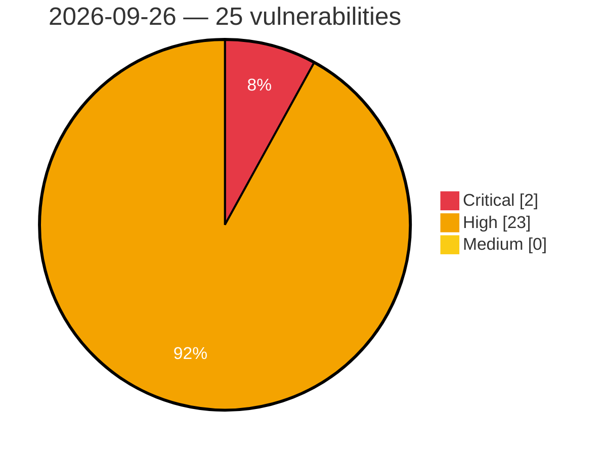

# Critical, High & Medium Severity Vulnerabilities — 2026-09-26

**Source status for this day:**

| Source | Critical | High | Medium | Total |
|--------|---------:|-----:|-------:|------:|
| cvefeed.io (High/Critical) | 2 | 23 | 0 | 25 |

**KEV (actively exploited):** 0  **Watchlist matches:** 19

## Critical (2)

| CVSS | Flags | Source | CVE / Title | Reported |
|------|-------|--------|-------------|----------|
| 9.8 | ⭐ | cvefeed.io (High/Critical) | [CVE-2026-18143 - Request a Quote for WooCommerce <= 2.9.2 - Unauthenticated Arbitrary File Upload via AJAX Popup Handler](https://cvefeed.io/vuln/detail/CVE-2026-18143) | 4 hours, 27 minutes ago |
| 9.0 | ⭐ | cvefeed.io (High/Critical) | [CVE-2026-100551 - OpenClaw iOS Control UI TLS Pin Enforcement Bypass](https://cvefeed.io/vuln/detail/CVE-2026-100551) | 1 hour, 26 minutes ago |

## High (23)

| CVSS | Flags | Source | CVE / Title | Reported |
|------|-------|--------|-------------|----------|
| 8.9 | ⭐ | cvefeed.io (High/Critical) | [CVE-2026-100567 - OpenClaw before 2026.8.1 DNS Rebinding via CDP Hostname](https://cvefeed.io/vuln/detail/CVE-2026-100567) | 1 hour, 26 minutes ago |
| 8.8 | ⭐ | cvefeed.io (High/Critical) | [CVE-2026-100599 - OpenClaw 2026.5.1 before 2026.7.1 Remote Code Execution via googlemeet.chrome](https://cvefeed.io/vuln/detail/CVE-2026-100599) | 1 hour, 26 minutes ago |
| 8.8 | ⭐ | cvefeed.io (High/Critical) | [CVE-2026-100597 - OpenClaw before 2026.7.1 Path Traversal via Filesystem Race](https://cvefeed.io/vuln/detail/CVE-2026-100597) | 1 hour, 26 minutes ago |
| 8.8 | — | cvefeed.io (High/Critical) | [CVE-2026-100596 - OpenClaw before 2026.7.1 Authorization Bypass via MCP Configuration](https://cvefeed.io/vuln/detail/CVE-2026-100596) | 1 hour, 26 minutes ago |
| 8.8 | — | cvefeed.io (High/Critical) | [CVE-2026-100587 - OpenClaw before 2026.7.1 Authorization Bypass via Codex Install](https://cvefeed.io/vuln/detail/CVE-2026-100587) | 1 hour, 26 minutes ago |
| 8.8 | ⭐ | cvefeed.io (High/Critical) | [CVE-2026-100586 - OpenClaw Codex before 2026.7.1 Authorization Bypass via Bind](https://cvefeed.io/vuln/detail/CVE-2026-100586) | 1 hour, 26 minutes ago |
| 8.8 | ⭐ | cvefeed.io (High/Critical) | [CVE-2026-100580 - OpenClaw before 2026.7.1 Remote Code Execution via cron tool](https://cvefeed.io/vuln/detail/CVE-2026-100580) | 1 hour, 26 minutes ago |
| 8.8 | ⭐ | cvefeed.io (High/Critical) | [CVE-2026-100575 - OpenClaw Slack before 2026.8.1 Authentication Bypass via Group DM](https://cvefeed.io/vuln/detail/CVE-2026-100575) | 1 hour, 26 minutes ago |
| 8.8 | ⭐ | cvefeed.io (High/Critical) | [CVE-2026-100552 - OpenClaw before 2026.8.1 Policy Bypass via Native Tools](https://cvefeed.io/vuln/detail/CVE-2026-100552) | 1 hour, 26 minutes ago |
| 8.8 | — | cvefeed.io (High/Critical) | [CVE-2026-100544 - openclaw voice-call before 2026.8.1 Authorization Bypass](https://cvefeed.io/vuln/detail/CVE-2026-100544) | 1 hour, 26 minutes ago |
| 8.8 | ⭐ | cvefeed.io (High/Critical) | [CVE-2026-100520 - Laranode before 1.2.1 Path Traversal in File Manager Upload Endpoint](https://cvefeed.io/vuln/detail/CVE-2026-100520) | 3 hours, 26 minutes ago |
| 8.7 | — | cvefeed.io (High/Critical) | [CVE-2026-100589 - OpenClaw before 2026.7.1 Sandbox Bypass via Browser Node](https://cvefeed.io/vuln/detail/CVE-2026-100589) | 1 hour, 26 minutes ago |
| 8.7 | ⭐ | cvefeed.io (High/Critical) | [CVE-2026-100588 - OpenClaw before 2026.7.1 Authentication Bypass via node.invoke](https://cvefeed.io/vuln/detail/CVE-2026-100588) | 1 hour, 26 minutes ago |
| 8.7 | ⭐ | cvefeed.io (High/Critical) | [CVE-2026-100568 - OpenClaw before 2026.8.1 Unauthorized Command Job Access](https://cvefeed.io/vuln/detail/CVE-2026-100568) | 1 hour, 26 minutes ago |
| 8.7 | ⭐ | cvefeed.io (High/Critical) | [CVE-2026-100558 - OpenClaw before 2026.8.1 Resource Exhaustion via WebSocket Upgrade](https://cvefeed.io/vuln/detail/CVE-2026-100558) | 1 hour, 26 minutes ago |
| 8.7 | — | cvefeed.io (High/Critical) | [CVE-2026-100557 - OpenClaw before 2026.8.1 Authorization Bypass via Skill Tool Dispatch](https://cvefeed.io/vuln/detail/CVE-2026-100557) | 1 hour, 26 minutes ago |
| 8.6 | ⭐ | cvefeed.io (High/Critical) | [CVE-2026-100585 - OpenClaw before 2026.7.1 Authentication Bypass via MCP Channel](https://cvefeed.io/vuln/detail/CVE-2026-100585) | 1 hour, 26 minutes ago |
| 8.6 | ⭐ | cvefeed.io (High/Critical) | [CVE-2026-100561 - OpenClaw before 2026.8.1 Authentication Bypass via Exec Wrapper](https://cvefeed.io/vuln/detail/CVE-2026-100561) | 1 hour, 26 minutes ago |
| 8.6 | ⭐ | cvefeed.io (High/Critical) | [CVE-2026-100559 - OpenClaw before 2026.8.1 Command Injection via Escaped Newlines](https://cvefeed.io/vuln/detail/CVE-2026-100559) | 1 hour, 26 minutes ago |
| 8.5 | ⭐ | cvefeed.io (High/Critical) | [CVE-2026-100570 - OpenClaw before 2026.8.1 Remote Code Execution via CLOUDSDK_PYTHON_ARGS](https://cvefeed.io/vuln/detail/CVE-2026-100570) | 1 hour, 26 minutes ago |
| 8.5 | — | cvefeed.io (High/Critical) | [CVE-2026-100530 - OpenClaw before 2026.8.1 Exec Approval Directory Binding](https://cvefeed.io/vuln/detail/CVE-2026-100530) | 1 hour, 26 minutes ago |
| 8.2 | ⭐ | cvefeed.io (High/Critical) | [CVE-2026-100574 - OpenClaw before 2026.8.1 SSRF via Trusted-Host DNS](https://cvefeed.io/vuln/detail/CVE-2026-100574) | 1 hour, 26 minutes ago |
| 8.1 | ⭐ | cvefeed.io (High/Critical) | [CVE-2026-100532 - openclaw WhatsApp before 2026.8.1 Authentication Bypass](https://cvefeed.io/vuln/detail/CVE-2026-100532) | 1 hour, 26 minutes ago |
