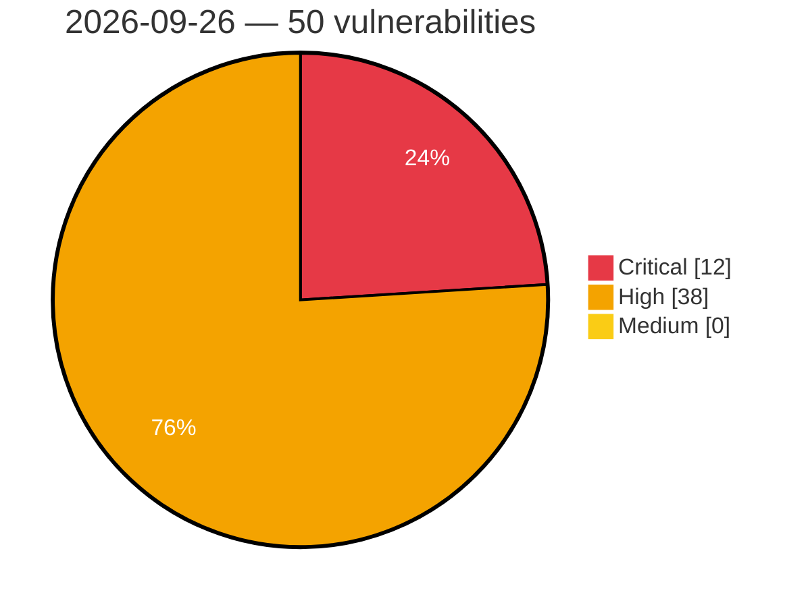

# Critical, High & Medium Severity Vulnerabilities — 2026-09-26

**Source status for this day:**

| Source | Critical | High | Medium | Total |
|--------|---------:|-----:|-------:|------:|
| cvefeed.io (High/Critical) | 12 | 38 | 0 | 50 |

**KEV (actively exploited):** 0  **Watchlist matches:** 38

## Critical (12)

| CVSS | Flags | Source | CVE / Title | Reported |
|------|-------|--------|-------------|----------|
| 10.0 | — | cvefeed.io (High/Critical) | [CVE-2026-97163 - Joomla Extension - lomart.fr - Unauthenticated remote code installation in UP plugin extension 5.0.0-5.2.0, 6.0.0-6.0.29](https://cvefeed.io/vuln/detail/CVE-2026-97163) | 20 minutes ago |
| 9.9 | — | cvefeed.io (High/Critical) | [CVE-2026-100717 - froxlor before 2.3.12 CRLF Injection via validateUrl userinfo](https://cvefeed.io/vuln/detail/CVE-2026-100717) | 36 minutes ago |
| 9.9 | ⭐ | cvefeed.io (High/Critical) | [CVE-2026-100716 - Froxlor before 2.3.12 Privilege Escalation via Symlink](https://cvefeed.io/vuln/detail/CVE-2026-100716) | 36 minutes ago |
| 9.9 | ⭐ | cvefeed.io (High/Critical) | [CVE-2026-100706 - kyverno before 1.19.1 Privilege Escalation via Policy apiCall urlPath](https://cvefeed.io/vuln/detail/CVE-2026-100706) | 37 minutes ago |
| 9.8 | ⭐ | cvefeed.io (High/Critical) | [CVE-2026-18143 - Request a Quote for WooCommerce <= 2.9.2 - Unauthenticated Arbitrary File Upload via AJAX Popup Handler](https://cvefeed.io/vuln/detail/CVE-2026-18143) | 4 hours, 27 minutes ago |
| 9.6 | — | cvefeed.io (High/Critical) | [CVE-2026-100715 - Froxlor before 2.3.12 Arbitrary File Deletion via Symlink](https://cvefeed.io/vuln/detail/CVE-2026-100715) | 36 minutes ago |
| 9.4 | ⭐ | cvefeed.io (High/Critical) | [CVE-2026-97160 - Joomla Extension - lomart.fr - Authenticated, privileged PHP command injection in UP plugin extension 5.0.0-5.2.0, 6.0.0-6.0.29](https://cvefeed.io/vuln/detail/CVE-2026-97160) | 23 minutes ago |
| 9.4 | ⭐ | cvefeed.io (High/Critical) | [CVE-2026-100714 - Froxlor before 2.3.12 Command Injection via letsencryptchallengepath](https://cvefeed.io/vuln/detail/CVE-2026-100714) | 36 minutes ago |
| 9.3 | ⭐ | cvefeed.io (High/Critical) | [CVE-2026-94130 - Joomla Extension - joomlaboat.com - Unauthenticated SQL injection in YouTube Gallery extension < 5.7.3](https://cvefeed.io/vuln/detail/CVE-2026-94130) | 36 minutes ago |
| 9.3 | ⭐ | cvefeed.io (High/Critical) | [CVE-2026-100720 - Froxlor before 2.3.12 Stored XSS via SSL certificate issuer](https://cvefeed.io/vuln/detail/CVE-2026-100720) | 36 minutes ago |
| 9.2 | ⭐ | cvefeed.io (High/Critical) | [CVE-2026-97161 - Joomla Extension - lomart.fr - Various path traversal / file access vectors in UP plugin extension 5.0.0-5.2.0, 6.0.0-6.0.29](https://cvefeed.io/vuln/detail/CVE-2026-97161) | 18 minutes ago |
| 9.0 | ⭐ | cvefeed.io (High/Critical) | [CVE-2026-100551 - OpenClaw iOS Control UI TLS Pin Enforcement Bypass](https://cvefeed.io/vuln/detail/CVE-2026-100551) | 1 hour, 26 minutes ago |

## High (38)

| CVSS | Flags | Source | CVE / Title | Reported |
|------|-------|--------|-------------|----------|
| 8.9 | ⭐ | cvefeed.io (High/Critical) | [CVE-2026-100567 - OpenClaw before 2026.8.1 DNS Rebinding via CDP Hostname](https://cvefeed.io/vuln/detail/CVE-2026-100567) | 1 hour, 26 minutes ago |
| 8.8 | ⭐ | cvefeed.io (High/Critical) | [CVE-2026-100599 - OpenClaw 2026.5.1 before 2026.7.1 Remote Code Execution via googlemeet.chrome](https://cvefeed.io/vuln/detail/CVE-2026-100599) | 1 hour, 26 minutes ago |
| 8.8 | ⭐ | cvefeed.io (High/Critical) | [CVE-2026-100597 - OpenClaw before 2026.7.1 Path Traversal via Filesystem Race](https://cvefeed.io/vuln/detail/CVE-2026-100597) | 1 hour, 26 minutes ago |
| 8.8 | — | cvefeed.io (High/Critical) | [CVE-2026-100596 - OpenClaw before 2026.7.1 Authorization Bypass via MCP Configuration](https://cvefeed.io/vuln/detail/CVE-2026-100596) | 1 hour, 26 minutes ago |
| 8.8 | — | cvefeed.io (High/Critical) | [CVE-2026-100587 - OpenClaw before 2026.7.1 Authorization Bypass via Codex Install](https://cvefeed.io/vuln/detail/CVE-2026-100587) | 1 hour, 26 minutes ago |
| 8.8 | ⭐ | cvefeed.io (High/Critical) | [CVE-2026-100586 - OpenClaw Codex before 2026.7.1 Authorization Bypass via Bind](https://cvefeed.io/vuln/detail/CVE-2026-100586) | 1 hour, 26 minutes ago |
| 8.8 | ⭐ | cvefeed.io (High/Critical) | [CVE-2026-100580 - OpenClaw before 2026.7.1 Remote Code Execution via cron tool](https://cvefeed.io/vuln/detail/CVE-2026-100580) | 1 hour, 26 minutes ago |
| 8.8 | ⭐ | cvefeed.io (High/Critical) | [CVE-2026-100575 - OpenClaw Slack before 2026.8.1 Authentication Bypass via Group DM](https://cvefeed.io/vuln/detail/CVE-2026-100575) | 1 hour, 26 minutes ago |
| 8.8 | ⭐ | cvefeed.io (High/Critical) | [CVE-2026-100552 - OpenClaw before 2026.8.1 Policy Bypass via Native Tools](https://cvefeed.io/vuln/detail/CVE-2026-100552) | 1 hour, 26 minutes ago |
| 8.8 | — | cvefeed.io (High/Critical) | [CVE-2026-100544 - openclaw voice-call before 2026.8.1 Authorization Bypass](https://cvefeed.io/vuln/detail/CVE-2026-100544) | 1 hour, 26 minutes ago |
| 8.8 | ⭐ | cvefeed.io (High/Critical) | [CVE-2026-100520 - Laranode before 1.2.1 Path Traversal in File Manager Upload Endpoint](https://cvefeed.io/vuln/detail/CVE-2026-100520) | 3 hours, 26 minutes ago |
| 8.7 | — | cvefeed.io (High/Critical) | [CVE-2026-100589 - OpenClaw before 2026.7.1 Sandbox Bypass via Browser Node](https://cvefeed.io/vuln/detail/CVE-2026-100589) | 1 hour, 26 minutes ago |
| 8.7 | ⭐ | cvefeed.io (High/Critical) | [CVE-2026-100588 - OpenClaw before 2026.7.1 Authentication Bypass via node.invoke](https://cvefeed.io/vuln/detail/CVE-2026-100588) | 1 hour, 26 minutes ago |
| 8.7 | ⭐ | cvefeed.io (High/Critical) | [CVE-2026-100568 - OpenClaw before 2026.8.1 Unauthorized Command Job Access](https://cvefeed.io/vuln/detail/CVE-2026-100568) | 1 hour, 26 minutes ago |
| 8.7 | ⭐ | cvefeed.io (High/Critical) | [CVE-2026-100558 - OpenClaw before 2026.8.1 Resource Exhaustion via WebSocket Upgrade](https://cvefeed.io/vuln/detail/CVE-2026-100558) | 1 hour, 26 minutes ago |
| 8.7 | — | cvefeed.io (High/Critical) | [CVE-2026-100557 - OpenClaw before 2026.8.1 Authorization Bypass via Skill Tool Dispatch](https://cvefeed.io/vuln/detail/CVE-2026-100557) | 1 hour, 26 minutes ago |
| 8.7 | ⭐ | cvefeed.io (High/Critical) | [CVE-2026-100711 - froxlor before 2.3.12 Authentication Bypass via Session Persistence](https://cvefeed.io/vuln/detail/CVE-2026-100711) | 36 minutes ago |
| 8.7 | — | cvefeed.io (High/Critical) | [CVE-2026-100700 - nodemailer before 10.0.6 Denial of Service via addressparser](https://cvefeed.io/vuln/detail/CVE-2026-100700) | 37 minutes ago |
| 8.7 | ⭐ | cvefeed.io (High/Critical) | [CVE-2026-100692 - Hugo before v0.166.0 Path Traversal via Symlinked Mount Roots](https://cvefeed.io/vuln/detail/CVE-2026-100692) | 37 minutes ago |
| 8.7 | ⭐ | cvefeed.io (High/Critical) | [CVE-2026-100690 - Hugo v0.161.0 to v0.165.0 Arbitrary File Read via Symlinks](https://cvefeed.io/vuln/detail/CVE-2026-100690) | 37 minutes ago |
| 8.7 | ⭐ | cvefeed.io (High/Critical) | [CVE-2026-100689 - GitPython before 3.1.62 Path Traversal via gitmodules path](https://cvefeed.io/vuln/detail/CVE-2026-100689) | 37 minutes ago |
| 8.6 | ⭐ | cvefeed.io (High/Critical) | [CVE-2026-100585 - OpenClaw before 2026.7.1 Authentication Bypass via MCP Channel](https://cvefeed.io/vuln/detail/CVE-2026-100585) | 1 hour, 26 minutes ago |
| 8.6 | ⭐ | cvefeed.io (High/Critical) | [CVE-2026-100561 - OpenClaw before 2026.8.1 Authentication Bypass via Exec Wrapper](https://cvefeed.io/vuln/detail/CVE-2026-100561) | 1 hour, 26 minutes ago |
| 8.6 | ⭐ | cvefeed.io (High/Critical) | [CVE-2026-100559 - OpenClaw before 2026.8.1 Command Injection via Escaped Newlines](https://cvefeed.io/vuln/detail/CVE-2026-100559) | 1 hour, 26 minutes ago |
| 8.6 | — | cvefeed.io (High/Critical) | [CVE-2026-100697 - Adminer 6.0.0 Server-Side Request Forgery via ClickHouse driver](https://cvefeed.io/vuln/detail/CVE-2026-100697) | 37 minutes ago |
| 8.6 | ⭐ | cvefeed.io (High/Critical) | [CVE-2026-100693 - Hugo v0.162.0 before v0.166.0 IP-literal Deny Rule Bypass](https://cvefeed.io/vuln/detail/CVE-2026-100693) | 37 minutes ago |
| 8.6 | ⭐ | cvefeed.io (High/Critical) | [CVE-2026-100686 - Budibase before 3.45.0 Cross-Workspace Privilege Escalation via POST /api/global/groups/:groupId/apps](https://cvefeed.io/vuln/detail/CVE-2026-100686) | 37 minutes ago |
| 8.5 | ⭐ | cvefeed.io (High/Critical) | [CVE-2026-100570 - OpenClaw before 2026.8.1 Remote Code Execution via CLOUDSDK_PYTHON_ARGS](https://cvefeed.io/vuln/detail/CVE-2026-100570) | 1 hour, 26 minutes ago |
| 8.5 | — | cvefeed.io (High/Critical) | [CVE-2026-100530 - OpenClaw before 2026.8.1 Exec Approval Directory Binding](https://cvefeed.io/vuln/detail/CVE-2026-100530) | 1 hour, 26 minutes ago |
| 8.3 | ⭐ | cvefeed.io (High/Critical) | [CVE-2026-97162 - Joomla Extension - lomart.fr - Various SQL injection vectors in UP plugin extension 5.0.0-5.2.0, 6.0.0-6.0.29](https://cvefeed.io/vuln/detail/CVE-2026-97162) | 20 minutes ago |
| 8.3 | ⭐ | cvefeed.io (High/Critical) | [CVE-2026-100707 - Kyverno before 1.19.1 Namespace Isolation Bypass via Percent-Encoded Path](https://cvefeed.io/vuln/detail/CVE-2026-100707) | 37 minutes ago |
| 8.3 | ⭐ | cvefeed.io (High/Critical) | [CVE-2026-100705 - Kyverno before 1.19.1 SSRF via legacy apiCall service executor](https://cvefeed.io/vuln/detail/CVE-2026-100705) | 37 minutes ago |
| 8.3 | ⭐ | cvefeed.io (High/Critical) | [CVE-2026-100704 - Kyverno before 1.19.1 ImageValidatingPolicy Exception Bypass](https://cvefeed.io/vuln/detail/CVE-2026-100704) | 37 minutes ago |
| 8.3 | ⭐ | cvefeed.io (High/Critical) | [CVE-2026-100703 - Kyverno before 1.19.1 Cross-Namespace Data Access via globalcontext.Lib](https://cvefeed.io/vuln/detail/CVE-2026-100703) | 37 minutes ago |
| 8.3 | ⭐ | cvefeed.io (High/Critical) | [CVE-2026-100685 - Budibase before 3.45.0 Information Disclosure via Chat Links](https://cvefeed.io/vuln/detail/CVE-2026-100685) | 37 minutes ago |
| 8.2 | ⭐ | cvefeed.io (High/Critical) | [CVE-2026-100574 - OpenClaw before 2026.8.1 SSRF via Trusted-Host DNS](https://cvefeed.io/vuln/detail/CVE-2026-100574) | 1 hour, 26 minutes ago |
| 8.2 | — | cvefeed.io (High/Critical) | [CVE-2026-100702 - Nodemailer before 10.0.2 Stack Exhaustion via Nested Recipient Arrays](https://cvefeed.io/vuln/detail/CVE-2026-100702) | 37 minutes ago |
| 8.1 | ⭐ | cvefeed.io (High/Critical) | [CVE-2026-100532 - openclaw WhatsApp before 2026.8.1 Authentication Bypass](https://cvefeed.io/vuln/detail/CVE-2026-100532) | 1 hour, 26 minutes ago |
