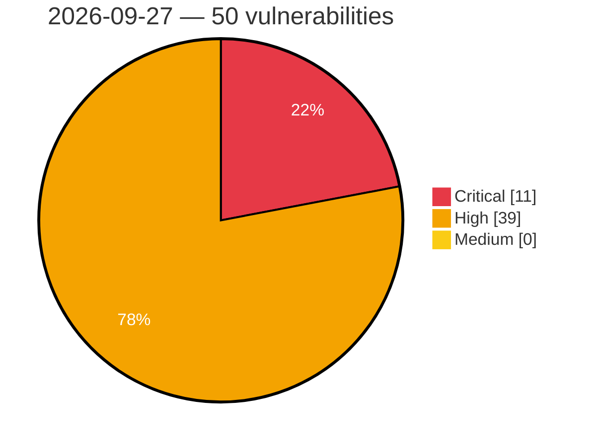

# Critical, High & Medium Severity Vulnerabilities — 2026-09-27

**Source status for this day:**

| Source | Critical | High | Medium | Total |
|--------|---------:|-----:|-------:|------:|
| cvefeed.io (High/Critical) | 11 | 39 | 0 | 50 |

**KEV (actively exploited):** 0  **Watchlist matches:** 36

## Critical (11)

| CVSS | Flags | Source | CVE / Title | Reported |
|------|-------|--------|-------------|----------|
| 10.0 | — | cvefeed.io (High/Critical) | [CVE-2026-100886 - Seetong T8108/T8108P/T8116/T8232 Debug Service improper authentication](https://cvefeed.io/vuln/detail/CVE-2026-100886) | 6 hours, 59 minutes ago |
| 9.9 | — | cvefeed.io (High/Critical) | [CVE-2026-100740 - D-Link DIR-895L L2TP Control Channel tunnel.c tunnel_set_params out-of-bounds write](https://cvefeed.io/vuln/detail/CVE-2026-100740) | 3 hours, 36 minutes ago |
| 9.8 | ⭐ | cvefeed.io (High/Critical) | [CVE-2026-100741 - Improper Neutralization of Directives in Dynamically Evaluated Code ('Eval Injection') in hMailServer](https://cvefeed.io/vuln/detail/CVE-2026-100741) | 45 minutes ago |
| 9.8 | ⭐ | cvefeed.io (High/Critical) | [CVE-2026-101090 - Nezha through 2.2.3 Host Header Injection via OAuth2 redirect_uri](https://cvefeed.io/vuln/detail/CVE-2026-101090) | 1 hour, 31 minutes ago |
| 9.8 | ⭐ | cvefeed.io (High/Critical) | [CVE-2026-101065 - Obot Quickstart Docker Deployment Unauthenticated Admin Access](https://cvefeed.io/vuln/detail/CVE-2026-101065) | 1 hour, 31 minutes ago |
| 9.6 | ⭐ | cvefeed.io (High/Critical) | [CVE-2026-101084 - obot before v0.21.1 Authorization Bypass via /mcp-connect](https://cvefeed.io/vuln/detail/CVE-2026-101084) | 1 hour, 31 minutes ago |
| 9.5 | — | cvefeed.io (High/Critical) | [CVE-2026-100721 - vm2 before 3.12.2 Authorization Bypass via Custom Resolver](https://cvefeed.io/vuln/detail/CVE-2026-100721) | 2 hours, 36 minutes ago |
| 9.5 | ⭐ | cvefeed.io (High/Critical) | [CVE-2026-88772 - Memory overflow vulnerability leading to Remote Code Execution or Denial of Service](https://cvefeed.io/vuln/detail/CVE-2026-88772) | 1 hour, 37 minutes ago |
| 9.5 | ⭐ | cvefeed.io (High/Critical) | [CVE-2026-88771 - A remote code execution vulnerability exists due to improper input validation, which can allow an unauthenticated attacker to execute arbitrary commands](https://cvefeed.io/vuln/detail/CVE-2026-88771) | 1 hour, 37 minutes ago |
| 9.3 | — | cvefeed.io (High/Critical) | [CVE-2026-88773 - HTTP Request Smuggling](https://cvefeed.io/vuln/detail/CVE-2026-88773) | 1 hour, 37 minutes ago |
| 9.1 | ⭐ | cvefeed.io (High/Critical) | [CVE-2026-100835 - Contrast before 1.16.0 Remote Attestation Relay Attack](https://cvefeed.io/vuln/detail/CVE-2026-100835) | 2 hours, 36 minutes ago |

## High (39)

| CVSS | Flags | Source | CVE / Title | Reported |
|------|-------|--------|-------------|----------|
| 8.9 | — | cvefeed.io (High/Critical) | [CVE-2026-100722 - vm2 before 3.12.2 Host Process Termination via Construct Trap](https://cvefeed.io/vuln/detail/CVE-2026-100722) | 2 hours, 36 minutes ago |
| 8.9 | ⭐ | cvefeed.io (High/Critical) | [CVE-2026-101045 - Fleet Homebrew Cask OS Command Injection via Metadata](https://cvefeed.io/vuln/detail/CVE-2026-101045) | 38 minutes ago |
| 8.8 | ⭐ | cvefeed.io (High/Critical) | [CVE-2026-100865 - Heym before 0.0.53 Multiple RCE and Authentication Bypass Vulnerabilities](https://cvefeed.io/vuln/detail/CVE-2026-100865) | 2 hours, 36 minutes ago |
| 8.8 | ⭐ | cvefeed.io (High/Critical) | [CVE-2026-100864 - heym before 0.0.91 Remote Code Execution via Expression Engine](https://cvefeed.io/vuln/detail/CVE-2026-100864) | 2 hours, 36 minutes ago |
| 8.8 | ⭐ | cvefeed.io (High/Critical) | [CVE-2026-100856 - AzuraCast before 0.23.6 Code Injection via Remote Relay Password](https://cvefeed.io/vuln/detail/CVE-2026-100856) | 2 hours, 36 minutes ago |
| 8.8 | ⭐ | cvefeed.io (High/Critical) | [CVE-2026-100852 - AzuraCast through 0.23.x Command Injection via Streamer Username](https://cvefeed.io/vuln/detail/CVE-2026-100852) | 2 hours, 36 minutes ago |
| 8.8 | ⭐ | cvefeed.io (High/Critical) | [CVE-2026-100846 - MONAI before 1.5.2 Remote Code Execution via Pickle Deserialization](https://cvefeed.io/vuln/detail/CVE-2026-100846) | 2 hours, 36 minutes ago |
| 8.8 | ⭐ | cvefeed.io (High/Critical) | [CVE-2026-100871 - Sylius before 1.12.25, 1.13.17, 1.14.20, 2.1.16, and 2.2.9 JWT Audience Confusion Allows Admin API Authentication](https://cvefeed.io/vuln/detail/CVE-2026-100871) | 1 hour, 45 minutes ago |
| 8.8 | ⭐ | cvefeed.io (High/Critical) | [CVE-2026-100870 - Sylius before 1.12.25, 1.13.17, 1.14.20, 2.1.16, and 2.2.9 Admin Password Reset Poisoning via Host Header](https://cvefeed.io/vuln/detail/CVE-2026-100870) | 1 hour, 45 minutes ago |
| 8.8 | — | cvefeed.io (High/Critical) | [CVE-2026-88778 - TCP Initial Sequence Number (ISN) prediction](https://cvefeed.io/vuln/detail/CVE-2026-88778) | 1 hour, 37 minutes ago |
| 8.8 | — | cvefeed.io (High/Critical) | [CVE-2026-88777 - Memory overflow vulnerability leading to unpredictable or erroneous behavior or Denial of Service](https://cvefeed.io/vuln/detail/CVE-2026-88777) | 1 hour, 37 minutes ago |
| 8.8 | — | cvefeed.io (High/Critical) | [CVE-2026-88776 - Memory overflow vulnerability leading to unpredictable or erroneous behavior or Denial of Service](https://cvefeed.io/vuln/detail/CVE-2026-88776) | 1 hour, 37 minutes ago |
| 8.8 | — | cvefeed.io (High/Critical) | [CVE-2026-88775 - Memory overflow vulnerability leading to unpredictable or erroneous behavior or Denial of Service](https://cvefeed.io/vuln/detail/CVE-2026-88775) | 1 hour, 37 minutes ago |
| 8.8 | ⭐ | cvefeed.io (High/Critical) | [CVE-2026-101062 - Obot before v0.23.0 Authentication Bypass via OAuth Dynamic Client Registration](https://cvefeed.io/vuln/detail/CVE-2026-101062) | 1 hour, 31 minutes ago |
| 8.7 | ⭐ | cvefeed.io (High/Critical) | [CVE-2026-100847 - AzuraCast before 0.23.8 DQL Injection via sortOrder](https://cvefeed.io/vuln/detail/CVE-2026-100847) | 2 hours, 36 minutes ago |
| 8.7 | — | cvefeed.io (High/Critical) | [CVE-2026-100872 - Sylius 2.x before 2.1.16 and 2.2.9 Payment Amount Overwrite](https://cvefeed.io/vuln/detail/CVE-2026-100872) | 1 hour, 45 minutes ago |
| 8.6 | ⭐ | cvefeed.io (High/Critical) | [CVE-2026-100857 - AzuraCast before 0.23.4 Remote Code Execution via Liquidsoap string interpolation](https://cvefeed.io/vuln/detail/CVE-2026-100857) | 2 hours, 36 minutes ago |
| 8.6 | ⭐ | cvefeed.io (High/Critical) | [CVE-2026-100844 - MONAI before 1.6.0 OS Command Injection via dataset_name_or_id](https://cvefeed.io/vuln/detail/CVE-2026-100844) | 2 hours, 36 minutes ago |
| 8.6 | ⭐ | cvefeed.io (High/Critical) | [CVE-2026-100838 - Contrast before 1.19.1 CopyFile Policy Symlink Subversion](https://cvefeed.io/vuln/detail/CVE-2026-100838) | 2 hours, 36 minutes ago |
| 8.5 | ⭐ | cvefeed.io (High/Critical) | [CVE-2026-100845 - MONAI before 1.6.0 Remote Code Execution via NumpyReader](https://cvefeed.io/vuln/detail/CVE-2026-100845) | 2 hours, 36 minutes ago |
| 8.5 | ⭐ | cvefeed.io (High/Critical) | [CVE-2026-100843 - MONAI before 1.6.0 Remote Code Execution via algo_from_pickle](https://cvefeed.io/vuln/detail/CVE-2026-100843) | 2 hours, 36 minutes ago |
| 8.5 | ⭐ | cvefeed.io (High/Critical) | [CVE-2026-100841 - MONAI 1.6.0 PersistentDataset Remote Code Execution via Pickle Cache](https://cvefeed.io/vuln/detail/CVE-2026-100841) | 2 hours, 36 minutes ago |
| 8.5 | ⭐ | cvefeed.io (High/Critical) | [CVE-2026-100840 - MONAI through 1.6.0 Remote Code Execution via bundle configuration](https://cvefeed.io/vuln/detail/CVE-2026-100840) | 2 hours, 36 minutes ago |
| 8.5 | ⭐ | cvefeed.io (High/Critical) | [CVE-2025-71425 - Contrast before 1.8.1 Information Disclosure via Logging](https://cvefeed.io/vuln/detail/CVE-2025-71425) | 2 hours, 37 minutes ago |
| 8.5 | ⭐ | cvefeed.io (High/Critical) | [CVE-2025-71423 - Edgelesssys Contrast before 1.12.2 Workload Secrets Information Disclosure](https://cvefeed.io/vuln/detail/CVE-2025-71423) | 2 hours, 37 minutes ago |
| 8.4 | ⭐ | cvefeed.io (High/Critical) | [CVE-2026-100839 - Contrast before 1.18.0 AML Injection Remote Code Execution](https://cvefeed.io/vuln/detail/CVE-2026-100839) | 2 hours, 36 minutes ago |
| 8.4 | ⭐ | cvefeed.io (High/Critical) | [CVE-2026-101060 - python-utcp before 1.1.4 SSRF via unvalidated HTTP redirects](https://cvefeed.io/vuln/detail/CVE-2026-101060) | 38 minutes ago |
| 8.3 | ⭐ | cvefeed.io (High/Critical) | [CVE-2026-100725 - http4k before 6.48.0.0 Cookie Scoping Bypass via BasicCookieStorage](https://cvefeed.io/vuln/detail/CVE-2026-100725) | 2 hours, 36 minutes ago |
| 8.3 | ⭐ | cvefeed.io (High/Critical) | [CVE-2026-93302 - Trusted peer certificate match ignores public key, allowing forged CA clones](https://cvefeed.io/vuln/detail/CVE-2026-93302) | 4 hours, 45 minutes ago |
| 8.3 | — | cvefeed.io (High/Critical) | [CVE-2026-89136 - Client accepts unsolicited RawPublicKey server certificate type](https://cvefeed.io/vuln/detail/CVE-2026-89136) | 4 hours, 45 minutes ago |
| 8.3 | — | cvefeed.io (High/Critical) | [CVE-2026-89102 - OCSP stapling v2 multi accepts non-CA chain certificates as issuers](https://cvefeed.io/vuln/detail/CVE-2026-89102) | 4 hours, 45 minutes ago |
| 8.3 | — | cvefeed.io (High/Critical) | [CVE-2026-101043 - pnpm 11.0.0 before 11.11.0 Environment Variable Exfiltration via Proxy Settings](https://cvefeed.io/vuln/detail/CVE-2026-101043) | 38 minutes ago |
| 8.3 | ⭐ | cvefeed.io (High/Critical) | [CVE-2026-101050 - Heym before 0.0.53 Authentication Bypass via Telegram Webhook](https://cvefeed.io/vuln/detail/CVE-2026-101050) | 1 hour, 37 minutes ago |
| 8.3 | — | cvefeed.io (High/Critical) | [CVE-2026-101049 - Heym before 0.0.53 Slack Webhook Signature Verification Bypass](https://cvefeed.io/vuln/detail/CVE-2026-101049) | 1 hour, 37 minutes ago |
| 8.3 | ⭐ | cvefeed.io (High/Critical) | [CVE-2026-101064 - Obot before v0.23.0 Server-Side Request Forgery via MCP](https://cvefeed.io/vuln/detail/CVE-2026-101064) | 1 hour, 31 minutes ago |
| 8.2 | ⭐ | cvefeed.io (High/Critical) | [CVE-2026-100853 - AzuraCast before 0.23.8 On-Demand Download Endpoint Authorization Bypass](https://cvefeed.io/vuln/detail/CVE-2026-100853) | 2 hours, 36 minutes ago |
| 8.2 | ⭐ | cvefeed.io (High/Critical) | [CVE-2026-100834 - http4k before 6.48.0.0 Digest Authentication Replay Protection Bypass](https://cvefeed.io/vuln/detail/CVE-2026-100834) | 2 hours, 36 minutes ago |
| 8.2 | ⭐ | cvefeed.io (High/Critical) | [CVE-2026-100833 - Contrast before 1.23.1 Image Substitution via Policy Generation](https://cvefeed.io/vuln/detail/CVE-2026-100833) | 2 hours, 36 minutes ago |
| 8.2 | ⭐ | cvefeed.io (High/Critical) | [CVE-2026-100869 - Sylius 2.x before 2.1.16 and 2.2.9 Arbitrary Payment Action via Shop API](https://cvefeed.io/vuln/detail/CVE-2026-100869) | 1 hour, 45 minutes ago |
