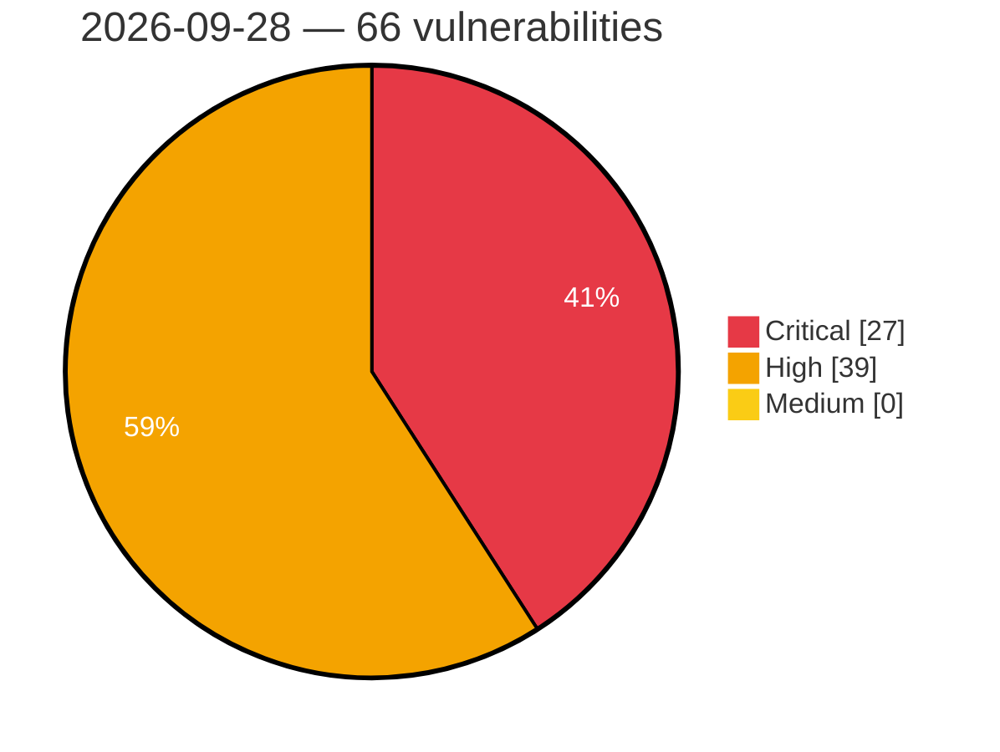

# Critical, High & Medium Severity Vulnerabilities — 2026-09-28

**Source status for this day:**

| Source | Critical | High | Medium | Total |
|--------|---------:|-----:|-------:|------:|
| cvefeed.io (High/Critical) | 27 | 39 | 0 | 66 |

**KEV (actively exploited):** 0  **Watchlist matches:** 50

## Critical (27)

| CVSS | Flags | Source | CVE / Title | Reported |
|------|-------|--------|-------------|----------|
| 10.0 | ⭐ | cvefeed.io (High/Critical) | [CVE-2026-101001 - Netcore NBR200V2 Web Management network_tools eval os command injection](https://cvefeed.io/vuln/detail/CVE-2026-101001) | 59 minutes ago |
| 10.0 | — | cvefeed.io (High/Critical) | [CVE-2026-101000 - Netcore NBR100V2 ACL unauthenticated.json uci.apply authorization](https://cvefeed.io/vuln/detail/CVE-2026-101000) | 59 minutes ago |
| 10.0 | — | cvefeed.io (High/Critical) | [CVE-2026-101039 - FAST FAC1900R devdiscover Service copy_msg_element stack-based overflow](https://cvefeed.io/vuln/detail/CVE-2026-101039) | 1 hour, 46 minutes ago |
| 9.9 | ⭐ | cvefeed.io (High/Critical) | [CVE-2026-100896 - TOTOLINK N150RT Web Management formWlSiteSurvey system os command injection](https://cvefeed.io/vuln/detail/CVE-2026-100896) | 3 hours, 58 minutes ago |
| 9.9 | — | cvefeed.io (High/Critical) | [CVE-2026-101038 - FAST FAC1200R MmtAtePrase stack-based overflow](https://cvefeed.io/vuln/detail/CVE-2026-101038) | 1 hour, 46 minutes ago |
| 9.9 | — | cvefeed.io (High/Critical) | [CVE-2026-101037 - FAST FAC1200R devdiscover Service parse_advertisement_frame stack-based overflow](https://cvefeed.io/vuln/detail/CVE-2026-101037) | 2 hours, 46 minutes ago |
| 9.9 | ⭐ | cvefeed.io (High/Critical) | [CVE-2026-82377 - Apache Roller: Missing weblog authorization in XML-RPC Blogger/MetaWeblog handlers](https://cvefeed.io/vuln/detail/CVE-2026-82377) | 4 hours, 46 minutes ago |
| 9.8 | ⭐ | cvefeed.io (High/Critical) | [CVE-2026-82384 - Apache Roller: Unauthenticated deserialization in the XML-RPC endpoint](https://cvefeed.io/vuln/detail/CVE-2026-82384) | 4 hours, 46 minutes ago |
| 9.6 | ⭐ | cvefeed.io (High/Critical) | [CVE-2026-88804 - Unauthenticated update of public UI settings leading to stored cross-site scripting in Rancher](https://cvefeed.io/vuln/detail/CVE-2026-88804) | 2 hours, 45 minutes ago |
| 9.4 | ⭐ | cvefeed.io (High/Critical) | [CVE-2026-81867 - Deserialization of Untrusted Data in Application Integration allows Remote Code Execution](https://cvefeed.io/vuln/detail/CVE-2026-81867) | 1 hour, 45 minutes ago |
| 9.4 | ⭐ | cvefeed.io (High/Critical) | [CVE-2026-19759 - Incorrect Authorization in Application Integration allows Internal Stubby RPC Execution](https://cvefeed.io/vuln/detail/CVE-2026-19759) | 1 hour, 45 minutes ago |
| 9.3 | ⭐ | cvefeed.io (High/Critical) | [CVE-2026-101110 - Joomla Extension - ordasoft.com - Unauthenticated SQL Injection in Book Library (Free) < 6.4.6](https://cvefeed.io/vuln/detail/CVE-2026-101110) | 20 minutes ago |
| 9.3 | ⭐ | cvefeed.io (High/Critical) | [CVE-2026-100752 - Joomla Extension - ordasoft.com - Unauthenticated SQL Injection in Real Estate Manager (Free) < 6.7.9](https://cvefeed.io/vuln/detail/CVE-2026-100752) | 21 minutes ago |
| 9.3 | ⭐ | cvefeed.io (High/Critical) | [CVE-2026-101108 - Joomla Extension - ordasoft.com - Unauthenticated SQL Injection in Vehicle Manager (Free) < 6.5.8](https://cvefeed.io/vuln/detail/CVE-2026-101108) | 23 minutes ago |
| 9.3 | ⭐ | cvefeed.io (High/Critical) | [CVE-2026-86102 - WatchGuard AP Command Injection in Internal Management API Allows Command Execution](https://cvefeed.io/vuln/detail/CVE-2026-86102) | 1 hour, 45 minutes ago |
| 9.3 | ⭐ | cvefeed.io (High/Critical) | [CVE-2026-101891 - WatchGuard AP Improper Access Control in API Service Allows Unauthenticated Access](https://cvefeed.io/vuln/detail/CVE-2026-101891) | 1 hour, 45 minutes ago |
| 9.1 | ⭐ | cvefeed.io (High/Critical) | [CVE-2026-101008 - aaPanel BaoTa File Merge files.py merge_split_file command injection](https://cvefeed.io/vuln/detail/CVE-2026-101008) | 5 hours, 45 minutes ago |
| 9.1 | ⭐ | cvefeed.io (High/Critical) | [CVE-2026-49994 - Bluehood: Missing authentication on Bluehood API routes when web auth is enabled](https://cvefeed.io/vuln/detail/CVE-2026-49994) | 45 minutes ago |
| 9.1 | ⭐ | cvefeed.io (High/Critical) | [CVE-2026-101894 - @xhmikosr/decompress: Path traversal via symlink chain](https://cvefeed.io/vuln/detail/CVE-2026-101894) | 1 hour, 45 minutes ago |
| 9.1 | — | cvefeed.io (High/Critical) | [CVE-2026-101081 - D-Link DI-8400 Web Administration Service menu_nat_more.asp menu_nat_more_asp stack-based overflow](https://cvefeed.io/vuln/detail/CVE-2026-101081) | 1 hour, 45 minutes ago |
| 9.1 | ⭐ | cvefeed.io (High/Critical) | [CVE-2026-102334 - Nginx Proxy Manager through 2.16.0 Missing Brute-Force Protection](https://cvefeed.io/vuln/detail/CVE-2026-102334) | 33 minutes ago |
| 9.1 | ⭐ | cvefeed.io (High/Critical) | [CVE-2026-102268 - PyJWT: Asymmetric-PEM detection bypass: whitespace/line-ending-mutated public keys skip the HS/asymmetric confusion guard](https://cvefeed.io/vuln/detail/CVE-2026-102268) | 1 hour, 38 minutes ago |
| 9.1 | ⭐ | cvefeed.io (High/Critical) | [CVE-2026-101187 - Ziroom ZHOME A0101 USB Device Management API zrUsb.lua pop_usb_device command injection](https://cvefeed.io/vuln/detail/CVE-2026-101187) | 1 hour, 38 minutes ago |
| 9.1 | ⭐ | cvefeed.io (High/Critical) | [CVE-2026-101262 - Ziroom ZHOME A0101 set_online_client command injection](https://cvefeed.io/vuln/detail/CVE-2026-101262) | 5 hours, 15 minutes ago |
| 9.1 | ⭐ | cvefeed.io (High/Critical) | [CVE-2026-101261 - Ziroom ZHOME A0101 firstSetup_wifi command injection](https://cvefeed.io/vuln/detail/CVE-2026-101261) | 5 hours, 15 minutes ago |
| 9.1 | ⭐ | cvefeed.io (High/Critical) | [CVE-2026-101260 - Ziroom ZHOME A0101 firstLogin command injection](https://cvefeed.io/vuln/detail/CVE-2026-101260) | 5 hours, 15 minutes ago |
| 9.0 | ⭐ | cvefeed.io (High/Critical) | [CVE-2026-82378 - Apache Roller: OAuth authorization endpoint trusts request-supplied identity](https://cvefeed.io/vuln/detail/CVE-2026-82378) | 4 hours, 46 minutes ago |

## High (39)

| CVSS | Flags | Source | CVE / Title | Reported |
|------|-------|--------|-------------|----------|
| 8.8 | ⭐ | cvefeed.io (High/Critical) | [CVE-2026-12265 - Missing Authorization on HA Failover Config allows Complete Data Destruction](https://cvefeed.io/vuln/detail/CVE-2026-12265) | 40 minutes ago |
| 8.8 | ⭐ | cvefeed.io (High/Critical) | [CVE-2026-78424 - OS Command Injection in Packet-Capture (Sniffer) Filter leading to Remote Code Execution on Kubernetes Nodes](https://cvefeed.io/vuln/detail/CVE-2026-78424) | 45 minutes ago |
| 8.8 | ⭐ | cvefeed.io (High/Critical) | [CVE-2026-12264 - Authenticated File Write via HA Failover Config Upload leads to RCE](https://cvefeed.io/vuln/detail/CVE-2026-12264) | 45 minutes ago |
| 8.8 | ⭐ | cvefeed.io (High/Critical) | [CVE-2026-12269 - Authenticated File Write to RCE via keepalived in DDI Central](https://cvefeed.io/vuln/detail/CVE-2026-12269) | 1 hour, 46 minutes ago |
| 8.8 | ⭐ | cvefeed.io (High/Critical) | [CVE-2026-12268 - Authenticated PowerShell Injection leads to RCE](https://cvefeed.io/vuln/detail/CVE-2026-12268) | 1 hour, 46 minutes ago |
| 8.8 | ⭐ | cvefeed.io (High/Critical) | [CVE-2026-85134 - Arbitrary File Upload Leading to Remote Command Execution in Bimser's eBA Plus](https://cvefeed.io/vuln/detail/CVE-2026-85134) | 3 hours, 45 minutes ago |
| 8.8 | ⭐ | cvefeed.io (High/Critical) | [CVE-2026-88808 - Fleet agent copies downstream resources with cluster-admin privileges, allowing cross-namespace writes on downstream clusters](https://cvefeed.io/vuln/detail/CVE-2026-88808) | 2 hours, 45 minutes ago |
| 8.8 | ⭐ | cvefeed.io (High/Critical) | [CVE-2026-87741 - ConvertPlus <= 3.6.3 - Authenticated (Subscriber+) PHP Object Injection via 'style' Parameter](https://cvefeed.io/vuln/detail/CVE-2026-87741) | 2 hours, 38 minutes ago |
| 8.8 | — | cvefeed.io (High/Critical) | [CVE-2026-86950 - Apple Kernel Out-of-Bounds Write Vulnerability](https://cvefeed.io/vuln/detail/CVE-2026-86950) | 2 hours, 38 minutes ago |
| 8.7 | — | cvefeed.io (High/Critical) | [CVE-2026-95104 - BUFFALO Wi-Fi Stack-Based Buffer Overflow](https://cvefeed.io/vuln/detail/CVE-2026-95104) | 3 hours, 45 minutes ago |
| 8.7 | ⭐ | cvefeed.io (High/Critical) | [CVE-2026-54675 - FreePBX: Authenticated Remote Code Execution via File Upload and Convert in Soundlang Module](https://cvefeed.io/vuln/detail/CVE-2026-54675) | 45 minutes ago |
| 8.7 | — | cvefeed.io (High/Critical) | [CVE-2026-48100 - Payy: agg_agg trailing message slots are unconstrained and allow forged burn messages](https://cvefeed.io/vuln/detail/CVE-2026-48100) | 1 hour, 45 minutes ago |
| 8.7 | ⭐ | cvefeed.io (High/Critical) | [CVE-2026-100371 - InvoicePlane: Incomplete Authorization Remediation in Users::form() Enables Primary Administrator Account Takeover via Email Reassignment and Password Recovery](https://cvefeed.io/vuln/detail/CVE-2026-100371) | 1 hour, 38 minutes ago |
| 8.6 | ⭐ | cvefeed.io (High/Critical) | [CVE-2026-86530 - BUFFALO Wi-Fi Products OS Command Injection Vulnerability](https://cvefeed.io/vuln/detail/CVE-2026-86530) | 3 hours, 45 minutes ago |
| 8.6 | ⭐ | cvefeed.io (High/Critical) | [CVE-2026-75600 - FreePBX: Authenticated API generatedocs Host Command Injection](https://cvefeed.io/vuln/detail/CVE-2026-75600) | 45 minutes ago |
| 8.6 | ⭐ | cvefeed.io (High/Critical) | [CVE-2026-54710 - FreePBX: Authenticated Superfecta Arbitrary PHP Code Execution (RCE via Unsafe File Inclusion)](https://cvefeed.io/vuln/detail/CVE-2026-54710) | 45 minutes ago |
| 8.6 | ⭐ | cvefeed.io (High/Critical) | [CVE-2026-54708 - Authenticated Remote Code Execution via Path Traversal in FreePBX Backup Module](https://cvefeed.io/vuln/detail/CVE-2026-54708) | 45 minutes ago |
| 8.6 | ⭐ | cvefeed.io (High/Critical) | [CVE-2026-54674 - Authenticated Command Injection in FreePBX UCP Interface](https://cvefeed.io/vuln/detail/CVE-2026-54674) | 45 minutes ago |
| 8.6 | ⭐ | cvefeed.io (High/Critical) | [CVE-2026-87969 - WatchGuard AP Authenticated Command Injection in Diagnostic CLI](https://cvefeed.io/vuln/detail/CVE-2026-87969) | 1 hour, 45 minutes ago |
| 8.6 | ⭐ | cvefeed.io (High/Critical) | [CVE-2026-93348 - Unsloth Zoo Code Injection via model_type in config.json](https://cvefeed.io/vuln/detail/CVE-2026-93348) | 2 hours, 45 minutes ago |
| 8.6 | — | cvefeed.io (High/Critical) | [CVE-2024-42002 - Unsafe use of eval() method in ros2 topic hz tool](https://cvefeed.io/vuln/detail/CVE-2024-42002) | 37 minutes ago |
| 8.5 | ⭐ | cvefeed.io (High/Critical) | [CVE-2026-101009 - aaPanel BaoTa Unzip panelTask.py panelTask.bt_task._unzip os command injection](https://cvefeed.io/vuln/detail/CVE-2026-101009) | 5 hours, 45 minutes ago |
| 8.5 | ⭐ | cvefeed.io (High/Critical) | [CVE-2026-101007 - aaPanel BaoTa Database Backup database.py InputSql os command injection](https://cvefeed.io/vuln/detail/CVE-2026-101007) | 5 hours, 45 minutes ago |
| 8.4 | ⭐ | cvefeed.io (High/Critical) | [CVE-2026-55157 - Token Optimizer MCP: OS command injection in smart_user via username in get-user-info](https://cvefeed.io/vuln/detail/CVE-2026-55157) | 45 minutes ago |
| 8.3 | ⭐ | cvefeed.io (High/Critical) | [CVE-2026-81375 - Confused Deputy in Application Integration allows Internal File Read](https://cvefeed.io/vuln/detail/CVE-2026-81375) | 1 hour, 45 minutes ago |
| 8.3 | ⭐ | cvefeed.io (High/Critical) | [CVE-2026-101909 - Axios: Prototype Pollution Gadget in axios toFormData Options](https://cvefeed.io/vuln/detail/CVE-2026-101909) | 45 minutes ago |
| 8.3 | ⭐ | cvefeed.io (High/Critical) | [CVE-2026-102296 - ZoneMinder before 1.38.4 Buffer Overflow via HTTP Camera Response](https://cvefeed.io/vuln/detail/CVE-2026-102296) | 37 minutes ago |
| 8.3 | — | cvefeed.io (High/Critical) | [CVE-2026-101188 - Netcore POWER13 ubus routerd.passwd_set password recovery](https://cvefeed.io/vuln/detail/CVE-2026-101188) | 37 minutes ago |
| 8.2 | ⭐ | cvefeed.io (High/Critical) | [CVE-2026-101292 - Artemis-core-client: unsafe reflection in apache activemq artemis federation message deserialization](https://cvefeed.io/vuln/detail/CVE-2026-101292) | 18 minutes ago |
| 8.2 | ⭐ | cvefeed.io (High/Critical) | [CVE-2026-91043 - HPACK-indexed cookie fields in Mint HTTP/2 responses bypass max_header_list_size and exhaust client memory](https://cvefeed.io/vuln/detail/CVE-2026-91043) | 45 minutes ago |
| 8.2 | — | cvefeed.io (High/Critical) | [CVE-2026-82383 - Apache Roller: Anonymous setup action allows frontpage configuration tampering](https://cvefeed.io/vuln/detail/CVE-2026-82383) | 4 hours, 46 minutes ago |
| 8.2 | — | cvefeed.io (High/Critical) | [CVE-2026-101906 - Axios: ReDoS (O(N²)) in shouldBypassProxy host normalization, reachable via untrusted redirect Location](https://cvefeed.io/vuln/detail/CVE-2026-101906) | 45 minutes ago |
| 8.2 | — | cvefeed.io (High/Critical) | [CVE-2026-101903 - Axios: ReDoS in fromDataURI data: URL parser freezes the Node event loop (DoS)](https://cvefeed.io/vuln/detail/CVE-2026-101903) | 45 minutes ago |
| 8.2 | — | cvefeed.io (High/Critical) | [CVE-2026-101901 - Axios: Denial of Service  via Unhandled 'error' Event in HTTP/2 ClientHttp2Session Initialization](https://cvefeed.io/vuln/detail/CVE-2026-101901) | 45 minutes ago |
| 8.2 | ⭐ | cvefeed.io (High/Critical) | [CVE-2026-54160 - Network UPS Tools: A PWN Request in make-dist workflow can execute PR-controlled code with write-scoped GITHUB_TOKEN](https://cvefeed.io/vuln/detail/CVE-2026-54160) | 1 hour, 45 minutes ago |
| 8.1 | — | cvefeed.io (High/Critical) | [CVE-2026-82323 - Improper Authorization in Enocta Educational's Enocta Platform](https://cvefeed.io/vuln/detail/CVE-2026-82323) | 26 minutes ago |
| 8.1 | ⭐ | cvefeed.io (High/Critical) | [CVE-2026-82380 - Apache Roller: CSRF protection bypass via self-generated salt validation](https://cvefeed.io/vuln/detail/CVE-2026-82380) | 4 hours, 46 minutes ago |
| 8.1 | — | cvefeed.io (High/Critical) | [CVE-2026-88805 - Session Not Revoked Server-Side on Logout in Rancher](https://cvefeed.io/vuln/detail/CVE-2026-88805) | 2 hours, 45 minutes ago |
| 8.1 | ⭐ | cvefeed.io (High/Critical) | [CVE-2026-93355 - LiteLLM Weak JWT Authentication via Email-Based User Lookup](https://cvefeed.io/vuln/detail/CVE-2026-93355) | 2 hours, 38 minutes ago |
