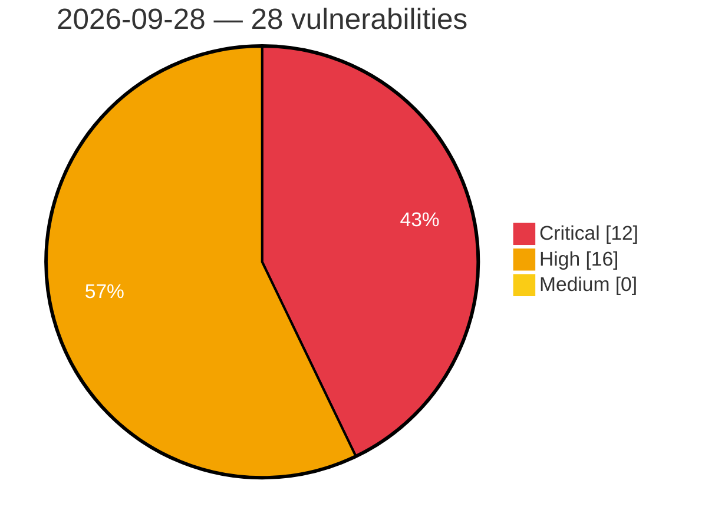

# Critical, High & Medium Severity Vulnerabilities — 2026-09-28

**Source status for this day:**

| Source | Critical | High | Medium | Total |
|--------|---------:|-----:|-------:|------:|
| cvefeed.io (High/Critical) | 12 | 16 | 0 | 28 |

**KEV (actively exploited):** 0  **Watchlist matches:** 21

## Critical (12)

| CVSS | Flags | Source | CVE / Title | Reported |
|------|-------|--------|-------------|----------|
| 10.0 | ⭐ | cvefeed.io (High/Critical) | [CVE-2026-101001 - Netcore NBR200V2 Web Management network_tools eval os command injection](https://cvefeed.io/vuln/detail/CVE-2026-101001) | 59 minutes ago |
| 10.0 | — | cvefeed.io (High/Critical) | [CVE-2026-101000 - Netcore NBR100V2 ACL unauthenticated.json uci.apply authorization](https://cvefeed.io/vuln/detail/CVE-2026-101000) | 59 minutes ago |
| 10.0 | — | cvefeed.io (High/Critical) | [CVE-2026-101039 - FAST FAC1900R devdiscover Service copy_msg_element stack-based overflow](https://cvefeed.io/vuln/detail/CVE-2026-101039) | 1 hour, 46 minutes ago |
| 9.9 | ⭐ | cvefeed.io (High/Critical) | [CVE-2026-100896 - TOTOLINK N150RT Web Management formWlSiteSurvey system os command injection](https://cvefeed.io/vuln/detail/CVE-2026-100896) | 3 hours, 58 minutes ago |
| 9.9 | — | cvefeed.io (High/Critical) | [CVE-2026-101038 - FAST FAC1200R MmtAtePrase stack-based overflow](https://cvefeed.io/vuln/detail/CVE-2026-101038) | 1 hour, 46 minutes ago |
| 9.9 | — | cvefeed.io (High/Critical) | [CVE-2026-101037 - FAST FAC1200R devdiscover Service parse_advertisement_frame stack-based overflow](https://cvefeed.io/vuln/detail/CVE-2026-101037) | 2 hours, 46 minutes ago |
| 9.9 | ⭐ | cvefeed.io (High/Critical) | [CVE-2026-82377 - Apache Roller: Missing weblog authorization in XML-RPC Blogger/MetaWeblog handlers](https://cvefeed.io/vuln/detail/CVE-2026-82377) | 4 hours, 46 minutes ago |
| 9.8 | ⭐ | cvefeed.io (High/Critical) | [CVE-2026-82384 - Apache Roller: Unauthenticated deserialization in the XML-RPC endpoint](https://cvefeed.io/vuln/detail/CVE-2026-82384) | 4 hours, 46 minutes ago |
| 9.4 | ⭐ | cvefeed.io (High/Critical) | [CVE-2026-81867 - Deserialization of Untrusted Data in Application Integration allows Remote Code Execution](https://cvefeed.io/vuln/detail/CVE-2026-81867) | 1 hour, 45 minutes ago |
| 9.4 | ⭐ | cvefeed.io (High/Critical) | [CVE-2026-19759 - Incorrect Authorization in Application Integration allows Internal Stubby RPC Execution](https://cvefeed.io/vuln/detail/CVE-2026-19759) | 1 hour, 45 minutes ago |
| 9.1 | ⭐ | cvefeed.io (High/Critical) | [CVE-2026-101008 - aaPanel BaoTa File Merge files.py merge_split_file command injection](https://cvefeed.io/vuln/detail/CVE-2026-101008) | 5 hours, 45 minutes ago |
| 9.0 | ⭐ | cvefeed.io (High/Critical) | [CVE-2026-82378 - Apache Roller: OAuth authorization endpoint trusts request-supplied identity](https://cvefeed.io/vuln/detail/CVE-2026-82378) | 4 hours, 46 minutes ago |

## High (16)

| CVSS | Flags | Source | CVE / Title | Reported |
|------|-------|--------|-------------|----------|
| 8.8 | ⭐ | cvefeed.io (High/Critical) | [CVE-2026-12265 - Missing Authorization on HA Failover Config allows Complete Data Destruction](https://cvefeed.io/vuln/detail/CVE-2026-12265) | 40 minutes ago |
| 8.8 | ⭐ | cvefeed.io (High/Critical) | [CVE-2026-78424 - OS Command Injection in Packet-Capture (Sniffer) Filter leading to Remote Code Execution on Kubernetes Nodes](https://cvefeed.io/vuln/detail/CVE-2026-78424) | 45 minutes ago |
| 8.8 | ⭐ | cvefeed.io (High/Critical) | [CVE-2026-12264 - Authenticated File Write via HA Failover Config Upload leads to RCE](https://cvefeed.io/vuln/detail/CVE-2026-12264) | 45 minutes ago |
| 8.8 | ⭐ | cvefeed.io (High/Critical) | [CVE-2026-12269 - Authenticated File Write to RCE via keepalived in DDI Central](https://cvefeed.io/vuln/detail/CVE-2026-12269) | 1 hour, 46 minutes ago |
| 8.8 | ⭐ | cvefeed.io (High/Critical) | [CVE-2026-12268 - Authenticated PowerShell Injection leads to RCE](https://cvefeed.io/vuln/detail/CVE-2026-12268) | 1 hour, 46 minutes ago |
| 8.8 | ⭐ | cvefeed.io (High/Critical) | [CVE-2026-85134 - Arbitrary File Upload Leading to Remote Command Execution in Bimser's eBA Plus](https://cvefeed.io/vuln/detail/CVE-2026-85134) | 3 hours, 45 minutes ago |
| 8.7 | — | cvefeed.io (High/Critical) | [CVE-2026-95104 - BUFFALO Wi-Fi Stack-Based Buffer Overflow](https://cvefeed.io/vuln/detail/CVE-2026-95104) | 3 hours, 45 minutes ago |
| 8.6 | ⭐ | cvefeed.io (High/Critical) | [CVE-2026-86530 - BUFFALO Wi-Fi Products OS Command Injection Vulnerability](https://cvefeed.io/vuln/detail/CVE-2026-86530) | 3 hours, 45 minutes ago |
| 8.5 | ⭐ | cvefeed.io (High/Critical) | [CVE-2026-101009 - aaPanel BaoTa Unzip panelTask.py panelTask.bt_task._unzip os command injection](https://cvefeed.io/vuln/detail/CVE-2026-101009) | 5 hours, 45 minutes ago |
| 8.5 | ⭐ | cvefeed.io (High/Critical) | [CVE-2026-101007 - aaPanel BaoTa Database Backup database.py InputSql os command injection](https://cvefeed.io/vuln/detail/CVE-2026-101007) | 5 hours, 45 minutes ago |
| 8.3 | ⭐ | cvefeed.io (High/Critical) | [CVE-2026-81375 - Confused Deputy in Application Integration allows Internal File Read](https://cvefeed.io/vuln/detail/CVE-2026-81375) | 1 hour, 45 minutes ago |
| 8.2 | ⭐ | cvefeed.io (High/Critical) | [CVE-2026-101292 - Artemis-core-client: unsafe reflection in apache activemq artemis federation message deserialization](https://cvefeed.io/vuln/detail/CVE-2026-101292) | 18 minutes ago |
| 8.2 | ⭐ | cvefeed.io (High/Critical) | [CVE-2026-91043 - HPACK-indexed cookie fields in Mint HTTP/2 responses bypass max_header_list_size and exhaust client memory](https://cvefeed.io/vuln/detail/CVE-2026-91043) | 45 minutes ago |
| 8.2 | — | cvefeed.io (High/Critical) | [CVE-2026-82383 - Apache Roller: Anonymous setup action allows frontpage configuration tampering](https://cvefeed.io/vuln/detail/CVE-2026-82383) | 4 hours, 46 minutes ago |
| 8.1 | — | cvefeed.io (High/Critical) | [CVE-2026-82323 - Improper Authorization in Enocta Educational's Enocta Platform](https://cvefeed.io/vuln/detail/CVE-2026-82323) | 26 minutes ago |
| 8.1 | ⭐ | cvefeed.io (High/Critical) | [CVE-2026-82380 - Apache Roller: CSRF protection bypass via self-generated salt validation](https://cvefeed.io/vuln/detail/CVE-2026-82380) | 4 hours, 46 minutes ago |
