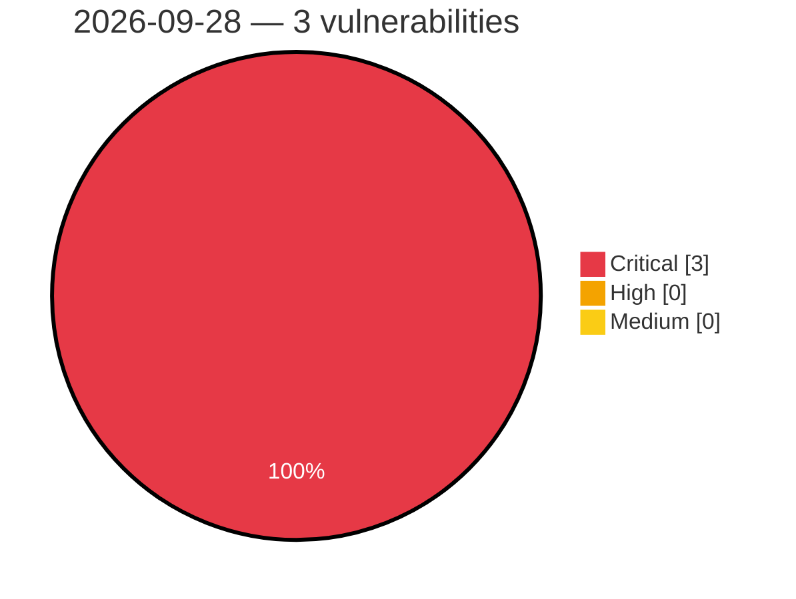

# Critical, High & Medium Severity Vulnerabilities — 2026-09-28

**Source status for this day:**

| Source | Critical | High | Medium | Total |
|--------|---------:|-----:|-------:|------:|
| cvefeed.io (High/Critical) | 3 | 0 | 0 | 3 |

**KEV (actively exploited):** 0  **Watchlist matches:** 2

## Critical (3)

| CVSS | Flags | Source | CVE / Title | Reported |
|------|-------|--------|-------------|----------|
| 10.0 | ⭐ | cvefeed.io (High/Critical) | [CVE-2026-101001 - Netcore NBR200V2 Web Management network_tools eval os command injection](https://cvefeed.io/vuln/detail/CVE-2026-101001) | 59 minutes ago |
| 10.0 | — | cvefeed.io (High/Critical) | [CVE-2026-101000 - Netcore NBR100V2 ACL unauthenticated.json uci.apply authorization](https://cvefeed.io/vuln/detail/CVE-2026-101000) | 59 minutes ago |
| 9.9 | ⭐ | cvefeed.io (High/Critical) | [CVE-2026-100896 - TOTOLINK N150RT Web Management formWlSiteSurvey system os command injection](https://cvefeed.io/vuln/detail/CVE-2026-100896) | 3 hours, 58 minutes ago |
