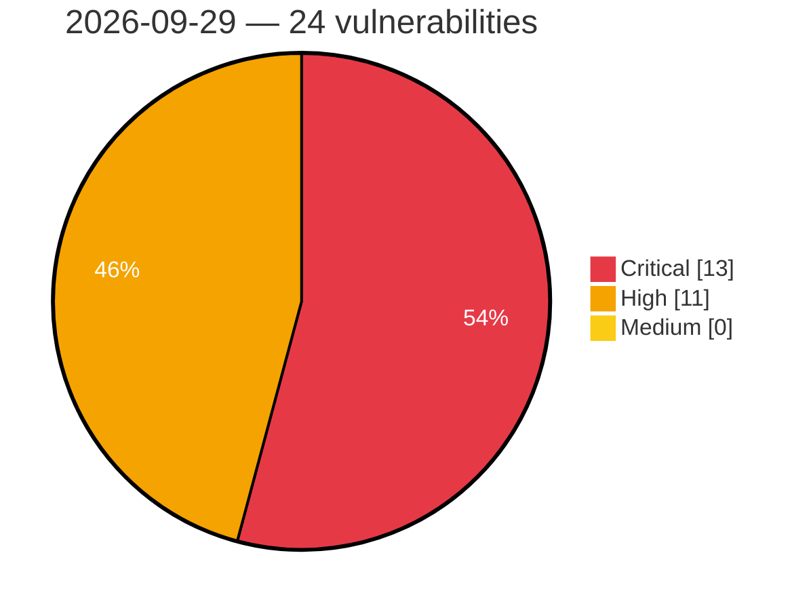

# Critical, High & Medium Severity Vulnerabilities — 2026-09-29

**Source status for this day:**

| Source | Critical | High | Medium | Total |
|--------|---------:|-----:|-------:|------:|
| cvefeed.io (High/Critical) | 13 | 11 | 0 | 24 |

**KEV (actively exploited):** 0  **Watchlist matches:** 15

## Critical (13)

| CVSS | Flags | Source | CVE / Title | Reported |
|------|-------|--------|-------------|----------|
| 10.0 | ⭐ | cvefeed.io (High/Critical) | [CVE-2026-102240 - Netcore NAP930 Network Tools CGI network_tools eval os command injection](https://cvefeed.io/vuln/detail/CVE-2026-102240) | 2 hours, 15 minutes ago |
| 9.9 | — | cvefeed.io (High/Critical) | [CVE-2026-84154 - Code Injection vulnerability affecting GEOVIA Geospatial Data Manager from Release 3DEXPERIENCE R2024x through Release 3DEXPERIENCE R2026x](https://cvefeed.io/vuln/detail/CVE-2026-84154) | 3 hours, 9 minutes ago |
| 9.6 | — | cvefeed.io (High/Critical) | [CVE-2026-101354 - FAST FAC1203R MmtAtePrase _tWlanTask stack-based overflow](https://cvefeed.io/vuln/detail/CVE-2026-101354) | 2 hours, 15 minutes ago |
| 9.3 | — | cvefeed.io (High/Critical) | [CVE-2026-102361 - mall4j through 4.0 Missing Authentication in Password Update Endpoint](https://cvefeed.io/vuln/detail/CVE-2026-102361) | 4 hours, 15 minutes ago |
| 9.3 | ⭐ | cvefeed.io (High/Critical) | [CVE-2026-96431 - Flowring Agentflow 4.0 - Unrestricted Upload of File with Dangerous Type](https://cvefeed.io/vuln/detail/CVE-2026-96431) | 2 hours, 10 minutes ago |
| 9.3 | ⭐ | cvefeed.io (High/Critical) | [CVE-2026-96429 - Flowring Agentflow 4.0 - SQL Injection](https://cvefeed.io/vuln/detail/CVE-2026-96429) | 2 hours, 10 minutes ago |
| 9.3 | ⭐ | cvefeed.io (High/Critical) | [CVE-2026-96428 - Flowring Agentflow 4.0 - SQL Injection](https://cvefeed.io/vuln/detail/CVE-2026-96428) | 2 hours, 10 minutes ago |
| 9.2 | ⭐ | cvefeed.io (High/Critical) | [CVE-2026-102422 - shell-quote `quote()` command injection via a line terminator in a token after a `{ comment }` token](https://cvefeed.io/vuln/detail/CVE-2026-102422) | 14 minutes ago |
| 9.1 | ⭐ | cvefeed.io (High/Critical) | [CVE-2026-101264 - Ziroom ZHOME A0101 set_passwd command injection](https://cvefeed.io/vuln/detail/CVE-2026-101264) | 4 hours, 15 minutes ago |
| 9.1 | ⭐ | cvefeed.io (High/Critical) | [CVE-2026-101263 - Ziroom ZHOME A0101 set_online_client command injection](https://cvefeed.io/vuln/detail/CVE-2026-101263) | 4 hours, 15 minutes ago |
| 9.1 | ⭐ | cvefeed.io (High/Critical) | [CVE-2026-8066 - Hitachi Energy RTU500 Directory Traversal Vulnerability](https://cvefeed.io/vuln/detail/CVE-2026-8066) | 1 hour, 10 minutes ago |
| 9.1 | ⭐ | cvefeed.io (High/Critical) | [CVE-2026-8065 - Hitachi Energy RTU500 Authentication Bypass and Arbitrary Firmware Upload Vulnerability](https://cvefeed.io/vuln/detail/CVE-2026-8065) | 1 hour, 10 minutes ago |
| 9.0 | — | cvefeed.io (High/Critical) | [CVE-2026-15390 - Out-of-bounds write in Das U-Boot](https://cvefeed.io/vuln/detail/CVE-2026-15390) | 1 hour, 10 minutes ago |

## High (11)

| CVSS | Flags | Source | CVE / Title | Reported |
|------|-------|--------|-------------|----------|
| 9.0 | — | cvefeed.io (High/Critical) | [CVE-2026-101860 - RaspAP raspap-webgui sudo Configuration PluginInstaller.php addSudoers privileges management](https://cvefeed.io/vuln/detail/CVE-2026-101860) | 2 hours, 15 minutes ago |
| 8.8 | — | cvefeed.io (High/Critical) | [CVE-2026-95509 - Out-of-bounds read vulnerability in string formatting impacts Qt for MCUs](https://cvefeed.io/vuln/detail/CVE-2026-95509) | 47 minutes ago |
| 8.7 | ⭐ | cvefeed.io (High/Critical) | [CVE-2026-84739 - Improper Neutralization of Input During Web Page Generation ('Cross-site Scripting') in GitLab](https://cvefeed.io/vuln/detail/CVE-2026-84739) | 1 hour, 10 minutes ago |
| 8.7 | ⭐ | cvefeed.io (High/Critical) | [CVE-2026-96430 - Flowring Agentflow 4.0 - Exposed Dangerous Method or Function](https://cvefeed.io/vuln/detail/CVE-2026-96430) | 2 hours, 10 minutes ago |
| 8.7 | ⭐ | cvefeed.io (High/Critical) | [CVE-2026-101169 - Octopus Server Insecure Deserialization Remote Code Execution](https://cvefeed.io/vuln/detail/CVE-2026-101169) | 3 hours, 9 minutes ago |
| 8.5 | ⭐ | cvefeed.io (High/Critical) | [CVE-2026-7395 - Asset Suite HTTPPublishAdapterTestServlet Improper Authorization](https://cvefeed.io/vuln/detail/CVE-2026-7395) | 1 hour, 10 minutes ago |
| 8.3 | — | cvefeed.io (High/Critical) | [CVE-2026-102247 - FastAdmin Database Management database.php unnecessary privileges](https://cvefeed.io/vuln/detail/CVE-2026-102247) | 14 minutes ago |
| 8.2 | ⭐ | cvefeed.io (High/Critical) | [CVE-2026-76719 - HPE OneView - Cross-site scripting vulnerability](https://cvefeed.io/vuln/detail/CVE-2026-76719) | 1 hour, 10 minutes ago |
| 8.2 | ⭐ | cvefeed.io (High/Critical) | [CVE-2026-76718 - HPE OneView - Cross-site scripting vulnerability](https://cvefeed.io/vuln/detail/CVE-2026-76718) | 1 hour, 10 minutes ago |
| 8.1 | — | cvefeed.io (High/Critical) | [CVE-2026-95389 - Heap-based Buffer Overflow in Wireshark](https://cvefeed.io/vuln/detail/CVE-2026-95389) | 1 hour, 9 minutes ago |
| 8.1 | — | cvefeed.io (High/Critical) | [CVE-2026-95387 - Heap-based Buffer Overflow in Wireshark](https://cvefeed.io/vuln/detail/CVE-2026-95387) | 1 hour, 10 minutes ago |
