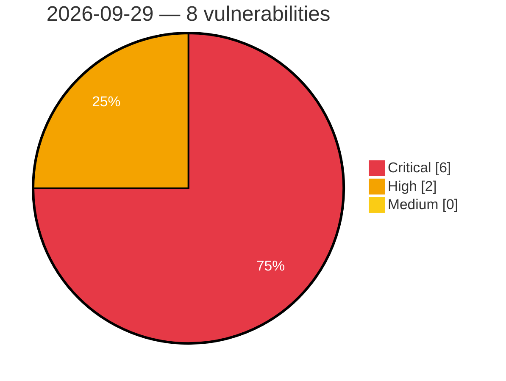

# Critical, High & Medium Severity Vulnerabilities — 2026-09-29

**Source status for this day:**

| Source | Critical | High | Medium | Total |
|--------|---------:|-----:|-------:|------:|
| cvefeed.io (High/Critical) | 6 | 2 | 0 | 8 |

**KEV (actively exploited):** 0  **Watchlist matches:** 4

## Critical (6)

| CVSS | Flags | Source | CVE / Title | Reported |
|------|-------|--------|-------------|----------|
| 10.0 | ⭐ | cvefeed.io (High/Critical) | [CVE-2026-102240 - Netcore NAP930 Network Tools CGI network_tools eval os command injection](https://cvefeed.io/vuln/detail/CVE-2026-102240) | 2 hours, 15 minutes ago |
| 9.6 | — | cvefeed.io (High/Critical) | [CVE-2026-101354 - FAST FAC1203R MmtAtePrase _tWlanTask stack-based overflow](https://cvefeed.io/vuln/detail/CVE-2026-101354) | 2 hours, 15 minutes ago |
| 9.3 | — | cvefeed.io (High/Critical) | [CVE-2026-102361 - mall4j through 4.0 Missing Authentication in Password Update Endpoint](https://cvefeed.io/vuln/detail/CVE-2026-102361) | 4 hours, 15 minutes ago |
| 9.2 | ⭐ | cvefeed.io (High/Critical) | [CVE-2026-102422 - shell-quote `quote()` command injection via a line terminator in a token after a `{ comment }` token](https://cvefeed.io/vuln/detail/CVE-2026-102422) | 14 minutes ago |
| 9.1 | ⭐ | cvefeed.io (High/Critical) | [CVE-2026-101264 - Ziroom ZHOME A0101 set_passwd command injection](https://cvefeed.io/vuln/detail/CVE-2026-101264) | 4 hours, 15 minutes ago |
| 9.1 | ⭐ | cvefeed.io (High/Critical) | [CVE-2026-101263 - Ziroom ZHOME A0101 set_online_client command injection](https://cvefeed.io/vuln/detail/CVE-2026-101263) | 4 hours, 15 minutes ago |

## High (2)

| CVSS | Flags | Source | CVE / Title | Reported |
|------|-------|--------|-------------|----------|
| 9.0 | — | cvefeed.io (High/Critical) | [CVE-2026-101860 - RaspAP raspap-webgui sudo Configuration PluginInstaller.php addSudoers privileges management](https://cvefeed.io/vuln/detail/CVE-2026-101860) | 2 hours, 15 minutes ago |
| 8.3 | — | cvefeed.io (High/Critical) | [CVE-2026-102247 - FastAdmin Database Management database.php unnecessary privileges](https://cvefeed.io/vuln/detail/CVE-2026-102247) | 14 minutes ago |
