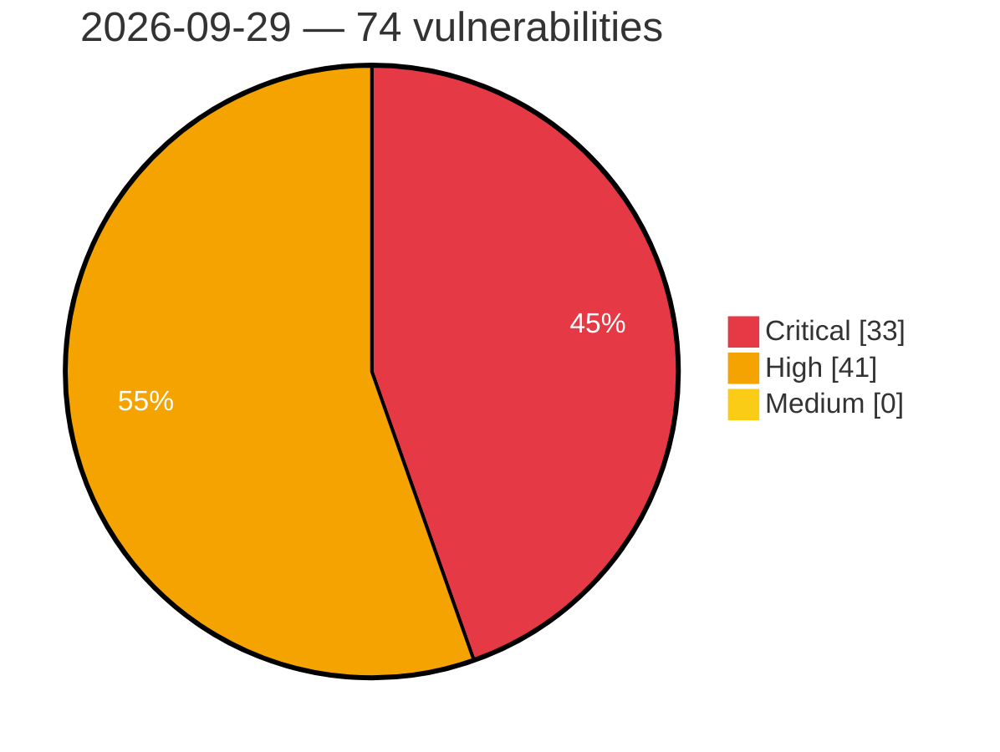

# Critical, High & Medium Severity Vulnerabilities — 2026-09-29

**Source status for this day:**

| Source | Critical | High | Medium | Total |
|--------|---------:|-----:|-------:|------:|
| cvefeed.io (High/Critical) | 33 | 41 | 0 | 74 |

**KEV (actively exploited):** 0  **Watchlist matches:** 42

## Critical (33)

| CVSS | Flags | Source | CVE / Title | Reported |
|------|-------|--------|-------------|----------|
| 10.0 | ⭐ | cvefeed.io (High/Critical) | [CVE-2026-102240 - Netcore NAP930 Network Tools CGI network_tools eval os command injection](https://cvefeed.io/vuln/detail/CVE-2026-102240) | 2 hours, 15 minutes ago |
| 10.0 | — | cvefeed.io (High/Critical) | [CVE-2026-71379 - Toptech TMS7 and TopHAT Files or Directories Accessible to External Parties](https://cvefeed.io/vuln/detail/CVE-2026-71379) | 53 minutes ago |
| 10.0 | ⭐ | cvefeed.io (High/Critical) | [CVE-2026-96587 - Use of Hard-coded Credentials in Viidure Dashcam Android Application](https://cvefeed.io/vuln/detail/CVE-2026-96587) | 57 minutes ago |
| 10.0 | ⭐ | cvefeed.io (High/Critical) | [CVE-2026-53988 - Dockhand < 1.0.40 Unauthenticated Webhook Trigger via Git Webhook Endpoints](https://cvefeed.io/vuln/detail/CVE-2026-53988) | 1 hour, 59 minutes ago |
| 9.9 | — | cvefeed.io (High/Critical) | [CVE-2026-84154 - Code Injection vulnerability affecting GEOVIA Geospatial Data Manager from Release 3DEXPERIENCE R2024x through Release 3DEXPERIENCE R2026x](https://cvefeed.io/vuln/detail/CVE-2026-84154) | 3 hours, 9 minutes ago |
| 9.8 | ⭐ | cvefeed.io (High/Critical) | [CVE-2023-54400 - Fumeng Cloud SQL Injection via AjaxMethod.ashx getEmpByname](https://cvefeed.io/vuln/detail/CVE-2023-54400) | 38 minutes ago |
| 9.8 | ⭐ | cvefeed.io (High/Critical) | [CVE-2026-79538 - MetaMCP Remote Code Execution](https://cvefeed.io/vuln/detail/CVE-2026-79538) | 1 hour, 59 minutes ago |
| 9.8 | ⭐ | cvefeed.io (High/Critical) | [CVE-2026-76722 - Uncontrolled Format String Vulnerabilities lead to Remote Code Execution or Denial-of-Service in HPE Networking Instant ON APs](https://cvefeed.io/vuln/detail/CVE-2026-76722) | 1 hour, 59 minutes ago |
| 9.8 | ⭐ | cvefeed.io (High/Critical) | [CVE-2026-76721 - Unauthenticated Buffer Overflow Vulnerability leads to Remote Code Execution in HPE Networking Instant ON APs](https://cvefeed.io/vuln/detail/CVE-2026-76721) | 1 hour, 59 minutes ago |
| 9.8 | ⭐ | cvefeed.io (High/Critical) | [CVE-2026-39117 - AltumCode 66Uptime Remote Code Execution](https://cvefeed.io/vuln/detail/CVE-2026-39117) | 1 hour, 59 minutes ago |
| 9.6 | — | cvefeed.io (High/Critical) | [CVE-2026-101354 - FAST FAC1203R MmtAtePrase _tWlanTask stack-based overflow](https://cvefeed.io/vuln/detail/CVE-2026-101354) | 2 hours, 15 minutes ago |
| 9.6 | ⭐ | cvefeed.io (High/Critical) | [CVE-2026-76725 - Authentication Bypass in a Management Protocol of HPE Networking Instant ON APs](https://cvefeed.io/vuln/detail/CVE-2026-76725) | 1 hour, 59 minutes ago |
| 9.6 | ⭐ | cvefeed.io (High/Critical) | [CVE-2026-76724 - Unauthenticated Adjacent Command Injection Vulnerability in HPE Networking Instant ON APs Command Line Interface (CLI) Accessed by the PAPI Protocol](https://cvefeed.io/vuln/detail/CVE-2026-76724) | 1 hour, 59 minutes ago |
| 9.6 | ⭐ | cvefeed.io (High/Critical) | [CVE-2026-76723 - Unauthenticated Adjacent Buffer Overflow Vulnerabilities lead to Remote Code Execution in HPE Networking Instant ON APS](https://cvefeed.io/vuln/detail/CVE-2026-76723) | 1 hour, 59 minutes ago |
| 9.4 | ⭐ | cvefeed.io (High/Critical) | [CVE-2026-82973 - Improper Neutralization of CRLF Sequences ('CRLF Injection') in docker-mailbox](https://cvefeed.io/vuln/detail/CVE-2026-82973) | 3 hours, 37 minutes ago |
| 9.3 | — | cvefeed.io (High/Critical) | [CVE-2026-102361 - mall4j through 4.0 Missing Authentication in Password Update Endpoint](https://cvefeed.io/vuln/detail/CVE-2026-102361) | 4 hours, 15 minutes ago |
| 9.3 | ⭐ | cvefeed.io (High/Critical) | [CVE-2026-96431 - Flowring Agentflow 4.0 - Unrestricted Upload of File with Dangerous Type](https://cvefeed.io/vuln/detail/CVE-2026-96431) | 2 hours, 10 minutes ago |
| 9.3 | ⭐ | cvefeed.io (High/Critical) | [CVE-2026-96429 - Flowring Agentflow 4.0 - SQL Injection](https://cvefeed.io/vuln/detail/CVE-2026-96429) | 2 hours, 10 minutes ago |
| 9.3 | ⭐ | cvefeed.io (High/Critical) | [CVE-2026-96428 - Flowring Agentflow 4.0 - SQL Injection](https://cvefeed.io/vuln/detail/CVE-2026-96428) | 2 hours, 10 minutes ago |
| 9.3 | — | cvefeed.io (High/Critical) | [CVE-2026-22094 - Weak root password in EVbee DC 80](https://cvefeed.io/vuln/detail/CVE-2026-22094) | 1 hour, 38 minutes ago |
| 9.3 | — | cvefeed.io (High/Critical) | [CVE-2026-7192 - Multiple vulnerabilities in the T-CPE301K 4G Mini WiFi Router from Shenzhen Dbit Network Equipment](https://cvefeed.io/vuln/detail/CVE-2026-7192) | 3 hours, 37 minutes ago |
| 9.2 | ⭐ | cvefeed.io (High/Critical) | [CVE-2026-102422 - shell-quote `quote()` command injection via a line terminator in a token after a `{ comment }` token](https://cvefeed.io/vuln/detail/CVE-2026-102422) | 14 minutes ago |
| 9.1 | ⭐ | cvefeed.io (High/Critical) | [CVE-2026-101264 - Ziroom ZHOME A0101 set_passwd command injection](https://cvefeed.io/vuln/detail/CVE-2026-101264) | 4 hours, 15 minutes ago |
| 9.1 | ⭐ | cvefeed.io (High/Critical) | [CVE-2026-101263 - Ziroom ZHOME A0101 set_online_client command injection](https://cvefeed.io/vuln/detail/CVE-2026-101263) | 4 hours, 15 minutes ago |
| 9.1 | ⭐ | cvefeed.io (High/Critical) | [CVE-2026-8066 - Hitachi Energy RTU500 Directory Traversal Vulnerability](https://cvefeed.io/vuln/detail/CVE-2026-8066) | 1 hour, 10 minutes ago |
| 9.1 | ⭐ | cvefeed.io (High/Critical) | [CVE-2026-8065 - Hitachi Energy RTU500 Authentication Bypass and Arbitrary Firmware Upload Vulnerability](https://cvefeed.io/vuln/detail/CVE-2026-8065) | 1 hour, 10 minutes ago |
| 9.1 | ⭐ | cvefeed.io (High/Critical) | [CVE-2026-70356 - Toptech TMS7 and TopHAT Unrestricted Upload of File with Dangerous Type](https://cvefeed.io/vuln/detail/CVE-2026-70356) | 50 minutes ago |
| 9.0 | — | cvefeed.io (High/Critical) | [CVE-2026-15390 - Out-of-bounds write in Das U-Boot](https://cvefeed.io/vuln/detail/CVE-2026-15390) | 1 hour, 10 minutes ago |
| 9.0 | ⭐ | cvefeed.io (High/Critical) | [CVE-2026-72507 - Toptech TMS7 and TopHAT SQL Injection](https://cvefeed.io/vuln/detail/CVE-2026-72507) | 39 minutes ago |
| 9.0 | ⭐ | cvefeed.io (High/Critical) | [CVE-2026-68068 - Toptech TMS7 and TopHAT SQL Injection](https://cvefeed.io/vuln/detail/CVE-2026-68068) | 42 minutes ago |
| 9.0 | ⭐ | cvefeed.io (High/Critical) | [CVE-2026-68954 - Toptech TMS7 and TopHAT SQL Injection](https://cvefeed.io/vuln/detail/CVE-2026-68954) | 44 minutes ago |
| 9.0 | ⭐ | cvefeed.io (High/Critical) | [CVE-2026-63713 - Toptech TMS7 and TopHAT SQL Injection](https://cvefeed.io/vuln/detail/CVE-2026-63713) | 46 minutes ago |
| 9.0 | ⭐ | cvefeed.io (High/Critical) | [CVE-2026-72510 - Toptech TMS7 and TopHAT SQL Injection](https://cvefeed.io/vuln/detail/CVE-2026-72510) | 48 minutes ago |

## High (41)

| CVSS | Flags | Source | CVE / Title | Reported |
|------|-------|--------|-------------|----------|
| 9.0 | — | cvefeed.io (High/Critical) | [CVE-2026-101860 - RaspAP raspap-webgui sudo Configuration PluginInstaller.php addSudoers privileges management](https://cvefeed.io/vuln/detail/CVE-2026-101860) | 2 hours, 15 minutes ago |
| 8.9 | ⭐ | cvefeed.io (High/Critical) | [CVE-2026-92222 - Joomla! Core - [20260909] - Core -  SSRF vectors in various core extensions in Joomla 4.0.0-5.4.8, 6.0.0-6.1.3](https://cvefeed.io/vuln/detail/CVE-2026-92222) | 17 minutes ago |
| 8.9 | — | cvefeed.io (High/Critical) | [CVE-2026-97689 - urllib3: HTTPResponse.stream()/read_chunked() buffers an unbounded chunk-size line into memory](https://cvefeed.io/vuln/detail/CVE-2026-97689) | 38 minutes ago |
| 8.8 | — | cvefeed.io (High/Critical) | [CVE-2026-95509 - Out-of-bounds read vulnerability in string formatting impacts Qt for MCUs](https://cvefeed.io/vuln/detail/CVE-2026-95509) | 47 minutes ago |
| 8.8 | ⭐ | cvefeed.io (High/Critical) | [CVE-2026-92370 - Remote Session Access Control Bypass Leading to Remote Code Execution](https://cvefeed.io/vuln/detail/CVE-2026-92370) | 38 minutes ago |
| 8.8 | ⭐ | cvefeed.io (High/Critical) | [CVE-2022-51019 - Akaunting before 2.1.31 OS Command Injection via app alias](https://cvefeed.io/vuln/detail/CVE-2022-51019) | 51 minutes ago |
| 8.8 | — | cvefeed.io (High/Critical) | [CVE-2026-100832 - Use-after-free in the Graphics: Canvas2D component](https://cvefeed.io/vuln/detail/CVE-2026-100832) | 3 hours, 38 minutes ago |
| 8.8 | — | cvefeed.io (High/Critical) | [CVE-2026-100831 - Use-after-free in the DOM: UI Events & Focus Handling component](https://cvefeed.io/vuln/detail/CVE-2026-100831) | 3 hours, 38 minutes ago |
| 8.8 | — | cvefeed.io (High/Critical) | [CVE-2026-100825 - Use-after-free in the JavaScript Engine: JIT component](https://cvefeed.io/vuln/detail/CVE-2026-100825) | 3 hours, 38 minutes ago |
| 8.8 | ⭐ | cvefeed.io (High/Critical) | [CVE-2026-61519 - Liberu CRM 0.9.1 < 10.0.0 Broken Access Control via TeamPolicy::addTeamMember()](https://cvefeed.io/vuln/detail/CVE-2026-61519) | 1 hour, 59 minutes ago |
| 8.7 | ⭐ | cvefeed.io (High/Critical) | [CVE-2026-84739 - Improper Neutralization of Input During Web Page Generation ('Cross-site Scripting') in GitLab](https://cvefeed.io/vuln/detail/CVE-2026-84739) | 1 hour, 10 minutes ago |
| 8.7 | ⭐ | cvefeed.io (High/Critical) | [CVE-2026-96430 - Flowring Agentflow 4.0 - Exposed Dangerous Method or Function](https://cvefeed.io/vuln/detail/CVE-2026-96430) | 2 hours, 10 minutes ago |
| 8.7 | ⭐ | cvefeed.io (High/Critical) | [CVE-2026-101169 - Octopus Server Insecure Deserialization Remote Code Execution](https://cvefeed.io/vuln/detail/CVE-2026-101169) | 3 hours, 9 minutes ago |
| 8.7 | — | cvefeed.io (High/Critical) | [CVE-2026-102634 - SGLang through 0.5.20 Denial of Service via Duplicate bootstrap_room](https://cvefeed.io/vuln/detail/CVE-2026-102634) | 51 minutes ago |
| 8.7 | — | cvefeed.io (High/Critical) | [CVE-2026-68911 - Nicotine+: Decompression of peer messages can exhaust available memory](https://cvefeed.io/vuln/detail/CVE-2026-68911) | 1 hour, 38 minutes ago |
| 8.7 | ⭐ | cvefeed.io (High/Critical) | [CVE-2015-20122 - Seeyon A6 OA Unauthenticated SQL Injection via downloadAtt.jsp](https://cvefeed.io/vuln/detail/CVE-2015-20122) | 1 hour, 38 minutes ago |
| 8.7 | — | cvefeed.io (High/Critical) | [CVE-2026-4034 - TIBCO Administrator Injection Vulnerability](https://cvefeed.io/vuln/detail/CVE-2026-4034) | 2 hours, 38 minutes ago |
| 8.7 | ⭐ | cvefeed.io (High/Critical) | [CVE-2026-94204 - Incorrect Permission Assignment for Critical Resource in Viidure Dashcam Android Application](https://cvefeed.io/vuln/detail/CVE-2026-94204) | 57 minutes ago |
| 8.7 | — | cvefeed.io (High/Critical) | [CVE-2026-102253 - iperf3 < 3.22 UDP Receive Worker Infinite Loop DoS](https://cvefeed.io/vuln/detail/CVE-2026-102253) | 59 minutes ago |
| 8.6 | — | cvefeed.io (High/Critical) | [CVE-2026-102557 - Libsoup: libsoup: heap buffer overflow during websocket message reassembly](https://cvefeed.io/vuln/detail/CVE-2026-102557) | 43 minutes ago |
| 8.6 | ⭐ | cvefeed.io (High/Critical) | [CVE-2026-102556 - Libsoup: libsoup: heap buffer overflow from websocket pong signal type confusion](https://cvefeed.io/vuln/detail/CVE-2026-102556) | 43 minutes ago |
| 8.6 | — | cvefeed.io (High/Critical) | [CVE-2026-102521 - lib0 `readFromDataView` out-of-bounds read](https://cvefeed.io/vuln/detail/CVE-2026-102521) | 2 hours, 38 minutes ago |
| 8.6 | — | cvefeed.io (High/Critical) | [CVE-2026-102360 - lib0 `readUint8Array` performs an unbounded read past the end of the decoder’s view, disclosing adjacent process memory](https://cvefeed.io/vuln/detail/CVE-2026-102360) | 2 hours, 38 minutes ago |
| 8.6 | — | cvefeed.io (High/Critical) | [CVE-2026-7193 - Multiple vulnerabilities in the T-CPE301K 4G Mini WiFi Router from Shenzhen Dbit Network Equipment](https://cvefeed.io/vuln/detail/CVE-2026-7193) | 3 hours, 37 minutes ago |
| 8.5 | ⭐ | cvefeed.io (High/Critical) | [CVE-2026-7395 - Asset Suite HTTPPublishAdapterTestServlet Improper Authorization](https://cvefeed.io/vuln/detail/CVE-2026-7395) | 1 hour, 10 minutes ago |
| 8.5 | — | cvefeed.io (High/Critical) | [CVE-2026-86035 - Weblate: Mercurial argument injection via repository filenames allows authenticated command execution](https://cvefeed.io/vuln/detail/CVE-2026-86035) | 1 hour, 38 minutes ago |
| 8.5 | — | cvefeed.io (High/Critical) | [CVE-2026-102566 - CTranslate2 before 4.8.1 Heap Buffer Overflow via model.bin](https://cvefeed.io/vuln/detail/CVE-2026-102566) | 1 hour, 38 minutes ago |
| 8.4 | ⭐ | cvefeed.io (High/Critical) | [CVE-2026-100308 - GluonTS arbitrary command execution during model deserialization](https://cvefeed.io/vuln/detail/CVE-2026-100308) | 38 minutes ago |
| 8.3 | — | cvefeed.io (High/Critical) | [CVE-2026-102247 - FastAdmin Database Management database.php unnecessary privileges](https://cvefeed.io/vuln/detail/CVE-2026-102247) | 14 minutes ago |
| 8.3 | — | cvefeed.io (High/Critical) | [CVE-2026-96274 - Uncaught exception in Baicells Nova 430H](https://cvefeed.io/vuln/detail/CVE-2026-96274) | 1 hour, 59 minutes ago |
| 8.2 | ⭐ | cvefeed.io (High/Critical) | [CVE-2026-76719 - HPE OneView - Cross-site scripting vulnerability](https://cvefeed.io/vuln/detail/CVE-2026-76719) | 1 hour, 10 minutes ago |
| 8.2 | ⭐ | cvefeed.io (High/Critical) | [CVE-2026-76718 - HPE OneView - Cross-site scripting vulnerability](https://cvefeed.io/vuln/detail/CVE-2026-76718) | 1 hour, 10 minutes ago |
| 8.2 | ⭐ | cvefeed.io (High/Critical) | [CVE-2026-92227 - Joomla! Core - [20260914] - Core - MFA Authentication Bypass through rememberme cookies in Joomla 4.0.0-5.4.8, 6.0.0-6.1.3](https://cvefeed.io/vuln/detail/CVE-2026-92227) | 19 minutes ago |
| 8.2 | — | cvefeed.io (High/Critical) | [CVE-2026-102633 - libexpat 2.7.2 through 2.8.5 Integer Overflow in expat_realloc](https://cvefeed.io/vuln/detail/CVE-2026-102633) | 51 minutes ago |
| 8.2 | — | cvefeed.io (High/Critical) | [CVE-2026-74222 - U-Boot before 2026.10-rc5 Use-After-Free in lwIP wget Receive Callback](https://cvefeed.io/vuln/detail/CVE-2026-74222) | 47 minutes ago |
| 8.2 | — | cvefeed.io (High/Critical) | [CVE-2026-74221 - U-Boot before 2026.10-rc5 Buffer Overflow via NFS READLINK](https://cvefeed.io/vuln/detail/CVE-2026-74221) | 47 minutes ago |
| 8.2 | — | cvefeed.io (High/Critical) | [CVE-2026-74220 - U-Boot before 2026.10-rc5 Buffer Overflow via NFS READ Reply](https://cvefeed.io/vuln/detail/CVE-2026-74220) | 47 minutes ago |
| 8.2 | — | cvefeed.io (High/Critical) | [CVE-2026-71971 - U-Boot before 2026.10-rc3 Out-of-Bounds Write in IP Fragment Reassembly](https://cvefeed.io/vuln/detail/CVE-2026-71971) | 47 minutes ago |
| 8.1 | — | cvefeed.io (High/Critical) | [CVE-2026-95389 - Heap-based Buffer Overflow in Wireshark](https://cvefeed.io/vuln/detail/CVE-2026-95389) | 1 hour, 9 minutes ago |
| 8.1 | — | cvefeed.io (High/Critical) | [CVE-2026-95387 - Heap-based Buffer Overflow in Wireshark](https://cvefeed.io/vuln/detail/CVE-2026-95387) | 1 hour, 10 minutes ago |
| 8.1 | ⭐ | cvefeed.io (High/Critical) | [CVE-2026-76726 - Authentication Bypass Leading to Unauthorized Network Access in HPE Networking Instant ON API Endpoint](https://cvefeed.io/vuln/detail/CVE-2026-76726) | 1 hour, 59 minutes ago |
