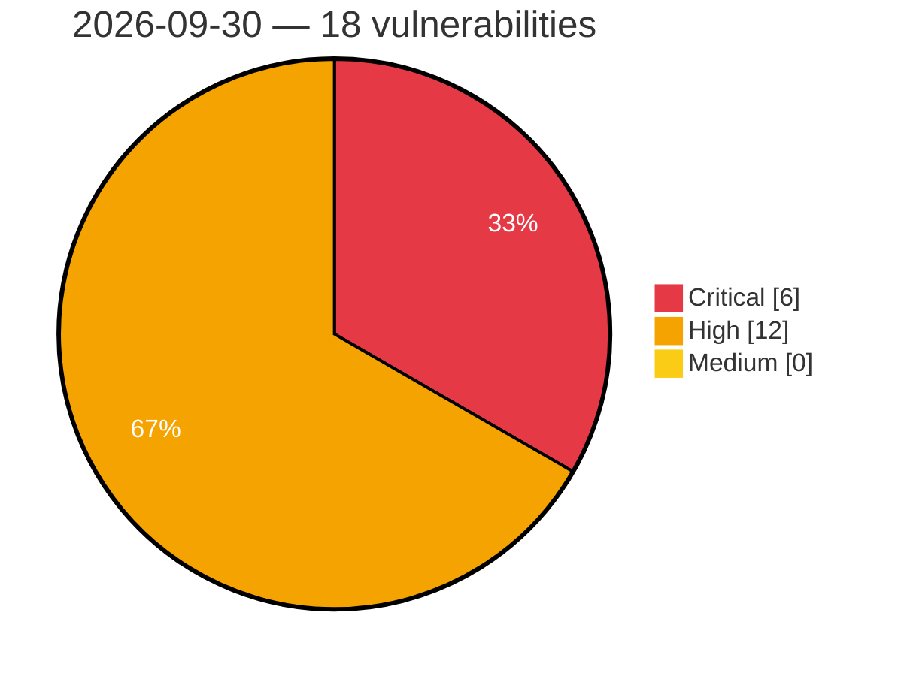

# Critical, High & Medium Severity Vulnerabilities — 2026-09-30

**Source status for this day:**

| Source | Critical | High | Medium | Total |
|--------|---------:|-----:|-------:|------:|
| cvefeed.io (High/Critical) | 6 | 12 | 0 | 18 |

**KEV (actively exploited):** 0  **Watchlist matches:** 13

## Critical (6)

| CVSS | Flags | Source | CVE / Title | Reported |
|------|-------|--------|-------------|----------|
| 9.9 | ⭐ | cvefeed.io (High/Critical) | [CVE-2026-102911 - zosmaai pi-llm-wiki wiki_capture_source MCP tool index.ts os command injection](https://cvefeed.io/vuln/detail/CVE-2026-102911) | 2 hours, 5 minutes ago |
| 9.8 | ⭐ | cvefeed.io (High/Critical) | [CVE-2026-103110 - Pexip Infinity Remote Code Execution Vulnerability](https://cvefeed.io/vuln/detail/CVE-2026-103110) | 2 hours, 5 minutes ago |
| 9.4 | ⭐ | cvefeed.io (High/Critical) | [CVE-2026-103056 - AiSOC 7.2.0 before 12.0.0 Command Injection via CrowdStrike RTR](https://cvefeed.io/vuln/detail/CVE-2026-103056) | 5 hours, 7 minutes ago |
| 9.2 | ⭐ | cvefeed.io (High/Critical) | [CVE-2026-86131 - Fireware OS Code Injection in BOVPN Over TLS Client Allows Remote Code Execution](https://cvefeed.io/vuln/detail/CVE-2026-86131) | 6 hours, 7 minutes ago |
| 9.1 | ⭐ | cvefeed.io (High/Critical) | [CVE-2026-102794 - Ziroom ZHOME A0101 ping command injection](https://cvefeed.io/vuln/detail/CVE-2026-102794) | 6 hours, 7 minutes ago |
| 9.1 | ⭐ | cvefeed.io (High/Critical) | [CVE-2026-102793 - Ziroom ZHOME A0101 set_time_zone command injection](https://cvefeed.io/vuln/detail/CVE-2026-102793) | 6 hours, 7 minutes ago |

## High (12)

| CVSS | Flags | Source | CVE / Title | Reported |
|------|-------|--------|-------------|----------|
| 8.8 | ⭐ | cvefeed.io (High/Critical) | [CVE-2026-103105 - Pexip Infinity Improper Access Control Vulnerability](https://cvefeed.io/vuln/detail/CVE-2026-103105) | 3 hours, 7 minutes ago |
| 8.7 | — | cvefeed.io (High/Critical) | [CVE-2026-86134 - Fireware OS Pre-Authentication NULL Pointer Dereference Allows Remote Denial of Service](https://cvefeed.io/vuln/detail/CVE-2026-86134) | 2 hours, 5 minutes ago |
| 8.7 | ⭐ | cvefeed.io (High/Critical) | [CVE-2026-103055 - AiSOC 7.5.0 before 12.0.0 Authentication Bypass via Hard-coded JWT Secret](https://cvefeed.io/vuln/detail/CVE-2026-103055) | 5 hours, 7 minutes ago |
| 8.7 | ⭐ | cvefeed.io (High/Critical) | [CVE-2026-86104 - Fireware OS Resource Exhaustion in Login Process Allows Denial of Service](https://cvefeed.io/vuln/detail/CVE-2026-86104) | 6 hours, 7 minutes ago |
| 8.7 | ⭐ | cvefeed.io (High/Critical) | [CVE-2026-81433 - Fireware OS Pre-Authentication Stack Buffer Overflow in fingerd Allows Remote Code Execution](https://cvefeed.io/vuln/detail/CVE-2026-81433) | 6 hours, 7 minutes ago |
| 8.6 | ⭐ | cvefeed.io (High/Critical) | [CVE-2026-103102 - Pexip Infinity Signaling Implementation Denial of Service Vulnerability](https://cvefeed.io/vuln/detail/CVE-2026-103102) | 3 hours, 7 minutes ago |
| 8.6 | — | cvefeed.io (High/Critical) | [CVE-2026-103101 - Pexip Infinity Improper Input Validation Vulnerability](https://cvefeed.io/vuln/detail/CVE-2026-103101) | 3 hours, 7 minutes ago |
| 8.6 | ⭐ | cvefeed.io (High/Critical) | [CVE-2026-18145 - Fireware OS Stack-based Buffer Overflow in spamd Allows Remote Code Execution](https://cvefeed.io/vuln/detail/CVE-2026-18145) | 6 hours, 7 minutes ago |
| 8.2 | — | cvefeed.io (High/Critical) | [CVE-2026-86133 - Fireware OS Pre-Authentication Integer Underflow in iked Allows Remote Denial of Service](https://cvefeed.io/vuln/detail/CVE-2026-86133) | 6 hours, 7 minutes ago |
| 8.2 | — | cvefeed.io (High/Critical) | [CVE-2026-86132 - Fireware OS Pre-Authentication Integer Underflow in iked Allows Denial of Service](https://cvefeed.io/vuln/detail/CVE-2026-86132) | 6 hours, 7 minutes ago |
| 8.2 | — | cvefeed.io (High/Critical) | [CVE-2026-86128 - Fireware OS NULL Pointer Dereference in NetFlow IPv6 Traffic Processing Allows Remote Denial of Service](https://cvefeed.io/vuln/detail/CVE-2026-86128) | 6 hours, 7 minutes ago |
| 8.2 | ⭐ | cvefeed.io (High/Critical) | [CVE-2026-13224 - Fireware OS Path Traversal in WebUI Management Agent Allows Arbitrary Local File Read](https://cvefeed.io/vuln/detail/CVE-2026-13224) | 6 hours, 7 minutes ago |
