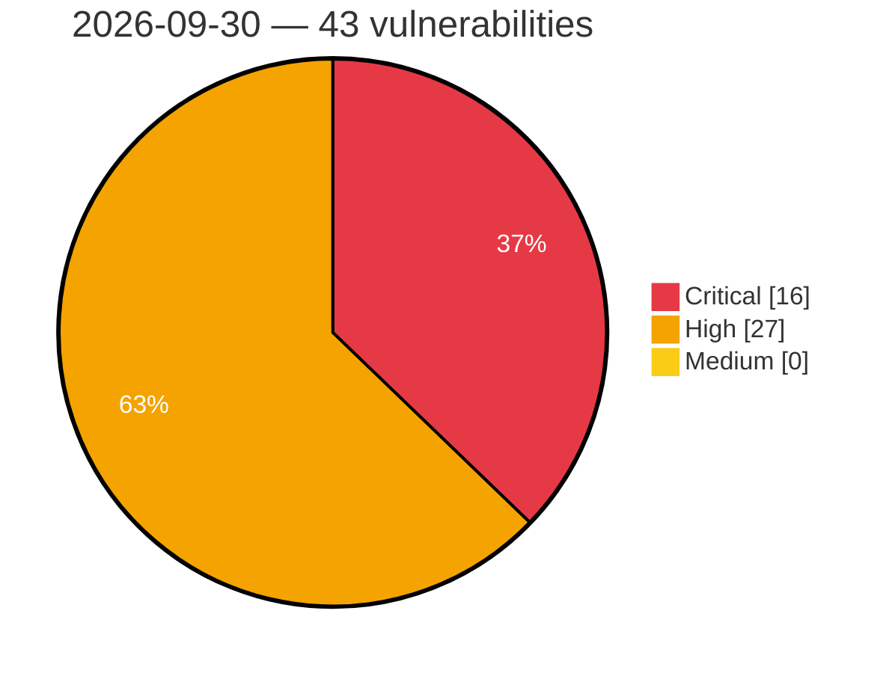

# Critical, High & Medium Severity Vulnerabilities — 2026-09-30

**Source status for this day:**

| Source | Critical | High | Medium | Total |
|--------|---------:|-----:|-------:|------:|
| cvefeed.io (High/Critical) | 16 | 27 | 0 | 43 |

**KEV (actively exploited):** 0  **Watchlist matches:** 31

## Critical (16)

| CVSS | Flags | Source | CVE / Title | Reported |
|------|-------|--------|-------------|----------|
| 10.0 | ⭐ | cvefeed.io (High/Critical) | [CVE-2026-96349 - WordPress SiteSkite plugin <= 2.1.8 - Remote Code Execution (RCE) vulnerability](https://cvefeed.io/vuln/detail/CVE-2026-96349) | 28 minutes ago |
| 9.9 | ⭐ | cvefeed.io (High/Critical) | [CVE-2026-102911 - zosmaai pi-llm-wiki wiki_capture_source MCP tool index.ts os command injection](https://cvefeed.io/vuln/detail/CVE-2026-102911) | 2 hours, 5 minutes ago |
| 9.8 | ⭐ | cvefeed.io (High/Critical) | [CVE-2026-103110 - Pexip Infinity Remote Code Execution Vulnerability](https://cvefeed.io/vuln/detail/CVE-2026-103110) | 2 hours, 5 minutes ago |
| 9.8 | ⭐ | cvefeed.io (High/Critical) | [CVE-2026-82307 - Multiple Vulnerabilities in Dolusoft Software's SOPLOG](https://cvefeed.io/vuln/detail/CVE-2026-82307) | 25 minutes ago |
| 9.8 | ⭐ | cvefeed.io (High/Critical) | [CVE-2026-97274 - WordPress OAuth Single Sign On – SSO (OAuth Client) plugin <= 7.1.2 - Bypass vulnerability vulnerability](https://cvefeed.io/vuln/detail/CVE-2026-97274) | 28 minutes ago |
| 9.8 | — | cvefeed.io (High/Critical) | [CVE-2026-97248 - WordPress Booking Activities plugin <= 1.18.7.1 - PHP Object Injection vulnerability](https://cvefeed.io/vuln/detail/CVE-2026-97248) | 28 minutes ago |
| 9.8 | ⭐ | cvefeed.io (High/Critical) | [CVE-2026-96350 - WordPress Estatik plugin <= 4.3.5 - Privilege Escalation vulnerability](https://cvefeed.io/vuln/detail/CVE-2026-96350) | 28 minutes ago |
| 9.8 | ⭐ | cvefeed.io (High/Critical) | [CVE-2026-76504 - Cisco Catalyst SD-WAN Manager System Account Authorization Bypass Vulnerability](https://cvefeed.io/vuln/detail/CVE-2026-76504) | 28 minutes ago |
| 9.4 | ⭐ | cvefeed.io (High/Critical) | [CVE-2026-103056 - AiSOC 7.2.0 before 12.0.0 Command Injection via CrowdStrike RTR](https://cvefeed.io/vuln/detail/CVE-2026-103056) | 5 hours, 7 minutes ago |
| 9.3 | ⭐ | cvefeed.io (High/Critical) | [CVE-2026-96822 - WordPress Books Gallery plugin <= 4.8.3 - SQL Injection vulnerability](https://cvefeed.io/vuln/detail/CVE-2026-96822) | 28 minutes ago |
| 9.3 | ⭐ | cvefeed.io (High/Critical) | [CVE-2026-74864 - Authentication Bypass in sogo_yhn](https://cvefeed.io/vuln/detail/CVE-2026-74864) | 28 minutes ago |
| 9.2 | ⭐ | cvefeed.io (High/Critical) | [CVE-2026-86131 - Fireware OS Code Injection in BOVPN Over TLS Client Allows Remote Code Execution](https://cvefeed.io/vuln/detail/CVE-2026-86131) | 6 hours, 7 minutes ago |
| 9.2 | ⭐ | cvefeed.io (High/Critical) | [CVE-2026-74865 - Authentication Bypass in sogo_yhn](https://cvefeed.io/vuln/detail/CVE-2026-74865) | 28 minutes ago |
| 9.1 | ⭐ | cvefeed.io (High/Critical) | [CVE-2026-102794 - Ziroom ZHOME A0101 ping command injection](https://cvefeed.io/vuln/detail/CVE-2026-102794) | 6 hours, 7 minutes ago |
| 9.1 | ⭐ | cvefeed.io (High/Critical) | [CVE-2026-102793 - Ziroom ZHOME A0101 set_time_zone command injection](https://cvefeed.io/vuln/detail/CVE-2026-102793) | 6 hours, 7 minutes ago |
| 9.0 | ⭐ | cvefeed.io (High/Critical) | [CVE-2026-94389 - WordPress AcyMailing SMTP Newsletter plugin <= 11.0.5 - Remote Code Execution (RCE) vulnerability](https://cvefeed.io/vuln/detail/CVE-2026-94389) | 28 minutes ago |

## High (27)

| CVSS | Flags | Source | CVE / Title | Reported |
|------|-------|--------|-------------|----------|
| 8.8 | ⭐ | cvefeed.io (High/Critical) | [CVE-2026-103105 - Pexip Infinity Improper Access Control Vulnerability](https://cvefeed.io/vuln/detail/CVE-2026-103105) | 3 hours, 7 minutes ago |
| 8.8 | ⭐ | cvefeed.io (High/Critical) | [CVE-2026-96838 - WordPress Blacklist Manager &#8211; WooCommerce Anti-Fraud, Blacklist &amp; Checkout Verification plugin <= 2.3.1 - Cross Site Request Forgery (CSRF) vulnerability](https://cvefeed.io/vuln/detail/CVE-2026-96838) | 28 minutes ago |
| 8.8 | ⭐ | cvefeed.io (High/Critical) | [CVE-2026-96837 - WordPress CartFlows plugin <= 3.2.0 - Remote Code Execution (RCE) vulnerability](https://cvefeed.io/vuln/detail/CVE-2026-96837) | 28 minutes ago |
| 8.8 | — | cvefeed.io (High/Critical) | [CVE-2026-96831 - WordPress Themify Builder plugin <= 7.8.1 - PHP Object Injection vulnerability](https://cvefeed.io/vuln/detail/CVE-2026-96831) | 28 minutes ago |
| 8.8 | — | cvefeed.io (High/Critical) | [CVE-2026-95531 - WordPress Conversational Forms for ChatBot plugin <= 1.5.0 - PHP Object Injection vulnerability](https://cvefeed.io/vuln/detail/CVE-2026-95531) | 28 minutes ago |
| 8.8 | — | cvefeed.io (High/Critical) | [CVE-2026-94683 - WordPress DesignSetGo plugin <= 2.8.0 - PHP Object Injection vulnerability](https://cvefeed.io/vuln/detail/CVE-2026-94683) | 28 minutes ago |
| 8.8 | — | cvefeed.io (High/Critical) | [CVE-2026-94678 - WordPress Go Live Update Urls plugin <= 7.0.8 - PHP Object Injection vulnerability](https://cvefeed.io/vuln/detail/CVE-2026-94678) | 28 minutes ago |
| 8.8 | — | cvefeed.io (High/Critical) | [CVE-2026-94121 - WordPress 10Web Booster – Website speed optimization, Cache & Page Speed optimizer plugin <= 2.33.6 - PHP Object Injection vulnerability](https://cvefeed.io/vuln/detail/CVE-2026-94121) | 28 minutes ago |
| 8.8 | — | cvefeed.io (High/Critical) | [CVE-2026-94076 - WordPress SEO Plugin by Squirrly SEO plugin <= 14.2.5 - PHP Object Injection vulnerability](https://cvefeed.io/vuln/detail/CVE-2026-94076) | 28 minutes ago |
| 8.7 | — | cvefeed.io (High/Critical) | [CVE-2026-86134 - Fireware OS Pre-Authentication NULL Pointer Dereference Allows Remote Denial of Service](https://cvefeed.io/vuln/detail/CVE-2026-86134) | 2 hours, 5 minutes ago |
| 8.7 | ⭐ | cvefeed.io (High/Critical) | [CVE-2026-103055 - AiSOC 7.5.0 before 12.0.0 Authentication Bypass via Hard-coded JWT Secret](https://cvefeed.io/vuln/detail/CVE-2026-103055) | 5 hours, 7 minutes ago |
| 8.7 | ⭐ | cvefeed.io (High/Critical) | [CVE-2026-86104 - Fireware OS Resource Exhaustion in Login Process Allows Denial of Service](https://cvefeed.io/vuln/detail/CVE-2026-86104) | 6 hours, 7 minutes ago |
| 8.7 | ⭐ | cvefeed.io (High/Critical) | [CVE-2026-81433 - Fireware OS Pre-Authentication Stack Buffer Overflow in fingerd Allows Remote Code Execution](https://cvefeed.io/vuln/detail/CVE-2026-81433) | 6 hours, 7 minutes ago |
| 8.6 | ⭐ | cvefeed.io (High/Critical) | [CVE-2026-103102 - Pexip Infinity Signaling Implementation Denial of Service Vulnerability](https://cvefeed.io/vuln/detail/CVE-2026-103102) | 3 hours, 7 minutes ago |
| 8.6 | — | cvefeed.io (High/Critical) | [CVE-2026-103101 - Pexip Infinity Improper Input Validation Vulnerability](https://cvefeed.io/vuln/detail/CVE-2026-103101) | 3 hours, 7 minutes ago |
| 8.6 | ⭐ | cvefeed.io (High/Critical) | [CVE-2026-18145 - Fireware OS Stack-based Buffer Overflow in spamd Allows Remote Code Execution](https://cvefeed.io/vuln/detail/CVE-2026-18145) | 6 hours, 7 minutes ago |
| 8.5 | ⭐ | cvefeed.io (High/Critical) | [CVE-2026-97293 - WordPress Media LIbrary Assistant plugin <= 3.41 - SQL Injection vulnerability](https://cvefeed.io/vuln/detail/CVE-2026-97293) | 28 minutes ago |
| 8.5 | ⭐ | cvefeed.io (High/Critical) | [CVE-2026-97287 - WordPress Event Tickets plugin <= 5.29.5 - SQL Injection vulnerability](https://cvefeed.io/vuln/detail/CVE-2026-97287) | 28 minutes ago |
| 8.5 | ⭐ | cvefeed.io (High/Critical) | [CVE-2026-94177 - WordPress GamiPress plugin <= 8.0.2 - SQL Injection vulnerability](https://cvefeed.io/vuln/detail/CVE-2026-94177) | 28 minutes ago |
| 8.5 | ⭐ | cvefeed.io (High/Critical) | [CVE-2026-94115 - WordPress Easy Pricing Tables plugin <= 4.1.2 - SQL Injection vulnerability](https://cvefeed.io/vuln/detail/CVE-2026-94115) | 28 minutes ago |
| 8.3 | ⭐ | cvefeed.io (High/Critical) | [CVE-2026-103321 - MISP Stored Cross-Site Scripting (XSS) via Unvalidated Event Graph Preview Image](https://cvefeed.io/vuln/detail/CVE-2026-103321) | 28 minutes ago |
| 8.2 | — | cvefeed.io (High/Critical) | [CVE-2026-86133 - Fireware OS Pre-Authentication Integer Underflow in iked Allows Remote Denial of Service](https://cvefeed.io/vuln/detail/CVE-2026-86133) | 6 hours, 7 minutes ago |
| 8.2 | — | cvefeed.io (High/Critical) | [CVE-2026-86132 - Fireware OS Pre-Authentication Integer Underflow in iked Allows Denial of Service](https://cvefeed.io/vuln/detail/CVE-2026-86132) | 6 hours, 7 minutes ago |
| 8.2 | — | cvefeed.io (High/Critical) | [CVE-2026-86128 - Fireware OS NULL Pointer Dereference in NetFlow IPv6 Traffic Processing Allows Remote Denial of Service](https://cvefeed.io/vuln/detail/CVE-2026-86128) | 6 hours, 7 minutes ago |
| 8.2 | ⭐ | cvefeed.io (High/Critical) | [CVE-2026-13224 - Fireware OS Path Traversal in WebUI Management Agent Allows Arbitrary Local File Read](https://cvefeed.io/vuln/detail/CVE-2026-13224) | 6 hours, 7 minutes ago |
| 8.2 | ⭐ | cvefeed.io (High/Critical) | [CVE-2026-96817 - WordPress MakeCommerce for WooCommerce plugin <= 4.1.0 - Broken Access Control vulnerability](https://cvefeed.io/vuln/detail/CVE-2026-96817) | 28 minutes ago |
| 8.2 | ⭐ | cvefeed.io (High/Critical) | [CVE-2026-93621 - WordPress WP Data Access plugin <= 5.5.84 - SQL Injection vulnerability](https://cvefeed.io/vuln/detail/CVE-2026-93621) | 28 minutes ago |
